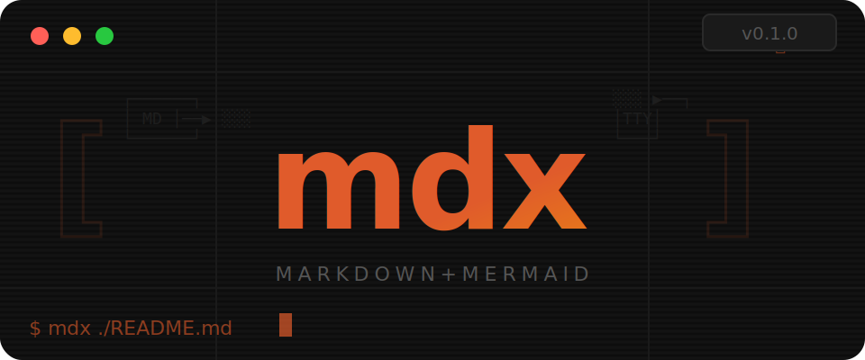
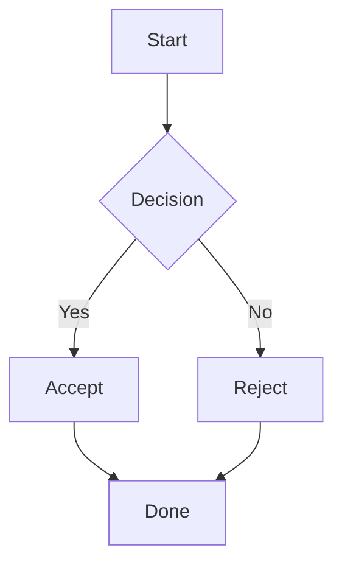

<p align="center">
  
</p>

# mdx

[](https://crates.io/crates/mermd)
[](https://crates.io/crates/mermd)
[](https://github.com/aleandros/mdx/actions/workflows/ci.yml)
[](https://github.com/aleandros/mdx/releases/latest)
[](LICENSE.txt)

A terminal-based Markdown renderer with Mermaid flowchart diagrams as ASCII art. Like `glow`, but with diagram support.

## Installation

```bash
curl -fsSL https://raw.githubusercontent.com/aleandros/mdx/main/install.sh | sh
```

This detects your OS and architecture, downloads the latest release binary, and installs it to `/usr/local/bin` (or `~/.local/bin` if you don't have root access).

## Usage

```bash
# Render a markdown file
mdx README.md

# Pipe from stdin
cat README.md | mdx

# Force plain output (no interactive pager)
mdx README.md --no-pager

# Force pager mode even when piped
mdx README.md --pager

# Override terminal width
mdx README.md --width 120
```

### Interactive Pager

When output is a TTY, mdx launches an interactive pager with vim-style keybindings:

**Scrolling:**
| Key | Action |
|-----|--------|
| `j` / `k` / Arrow keys | Scroll one line |
| `Space` / `Page Down` | Page down |
| `Page Up` | Page up |
| `Ctrl-d` / `Ctrl-u` | Half-page down / up |
| `Ctrl-f` / `Ctrl-b` | Full page down / up |
| `g` / `Home` | Go to beginning |
| `G` / `End` | Go to end |
| `h` / `l` / Left / Right | Horizontal scroll |
| Mouse scroll | Scroll (3 lines) |

**Search:**
| Key | Action |
|-----|--------|
| `/` | Forward search |
| `?` | Backward search |
| `n` | Next match |
| `N` | Previous match |

**Diagrams & Images:**
| Key | Action |
|-----|--------|
| `Tab` / `Shift-Tab` | Cycle through diagrams/images |
| `Enter` | Expand/collapse diagram, open image |

**General:**
| Key | Action |
|-----|--------|
| `q` / `Esc` | Quit |

Large diagrams are collapsed by default and can be expanded with Tab.

## Mermaid Diagrams

Fenced code blocks with the `mermaid` language tag are rendered as ASCII art:

````markdown

````

### Supported Syntax

**Directions:** `graph TD` (top-down), `graph LR` (left-right), `graph BT` (bottom-top), `graph RL` (right-left)

**Node shapes:**
- `A[text]` rectangle
- `A(text)` rounded
- `A{text}` diamond
- `A((text))` circle

**Edge styles:**
- `-->` arrow
- `---` plain line
- `-.->` dotted arrow
- `==>` thick arrow

**Edge labels:** `A -->|label| B`

**Chained edges:** `A --> B --> C`

## Building from Source

```bash
git clone https://github.com/aleandros/mdx.git
cd mdx
cargo build --release
# Binary at target/release/mdx
```
