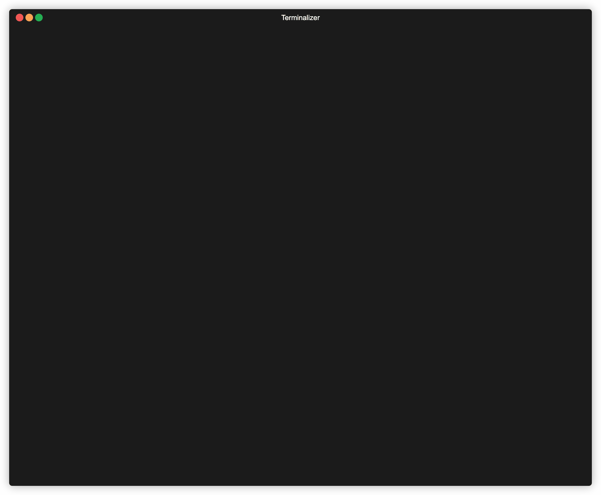

<p align="center">
  
</p>

# mdx

[](https://crates.io/crates/mermd)
[](https://crates.io/crates/mermd)
[](https://github.com/aleandros/mdx/actions/workflows/ci.yml)
[](https://github.com/aleandros/mdx/releases/latest)
[](LICENSE.txt)

**Read Markdown in the terminal — with Mermaid diagrams drawn as ASCII art.** Like [`glow`](https://github.com/charmbracelet/glow), but your `graph TD` blocks actually render.

<p align="center">
  
</p>

## Quick start

```bash
# Install
curl -fsSL https://raw.githubusercontent.com/aleandros/mdx/main/install.sh | sh

# Render a file
mdx README.md

# Or pipe anything
cat CHANGELOG.md | mdx
```

The installer detects your OS and architecture and drops the binary in `/usr/local/bin` (or `~/.local/bin` as a fallback).

## What you get

- **Mermaid as ASCII** — flowcharts and sequence diagrams rendered inline, no browser required
- **Interactive pager** — vim-style keybindings, search, tab-through diagrams, expand on demand
- **Embeddable** — `mdx embed` gives you a bounded ANSI stream for other TUIs
- **Themes** — 11 UI themes, syntect-powered syntax highlighting, project- and user-level config
- **Watch mode** — `mdx -W file.md` re-renders on save

> **Diagram support is scoped.** Today mdx renders `graph` / `flowchart` and `sequenceDiagram`. Class, state, ER, gantt, and other types are not yet supported — PRs welcome.

## Why

Markdown is everpresent in my day to day workflow, and `glow` spoils you — until the doc hits a Mermaid block and you're back to squinting at raw source or alt-tabbing to a browser. mdx is the fix: same "just read this thing" ergonomics, but diagrams render where you already are.

## Docs

Full CLI reference, config, themes, embedding contract, and mermaid syntax: **[docs/USAGE.md](docs/USAGE.md)**.

## Building from source

```bash
git clone https://github.com/aleandros/mdx.git
cd mdx
cargo build --release
# Binary at target/release/mdx
```

## License

MIT — see [LICENSE.txt](LICENSE.txt).
