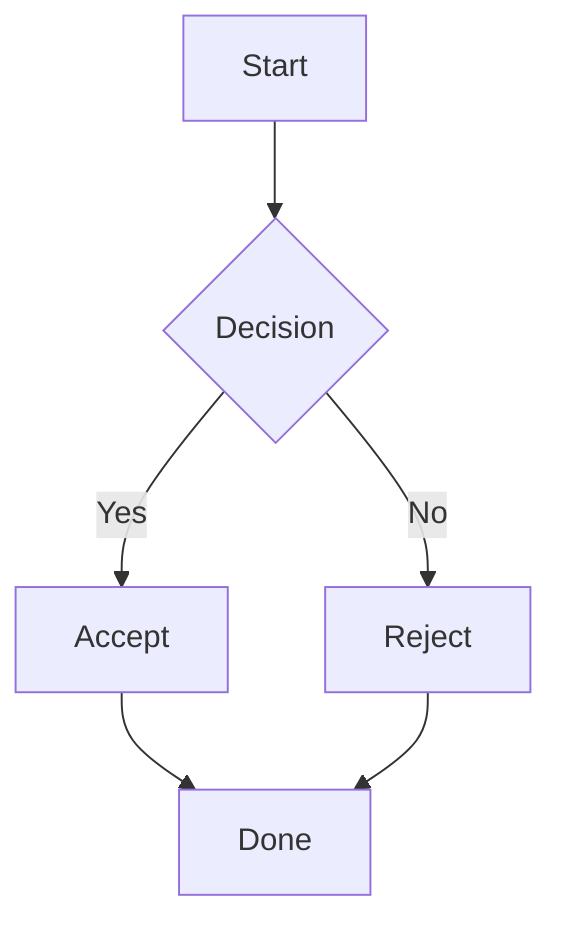
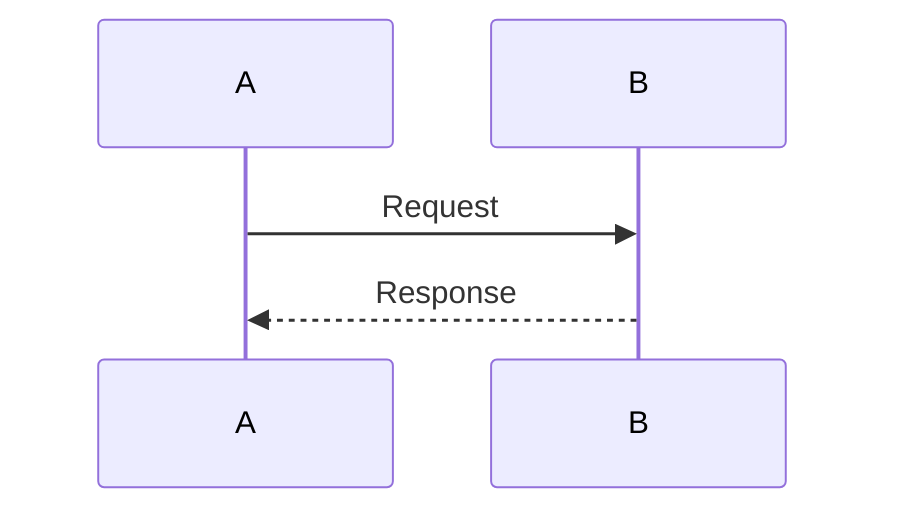
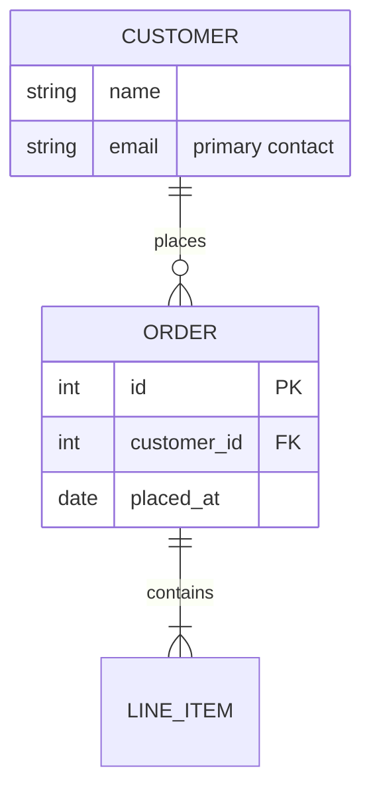

# mdx Usage

Full reference for the `mdx` CLI. For a quick overview see the [README](../README.md).

## Commands

```bash
mdx [FILE] [OPTIONS]     # Render a markdown file (or stdin)
mdx embed [FILE]         # Render a bounded ANSI stream for embedding in other TUIs
mdx update               # Update mdx to the latest release
mdx init                 # Write a default config to ~/.config/mdx/config.toml
mdx preview-themes       # Preview all available UI themes with sample markdown
```

## Rendering markdown

```bash
# Render a file
mdx README.md

# Pipe from stdin
cat README.md | mdx

# Force plain output (no interactive pager)
mdx README.md --no-pager

# Force pager mode even when piped
mdx README.md --pager

# Override terminal width
mdx README.md --width 120

# Watch a file and re-render live on change
mdx -W README.md
```

### Flags

| Flag | Description |
|------|-------------|
| `-p`, `--pager` | Force pager mode even when piped |
| `--no-pager` | Force plain output even on a TTY |
| `-W`, `--watch` | Watch the file and re-render on change |
| `-w`, `--width <N>` | Override terminal width for wrapping |
| `--theme <NAME>` | Syntax highlighting theme for code blocks (use `list` to see options) |
| `--ui-theme <NAME>` | UI theme for headers, text, chrome (use `list` to see options) |
| `--config <PATH>` | Use a specific config file (overrides user/project config) |
| `--no-mermaid-rendering` | Show raw mermaid source without rendering |
| `--split-mermaid-rendering` | Show mermaid source followed by the rendered diagram |

## Interactive pager

When the output is a TTY, mdx launches an interactive pager with vim-style keybindings.

**Scrolling**

| Key | Action |
|-----|--------|
| `j` / `k` / arrow keys | Scroll one line |
| `Space` / `Page Down` | Page down |
| `Page Up` | Page up |
| `Ctrl-d` / `Ctrl-u` | Half-page down / up |
| `Ctrl-f` / `Ctrl-b` | Full page down / up |
| `g` / `Home` | Go to beginning |
| `G` / `End` | Go to end |
| `h` / `l` / Left / Right | Horizontal scroll |
| Mouse scroll | Scroll (3 lines) |

**Search**

| Key | Action |
|-----|--------|
| `/` | Forward search |
| `?` | Backward search |
| `n` | Next match |
| `N` | Previous match |

**Diagrams & images**

| Key | Action |
|-----|--------|
| `Tab` / `Shift-Tab` | Cycle through diagrams/images |
| `Enter` | Expand/collapse diagram, open image |

**General**

| Key | Action |
|-----|--------|
| `q` / `Esc` | Quit |

Large diagrams are collapsed by default and can be expanded with `Enter`.

## Embedding in other programs

Use `mdx embed` when another program needs the rendered output as a bounded ANSI stream. It never opens a pager, never touches the alternate screen, and always emits ANSI color (set `NO_COLOR` to disable).

```bash
# Render into a 40-column, 10-row box (caller handles scrolling)
mdx embed --width 40 --height 10 README.md

# From stdin
cat README.md | mdx embed --width 60

# Drop color for plain output
NO_COLOR=1 mdx embed --width 40 README.md
```

**Output contract**

- Every line ends with `\n`; each line's display width ≤ `--width`.
- Total lines ≤ `--height` when provided.
- No pager, no alt-screen, no terminal escape sequences other than SGR color/style.
- Mermaid diagrams wider than `--width` are cropped (not reflowed).

### Embed flags

| Flag | Description |
|------|-------------|
| `-w`, `--width <N>` | Output width; each line is cropped to fit |
| `--height <N>` | Maximum number of output lines |
| `--theme <NAME>` | Syntax highlighting theme |
| `--ui-theme <NAME>` | UI theme |
| `--config <PATH>` | Use a specific config file |
| `--no-mermaid-rendering` | Raw mermaid source only |
| `--split-mermaid-rendering` | Mermaid source followed by rendered diagram |

## Configuration

mdx reads configuration from TOML files in this order (later entries override earlier ones):

1. **User config** — `$XDG_CONFIG_HOME/mdx/config.toml` (falls back to `~/.config/mdx/config.toml`)
2. **Project config** — `.mdx.toml` at the nearest ancestor directory containing `.git`
3. **`--config <PATH>`** — if passed, this file is loaded exclusively; user and project configs are ignored
4. **CLI flags** — always win

Generate a commented template with:

```bash
mdx init
```

### Keys

```toml
# Syntax highlighting theme for code blocks
theme = "base16-ocean.dark"

# UI theme for headers, text, and chrome
ui_theme = "clay"

# Force pager mode
pager = false

# Terminal width override (omit to use terminal width)
width = 100

# Mermaid diagram rendering
no_mermaid_rendering = false
split_mermaid_rendering = false
```

## Themes

### UI themes

Control colors for headers, text, links, and pager chrome.

```
clay (default)   hearth   frost   nord   glacier   steel
solarized-dark   solarized-light   paper   snow   latte
```

Preview them all against sample markdown:

```bash
mdx preview-themes
```

### Syntax highlighting themes

Applied to fenced code blocks. Powered by [syntect](https://github.com/trishume/syntect) — the built-in `base16-*` and `InspiredGitHub` themes are available out of the box.

```bash
mdx --theme=list           # List available syntax themes
mdx --ui-theme=list        # List available UI themes
```

## Mermaid diagrams

Fenced code blocks tagged `mermaid` are rendered as ASCII art.

> **Supported today:** `graph` / `flowchart`, `sequenceDiagram`, and `erDiagram`. Other diagram types (class, state, gantt, etc.) are not yet supported.

### Flowcharts

````markdown

````

**Directions:** `graph TD` (top-down), `graph LR` (left-right), `graph BT` (bottom-top), `graph RL` (right-left)

**Node shapes:**
- `A[text]` rectangle
- `A(text)` rounded
- `A{text}` diamond
- `A((text))` circle

**Edge styles:**
- `-->` arrow
- `---` plain line
- `-.->` dotted arrow
- `==>` thick arrow

**Edge labels:** `A -->|label| B`

**Chained edges:** `A --> B --> C`

### Sequence diagrams

````markdown

````

### ER diagrams

mdx renders `erDiagram` blocks as ASCII tables linked by ASCII crow's foot
endpoints.

````markdown

````

**Supported syntax**

- **Header:** `erDiagram`
- **Direction (extension):** `direction TD` / `direction LR`. Without one, mdx
  tries `LR` first and falls back to `TD` if the laid-out width exceeds the
  terminal width.
- **Relationships:** `LEFT <lcard> <op> <rcard> RIGHT [: LABEL]`
  - `<op>` is `--` (identifying, solid) or `..` (non-identifying, dotted).
  - `<lcard>` is one of `||`, `o|`, `}o`, `}|`.
  - `<rcard>` is one of `||`, `|o`, `o{`, `|{`.
  - `LABEL` is a quoted string or a bareword.
- **Entities:** `NAME { ... }` with one attribute per line:
  - `TYPE NAME [PK | FK | PK,FK | FK,PK] ["comment"]`
  - Long comments wrap below the attribute, aligned under the NAME column.
  - Box width is capped per terminal width; tweak by passing `--width`.

**Crow's foot glyphs**

| Cardinality   | Left   | Right  |
| ------------- | ------ | ------ |
| Exactly one   | `\|\|` | `\|\|` |
| Zero or one   | `o\|`  | `\|o`  |
| Zero or many  | `}o`   | `o{`   |
| One or many   | `}\|`  | `\|{`  |

### Styling

ER diagrams support the same `style`, `classDef`, and `class` directives
as flowcharts. Place them inside the `erDiagram` block:

```
erDiagram
    Notification ||--o{ Pref : has
    classDef audit fill:#666
    classDef config fill:#fc0
    Notification {
      string id PK
    }
    Pref {
      string id PK
    }
    class Notification config
    class Pref audit
    style Notification stroke:#f00
```

- `style ENTITY <props>` sets per-entity color. Properties: `fill`, `stroke`, `color`.
- `classDef NAME <props>` defines a reusable style.
- `class ENTITY[,ENTITY...] NAME` applies the named class to one or more entities.
- An explicit `style` line replaces any class-applied style on the same entity.
- Border cells (and crow's foot glyphs at edge endpoints) use `stroke` (or `fill` if `stroke` is not set). Inner text uses `color`.

## Updating

```bash
mdx update
```

Downloads the latest release binary and replaces the current one in place.

## Building from source

```bash
git clone https://github.com/aleandros/mdx.git
cd mdx
cargo build --release
# Binary at target/release/mdx
```
