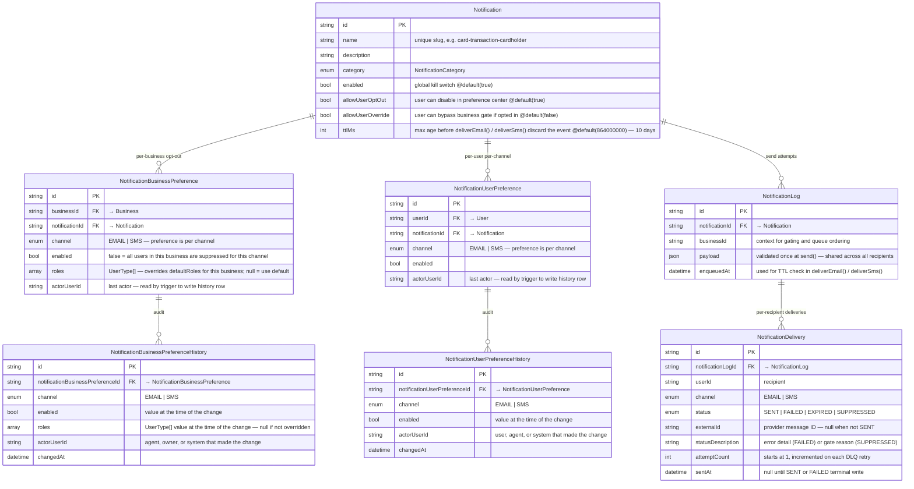

# ER full

```mermaid
erDiagram
    Notification ||--o{ NotificationBusinessPreference : "per-business opt-out"
    Notification ||--o{ NotificationUserPreference : "per-user per-channel"
    Notification ||--o{ NotificationLog : "send attempts"
    NotificationLog ||--o{ NotificationDelivery : "per-recipient deliveries"
    NotificationBusinessPreference ||--o{ NotificationBusinessPreferenceHistory : audit
    NotificationUserPreference ||--o{ NotificationUserPreferenceHistory : audit

    Notification {
      string id PK
      string name "unique slug, e.g. card-transaction-cardholder"
      string description
      enum category "NotificationCategory"
      bool enabled "global kill switch @default(true)"
      bool allowUserOptOut "user can disable in preference center @default(true)"
      bool allowUserOverride "user can bypass business gate if opted in @default(false)"
      int ttlMs "max age before deliverEmail() / deliverSms() discard the event @default(864000000) — 10 days"
    }
    NotificationBusinessPreference {
      string id PK
      string businessId FK "→ Business"
      string notificationId FK "→ Notification"
      enum channel "EMAIL | SMS — preference is per channel"
      bool enabled "false = all users in this business are suppressed for this channel"
      array roles "UserType[] — overrides defaultRoles for this business; null = use default"
      string actorUserId "last actor — read by trigger to write history row"
    }
    NotificationBusinessPreferenceHistory {
      string id PK
      string notificationBusinessPreferenceId FK "→ NotificationBusinessPreference"
      enum channel "EMAIL | SMS"
      bool enabled "value at the time of the change"
      array roles "UserType[] value at the time of the change — null if not overridden"
      string actorUserId "agent, owner, or system that made the change"
      datetime changedAt
    }
    NotificationUserPreference {
      string id PK
      string userId FK "→ User"
      string notificationId FK "→ Notification"
      enum channel "EMAIL | SMS — preference is per channel"
      bool enabled
      string actorUserId "last actor — read by trigger to write history row"
    }
    NotificationUserPreferenceHistory {
      string id PK
      string notificationUserPreferenceId FK "→ NotificationUserPreference"
      enum channel "EMAIL | SMS"
      bool enabled "value at the time of the change"
      string actorUserId "user, agent, or system that made the change"
      datetime changedAt
    }
    NotificationLog {
      string id PK
      string notificationId FK "→ Notification"
      string businessId "context for gating and queue ordering"
      json payload "validated once at send() — shared across all recipients"
      datetime enqueuedAt "used for TTL check in deliverEmail() / deliverSms()"
    }
    NotificationDelivery {
      string id PK
      string notificationLogId FK "→ NotificationLog"
      string userId "recipient"
      enum channel "EMAIL | SMS"
      enum status "SENT | FAILED | EXPIRED | SUPPRESSED"
      string externalId "provider message ID — null when not SENT"
      string statusDescription "error detail (FAILED) or gate reason (SUPPRESSED)"
      int attemptCount "starts at 1, incremented on each DLQ retry"
      datetime sentAt "null until SENT or FAILED terminal write"
    }
```
