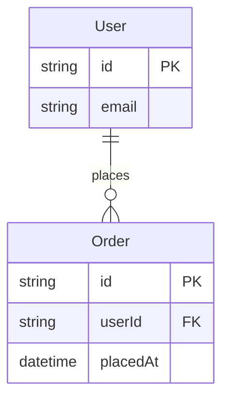

# ER minimal

Two entities with one relationship.

```mermaid
erDiagram
    User ||--o{ Order : places
    User {
      string id PK
      string email
    }
    Order {
      string id PK
      string userId FK
      datetime placedAt
    }
```
