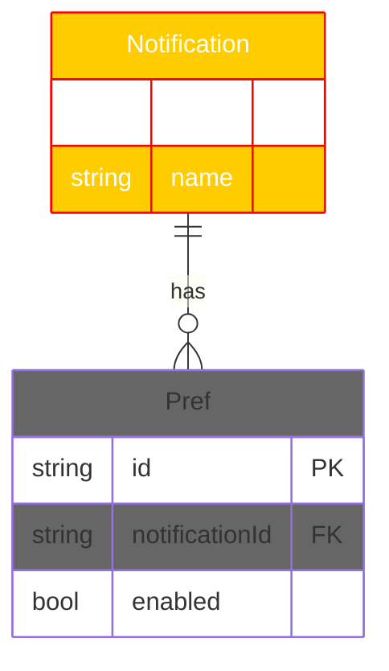

# ER styled

```mermaid
erDiagram
    Notification ||--o{ Pref : has
    classDef config fill:#fc0
    classDef audit fill:#666
    Notification {
      string id PK
      string name
    }
    Pref {
      string id PK
      string notificationId FK
      bool enabled
    }
    class Notification config
    class Pref audit
    style Notification stroke:#f00,color:#fff
```
