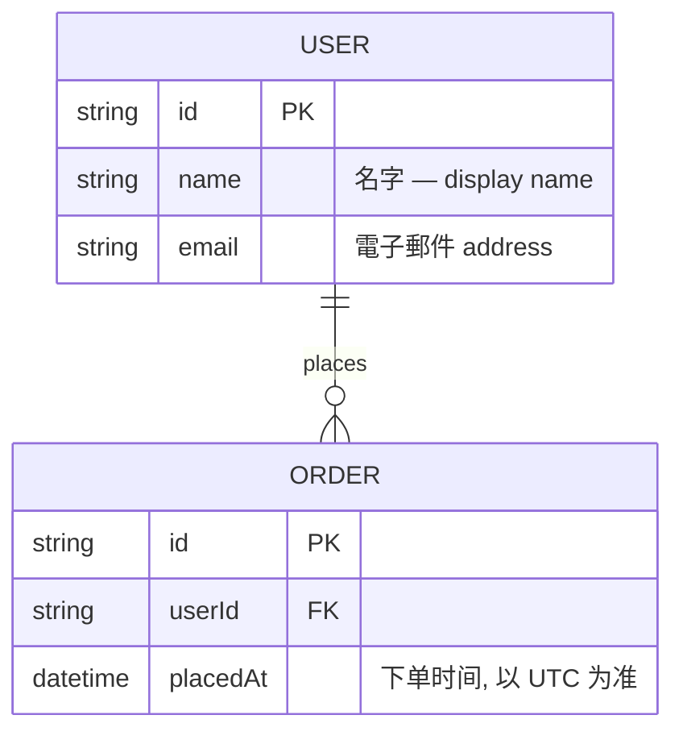

# ER unicode

```mermaid
erDiagram
    USER ||--o{ ORDER : places
    USER {
        string id PK
        string name "名字 — display name"
        string email "電子郵件 address"
    }
    ORDER {
        string id PK
        string userId FK
        datetime placedAt "下单时间, 以 UTC 为准"
    }
```
