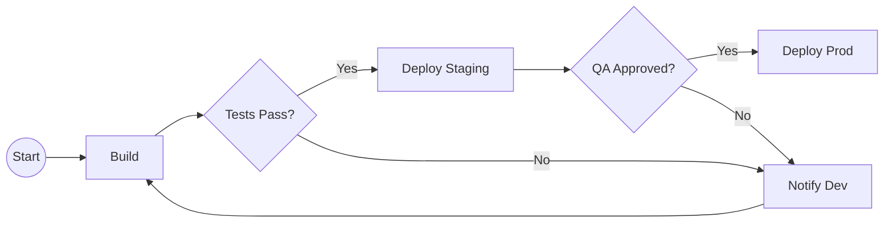
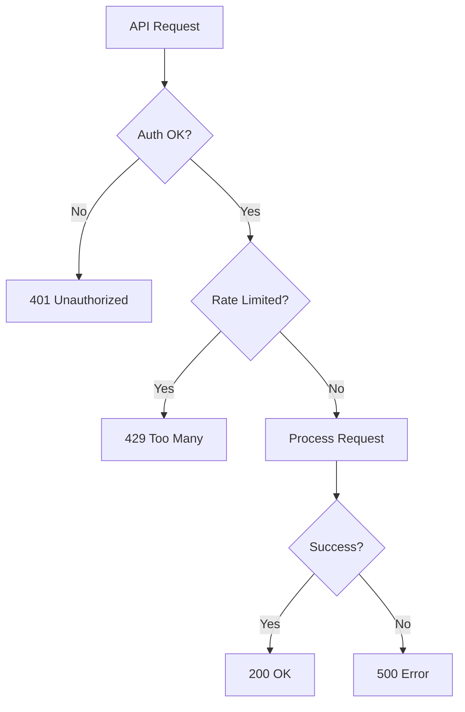
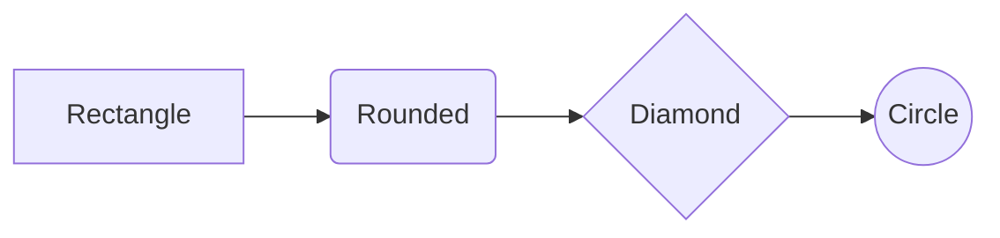
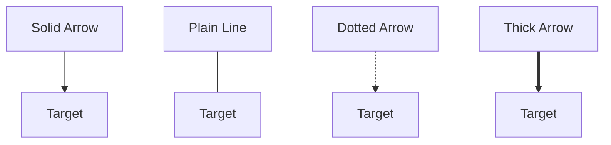

# Advanced Flowcharts

## CI/CD Pipeline

```mermaid
graph LR
    A((Start)) --> B[Build]
    B --> C{Tests Pass?}
    C -->|Yes| D[Deploy Staging]
    C -->|No| E[Notify Dev]
    D --> F{QA Approved?}
    F -->|Yes| G[Deploy Prod]
    F -->|No| E
    E --> B
```

## Error Handling Flow

```mermaid
graph TD
    A[API Request] --> B{Auth OK?}
    B -->|No| C[401 Unauthorized]
    B -->|Yes| D{Rate Limited?}
    D -->|Yes| E[429 Too Many]
    D -->|No| F[Process Request]
    F --> G{Success?}
    G -->|Yes| H[200 OK]
    G -->|No| I[500 Error]
```

## Node Shapes

Different node shapes available:

```mermaid
graph LR
    A[Rectangle] --> B(Rounded)
    B --> C{Diamond}
    C --> D((Circle))
```

## Edge Styles

Different edge connection styles:

```mermaid
graph TD
    A[Solid Arrow] --> B[Target]
    C[Plain Line] --- D[Target]
    E[Dotted Arrow] -.-> F[Target]
    G[Thick Arrow] ==> H[Target]
```
