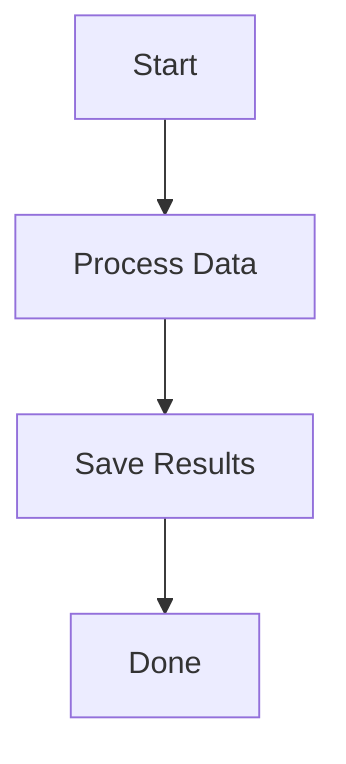
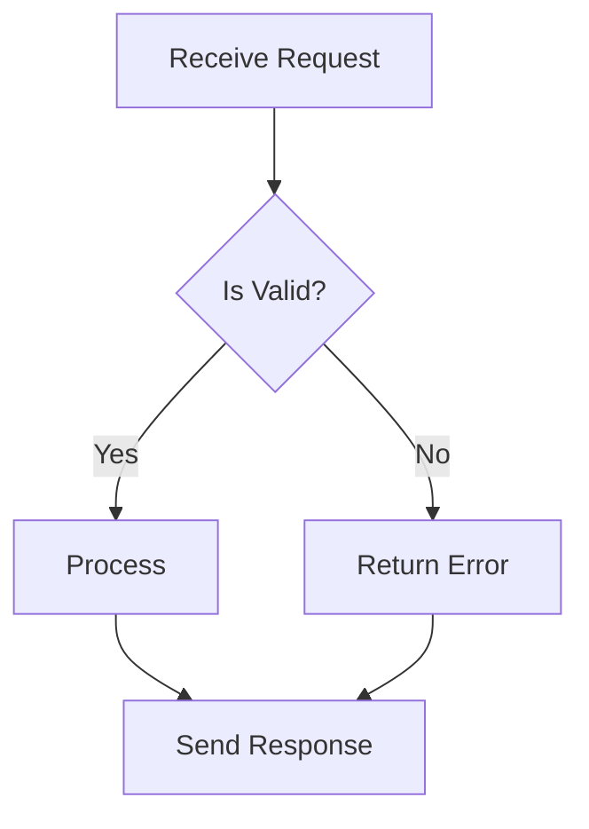
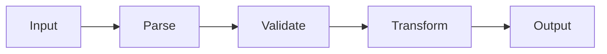

# Simple Flowcharts

## Linear Flow

A basic top-down sequence:

```mermaid
graph TD
    A[Start] --> B[Process Data] --> C[Save Results] --> D[Done]
```

## Decision Branch

A flowchart with a yes/no decision:

```mermaid
graph TD
    A[Receive Request] --> B{Is Valid?}
    B -->|Yes| C[Process]
    B -->|No| D[Return Error]
    C --> E[Send Response]
    D --> E
```

## Left-to-Right Flow

The same pipeline rendered horizontally:

```mermaid
graph LR
    A[Input] --> B[Parse] --> C[Validate] --> D[Transform] --> E[Output]
```
