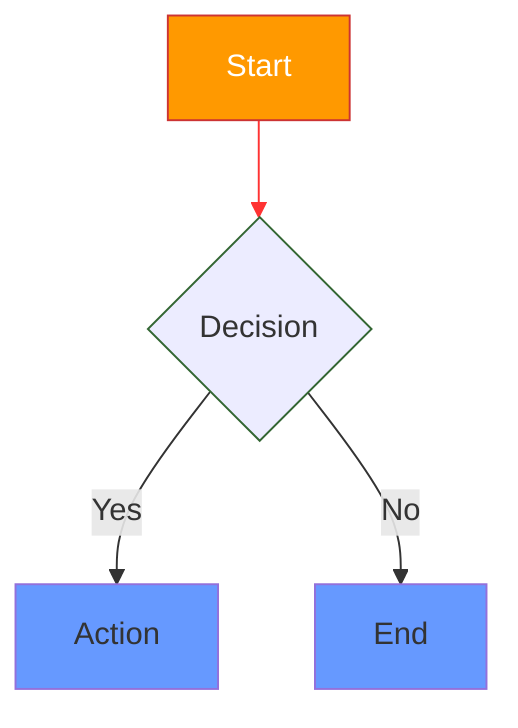

# Styled Flowchart

```mermaid
graph TD
    A[Start] --> B{Decision}
    B -->|Yes| C[Action]
    B -->|No| D[End]
    style A fill:#ff9900,stroke:#cc3333,color:#ffffff
    style B stroke:#336633
    classDef result fill:#6699ff
    class C,D result
    linkStyle 0 stroke:#ff3333
```
