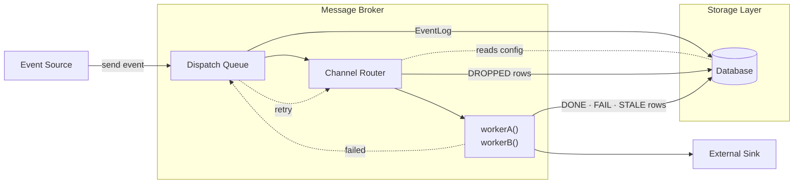

# Subgraph Pipeline

## Event Processing Flow

```mermaid
flowchart LR
    Producer["Event Source"]

    subgraph Broker["Message Broker"]
        Queue["Dispatch Queue"]
        Router["Channel Router"]
        Workers["workerA()<br/>workerB()"]
    end

    subgraph Persistence["Storage Layer"]
        DB[("Database")]
    end

    Sink["External Sink"]

    Producer -->|"send event"| Queue
    Queue -->|"EventLog"| DB
    Queue --> Router
    Router -.-|"reads config"| DB
    Router -->|"DROPPED rows"| DB
    Router --> Workers
    Workers -->|"DONE · FAIL · STALE rows"| DB
    Workers --> Sink
    Workers -.failed.-> Queue
    Queue -.retry.-> Router
```
