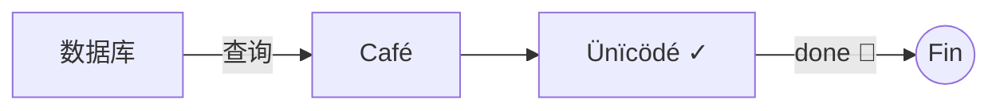
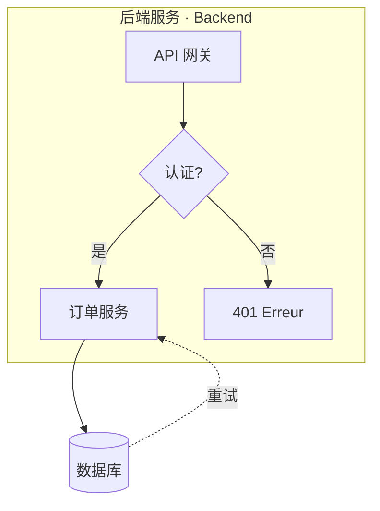

# Unicode labels

Node, edge and subgraph labels measured in terminal columns, not bytes.

```mermaid
graph LR
    A[数据库] -->|查询| B[Café]
    B --> C[Ünïcödé ✓]
    C -->|done 🎉| D((Fin))
```

```mermaid
graph TD
    subgraph backend["后端服务 · Backend"]
        API[API 网关] --> Auth{认证?}
        Auth -->|是| Svc[订单服务]
        Auth -->|否| Err[401 Erreur]
    end
    Svc --> DB[(数据库)]
    DB -. 重试 .-> Svc
```
