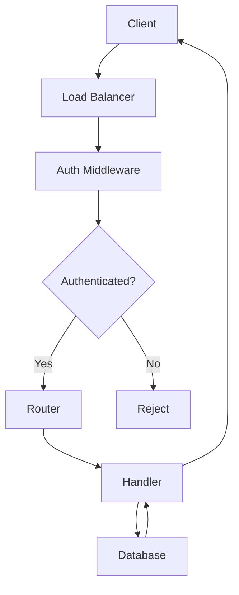
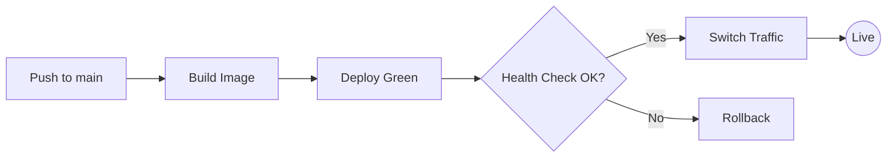

# Project Architecture

This document mixes prose, code, and diagrams to demonstrate **mdx** handling real-world documentation.

## Request Lifecycle

When a user makes an API call, the request flows through several stages:



The **Auth Middleware** checks the JWT token and validates it against our key store.
If the token is expired or invalid, the request is rejected with a `401` status.

## Handler Example

Each route handler follows this pattern:

```rust
async fn get_user(Path(id): Path<u64>, State(db): State<Pool>) -> Result<Json<User>> {
    let user = db.query("SELECT * FROM users WHERE id = $1", &[&id])
        .await?
        .into_first()?;
    Ok(Json(user))
}
```

## Deployment

We use a blue-green deployment strategy:



---

## Quick Reference

- **Auth**: JWT tokens, 1h expiry
- **Database**: PostgreSQL 16
- **Cache**: Redis for sessions
- **Deploy**: Blue-green via `kubectl`
