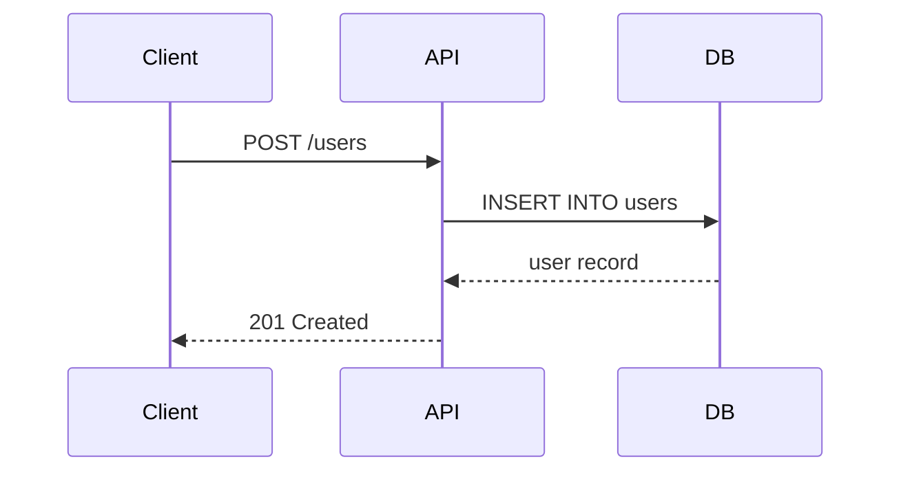

# Mixed Content with Code

A document mixing prose, code blocks, and diagrams.

## Configuration

Here's a sample `Cargo.toml` for a web service:

```toml
[package]
name = "api-server"
version = "0.1.0"
edition = "2024"

[dependencies]
axum = "0.8"
tokio = { version = "1", features = ["full"] }
serde = { version = "1", features = ["derive"] }
serde_json = "1"
```

## The Handler

The main route handler uses **axum** extractors:

```rust
use axum::{Json, extract::State};
use serde::{Deserialize, Serialize};

#[derive(Deserialize)]
struct CreateUser {
    name: String,
    email: String,
}

#[derive(Serialize)]
struct UserResponse {
    id: u64,
    name: String,
}

async fn create_user(
    State(db): State<Database>,
    Json(payload): Json<CreateUser>,
) -> Json<UserResponse> {
    let user = db.insert_user(&payload.name, &payload.email).await;
    Json(UserResponse {
        id: user.id,
        name: user.name,
    })
}
```

## Request Flow



## SQL Schema

```sql
CREATE TABLE users (
    id BIGSERIAL PRIMARY KEY,
    name VARCHAR(255) NOT NULL,
    email VARCHAR(255) UNIQUE NOT NULL,
    created_at TIMESTAMP DEFAULT NOW()
);

CREATE INDEX idx_users_email ON users(email);
```

## Testing with curl

```bash
curl -X POST http://localhost:3000/users \
  -H "Content-Type: application/json" \
  -d '{"name": "Alice", "email": "alice@example.com"}'
```

---

*Built with Rust, rendered with mdx.*
