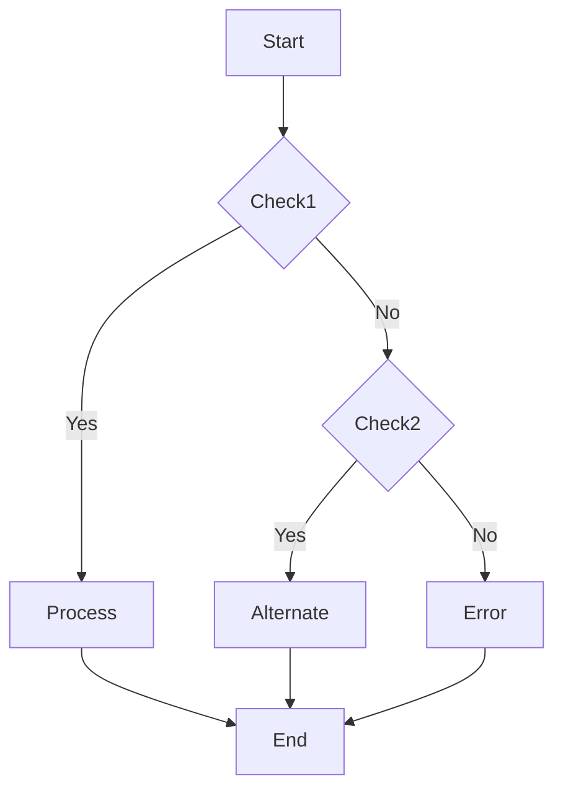

# Test: Complex Multi-Path

```mermaid
graph TD
    A[Start] --> B{Check1}
    B -->|Yes| C[Process]
    B -->|No| D{Check2}
    D -->|Yes| E[Alternate]
    D -->|No| F[Error]
    C --> G[End]
    E --> G
    F --> G
```
