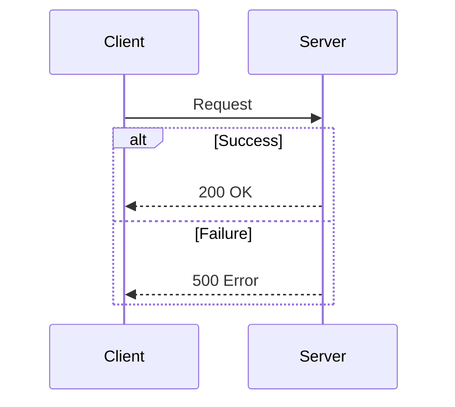

# Test: Alt Fragment

```mermaid
sequenceDiagram
    participant Client
    participant Server
    Client->>Server: Request
    alt Success
        Server-->>Client: 200 OK
    else Failure
        Server-->>Client: 500 Error
    end
```
