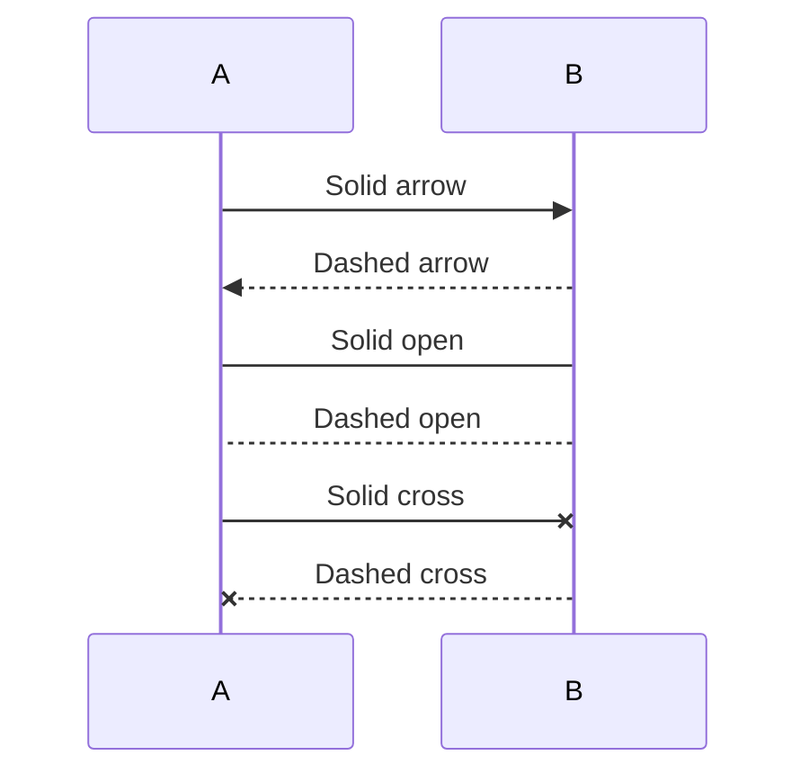

# Test: Arrow Styles

```mermaid
sequenceDiagram
    participant A
    participant B
    A->>B: Solid arrow
    B-->>A: Dashed arrow
    A->B: Solid open
    B-->A: Dashed open
    A-xB: Solid cross
    B--xA: Dashed cross
```
