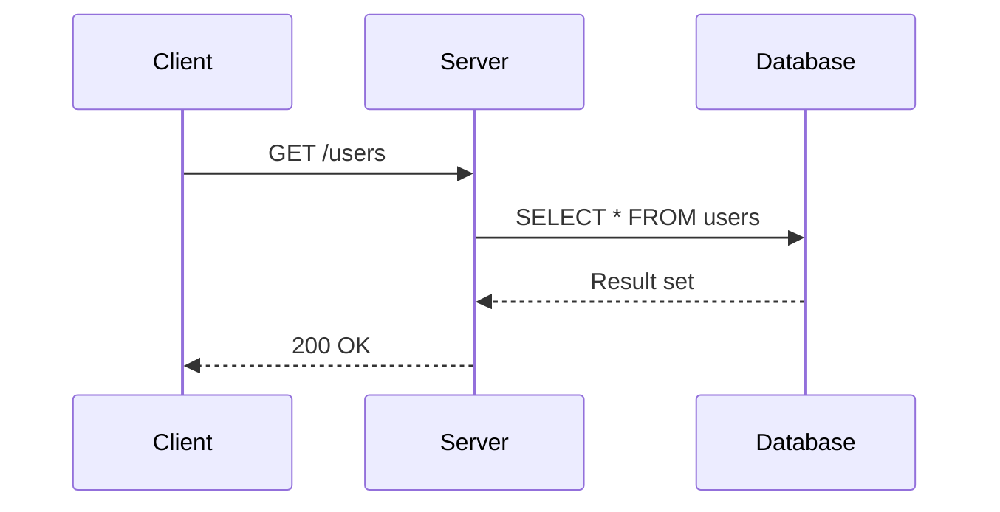

# Test: Multiple Participants

```mermaid
sequenceDiagram
    participant Client
    participant Server
    participant Database
    Client->>Server: GET /users
    Server->>Database: SELECT * FROM users
    Database-->>Server: Result set
    Server-->>Client: 200 OK
```
