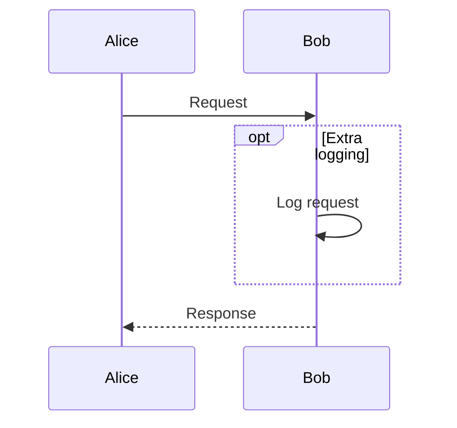

# Test: Opt Fragment

```mermaid
sequenceDiagram
    participant Alice
    participant Bob
    Alice->>Bob: Request
    opt Extra logging
        Bob->>Bob: Log request
    end
    Bob-->>Alice: Response
```
