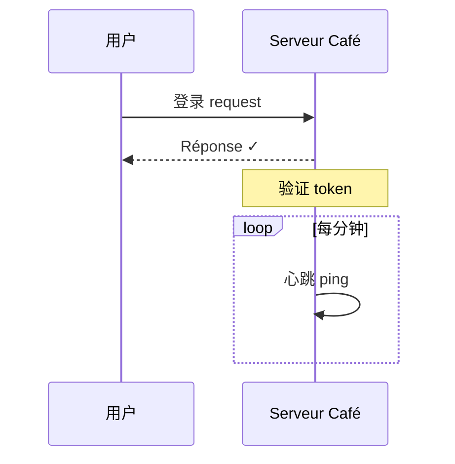

# Sequence unicode

```mermaid
sequenceDiagram
    participant U as 用户
    participant S as Serveur Café
    U->>S: 登录 request
    S-->>U: Réponse ✓
    Note over S: 验证 token
    loop 每分钟
        S->>S: 心跳 ping
    end
```
