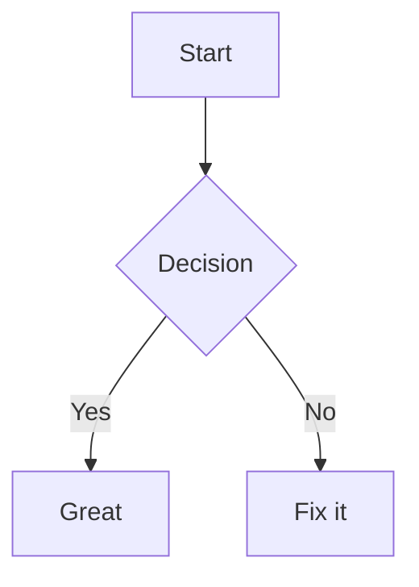
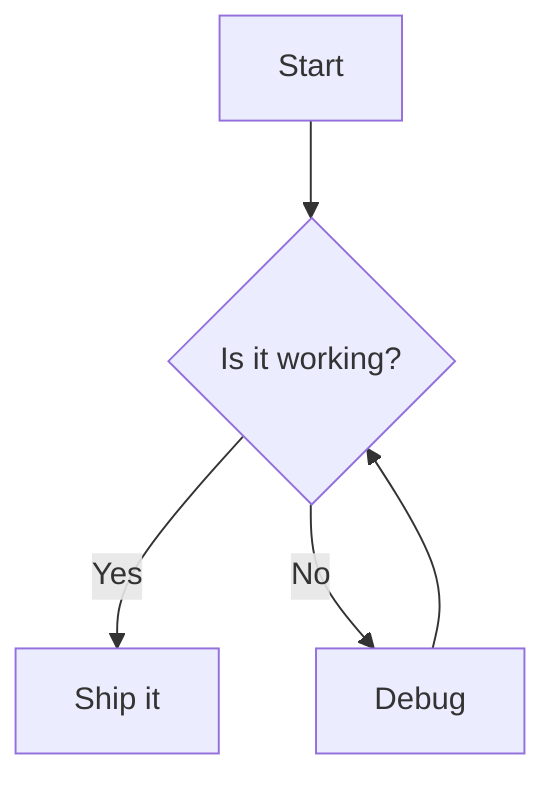

# mdx Implementation Plan

> **For agentic workers:** REQUIRED SUB-SKILL: Use superpowers:subagent-driven-development (recommended) or superpowers:executing-plans to implement this plan task-by-task. Steps use checkbox (`- [ ]`) syntax for tracking.

**Goal:** Build a terminal markdown renderer with inline mermaid flowchart ASCII art rendering.

**Architecture:** Layered pipeline — pulldown-cmark parses markdown into Block enums, a renderer converts blocks to styled lines (with mermaid blocks going through a custom parse/layout/ASCII pipeline), and a display layer either writes ANSI to stdout or launches a ratatui pager with scrolling and diagram expand/collapse.

**Tech Stack:** Rust (edition 2024), pulldown-cmark, ratatui + crossterm, clap, anyhow. Custom Sugiyama-style layout engine for mermaid flowcharts (layout-rs is unsuitable — it only does Graphviz dot rendering, not hierarchical layout).

---

## File Structure

```
src/
  main.rs              - CLI args (clap), TTY detection, orchestration
  parser.rs            - pulldown-cmark wrapper, Block enum, event grouping
  render.rs            - Block -> StyledLine conversion, word wrapping, ANSI output
  pager.rs             - ratatui interactive pager with scrolling + diagram expand
  mermaid/
    mod.rs             - public API: render_mermaid(content) -> Vec<String>
    parse.rs           - mermaid flowchart syntax -> FlowChart data structure
    layout.rs          - Sugiyama-style rank assignment + coordinate positioning
    ascii.rs           - positioned graph -> character buffer -> Vec<String>
```

---

### Task 1: Project Setup & CLI Skeleton

**Files:**
- Modify: `Cargo.toml`
- Modify: `src/main.rs`

- [ ] **Step 1: Add dependencies to Cargo.toml**

```toml
[package]
name = "mdx"
version = "0.1.0"
edition = "2024"

[dependencies]
anyhow = "1"
clap = { version = "4", features = ["derive"] }
crossterm = "0.28"
pulldown-cmark = "0.12"
ratatui = "0.29"
```

- [ ] **Step 2: Run cargo check to verify dependencies resolve**

Run: `cargo check`
Expected: compiles successfully (warnings OK)

- [ ] **Step 3: Write test for CLI arg parsing**

In `src/main.rs`:

```rust
use anyhow::Result;
use clap::Parser;
use std::io::{IsTerminal, Read};
use std::path::PathBuf;

#[derive(Parser)]
#[command(name = "mdx", version, about = "Terminal markdown renderer with mermaid diagrams")]
struct Args {
    /// Markdown file to render
    file: Option<PathBuf>,

    /// Force pager mode even when piped
    #[arg(short, long)]
    pager: bool,

    /// Force plain output even on TTY
    #[arg(long)]
    no_pager: bool,

    /// Override terminal width for wrapping
    #[arg(short, long)]
    width: Option<u16>,
}

fn read_input(args: &Args) -> Result<String> {
    match &args.file {
        Some(path) => Ok(std::fs::read_to_string(path)?),
        None if !std::io::stdin().is_terminal() => {
            let mut buf = String::new();
            std::io::stdin().read_to_string(&mut buf)?;
            Ok(buf)
        }
        None => {
            anyhow::bail!("No input: provide a file argument or pipe markdown to stdin");
        }
    }
}

fn main() -> Result<()> {
    let args = Args::parse();
    let input = read_input(&args)?;
    println!("Read {} bytes", input.len());
    Ok(())
}

#[cfg(test)]
mod tests {
    use super::*;

    #[test]
    fn test_args_parse_file() {
        let args = Args::parse_from(["mdx", "README.md"]);
        assert_eq!(args.file, Some(PathBuf::from("README.md")));
        assert!(!args.pager);
        assert!(!args.no_pager);
        assert_eq!(args.width, None);
    }

    #[test]
    fn test_args_parse_flags() {
        let args = Args::parse_from(["mdx", "-p", "-w", "80", "test.md"]);
        assert!(args.pager);
        assert_eq!(args.width, Some(80));
    }

    #[test]
    fn test_read_input_file() {
        let dir = std::env::temp_dir().join("mdx_test");
        std::fs::create_dir_all(&dir).unwrap();
        let path = dir.join("test.md");
        std::fs::write(&path, "# Hello").unwrap();
        let args = Args { file: Some(path), pager: false, no_pager: false, width: None };
        let input = read_input(&args).unwrap();
        assert_eq!(input, "# Hello");
    }

    #[test]
    fn test_read_input_no_file_no_stdin() {
        let args = Args { file: None, pager: false, no_pager: false, width: None };
        // When stdin is a terminal, this should error
        // (In test context stdin IS a terminal)
        assert!(read_input(&args).is_err());
    }
}
```

- [ ] **Step 4: Run tests to verify they pass**

Run: `cargo test`
Expected: all 4 tests pass

- [ ] **Step 5: Commit**

```bash
git add Cargo.toml src/main.rs
git commit -m "feat: project setup with CLI skeleton and input reading"
```

---

### Task 2: Markdown Block Parser

**Files:**
- Create: `src/parser.rs`
- Modify: `src/main.rs` (add `mod parser;`)

- [ ] **Step 1: Define Block and InlineElement types**

Create `src/parser.rs`:

```rust
use pulldown_cmark::{CodeBlockKind, Event, HeadingLevel, Parser, Tag, TagEnd};

#[derive(Debug, Clone, PartialEq)]
pub enum InlineElement {
    Text(String),
    Bold(String),
    Italic(String),
    Code(String),
    Link { text: String, url: String },
    SoftBreak,
}

#[derive(Debug, Clone, PartialEq)]
pub enum Block {
    Header {
        level: u8,
        content: Vec<InlineElement>,
    },
    Paragraph {
        content: Vec<InlineElement>,
    },
    CodeBlock {
        language: Option<String>,
        content: String,
    },
    MermaidBlock {
        content: String,
    },
    List {
        ordered: bool,
        items: Vec<Vec<InlineElement>>,
    },
    HorizontalRule,
}

fn heading_level_to_u8(level: HeadingLevel) -> u8 {
    match level {
        HeadingLevel::H1 => 1,
        HeadingLevel::H2 => 2,
        HeadingLevel::H3 => 3,
        HeadingLevel::H4 => 4,
        HeadingLevel::H5 => 5,
        HeadingLevel::H6 => 6,
    }
}
```

- [ ] **Step 2: Write tests for markdown parsing**

Add to `src/parser.rs`:

```rust
#[cfg(test)]
mod tests {
    use super::*;

    #[test]
    fn test_parse_header() {
        let blocks = parse_markdown("# Hello World");
        assert_eq!(blocks.len(), 1);
        match &blocks[0] {
            Block::Header { level, content } => {
                assert_eq!(*level, 1);
                assert_eq!(content, &[InlineElement::Text("Hello World".into())]);
            }
            other => panic!("expected Header, got {:?}", other),
        }
    }

    #[test]
    fn test_parse_paragraph_with_inline() {
        let blocks = parse_markdown("Hello **bold** and *italic* text");
        assert_eq!(blocks.len(), 1);
        match &blocks[0] {
            Block::Paragraph { content } => {
                assert_eq!(content, &[
                    InlineElement::Text("Hello ".into()),
                    InlineElement::Bold("bold".into()),
                    InlineElement::Text(" and ".into()),
                    InlineElement::Italic("italic".into()),
                    InlineElement::Text(" text".into()),
                ]);
            }
            other => panic!("expected Paragraph, got {:?}", other),
        }
    }

    #[test]
    fn test_parse_code_block() {
        let blocks = parse_markdown("```rust\nfn main() {}\n```");
        assert_eq!(blocks.len(), 1);
        match &blocks[0] {
            Block::CodeBlock { language, content } => {
                assert_eq!(language.as_deref(), Some("rust"));
                assert_eq!(content, "fn main() {}\n");
            }
            other => panic!("expected CodeBlock, got {:?}", other),
        }
    }

    #[test]
    fn test_parse_mermaid_block() {
        let blocks = parse_markdown("```mermaid\ngraph TD\n    A --> B\n```");
        assert_eq!(blocks.len(), 1);
        match &blocks[0] {
            Block::MermaidBlock { content } => {
                assert!(content.contains("graph TD"));
                assert!(content.contains("A --> B"));
            }
            other => panic!("expected MermaidBlock, got {:?}", other),
        }
    }

    #[test]
    fn test_parse_unordered_list() {
        let blocks = parse_markdown("- Item 1\n- Item 2");
        assert_eq!(blocks.len(), 1);
        match &blocks[0] {
            Block::List { ordered, items } => {
                assert!(!ordered);
                assert_eq!(items.len(), 2);
                assert_eq!(items[0], vec![InlineElement::Text("Item 1".into())]);
                assert_eq!(items[1], vec![InlineElement::Text("Item 2".into())]);
            }
            other => panic!("expected List, got {:?}", other),
        }
    }

    #[test]
    fn test_parse_horizontal_rule() {
        let blocks = parse_markdown("---");
        assert_eq!(blocks.len(), 1);
        assert_eq!(blocks[0], Block::HorizontalRule);
    }

    #[test]
    fn test_parse_inline_code() {
        let blocks = parse_markdown("Use `code` here");
        assert_eq!(blocks.len(), 1);
        match &blocks[0] {
            Block::Paragraph { content } => {
                assert_eq!(content, &[
                    InlineElement::Text("Use ".into()),
                    InlineElement::Code("code".into()),
                    InlineElement::Text(" here".into()),
                ]);
            }
            other => panic!("expected Paragraph, got {:?}", other),
        }
    }

    #[test]
    fn test_parse_link() {
        let blocks = parse_markdown("[click](http://example.com)");
        assert_eq!(blocks.len(), 1);
        match &blocks[0] {
            Block::Paragraph { content } => {
                assert_eq!(content, &[
                    InlineElement::Link {
                        text: "click".into(),
                        url: "http://example.com".into(),
                    },
                ]);
            }
            other => panic!("expected Paragraph, got {:?}", other),
        }
    }

    #[test]
    fn test_parse_multiple_blocks() {
        let input = "# Title\n\nA paragraph.\n\n---\n\n- one\n- two";
        let blocks = parse_markdown(input);
        assert_eq!(blocks.len(), 4);
        assert!(matches!(&blocks[0], Block::Header { level: 1, .. }));
        assert!(matches!(&blocks[1], Block::Paragraph { .. }));
        assert!(matches!(&blocks[2], Block::HorizontalRule));
        assert!(matches!(&blocks[3], Block::List { .. }));
    }
}
```

- [ ] **Step 3: Run tests to verify they fail**

Run: `cargo test`
Expected: compilation error — `parse_markdown` not defined

- [ ] **Step 4: Implement parse_markdown**

Add to `src/parser.rs`:

```rust
enum InlineStyle {
    Bold,
    Italic,
    Link(String),
}

pub fn parse_markdown(input: &str) -> Vec<Block> {
    let parser = Parser::new(input);
    let mut blocks = Vec::new();
    let mut inlines: Vec<InlineElement> = Vec::new();
    let mut style_stack: Vec<InlineStyle> = Vec::new();
    let mut code_buf = String::new();
    let mut code_lang: Option<String> = None;
    let mut in_code_block = false;
    let mut current_heading_level: u8 = 0;
    let mut in_heading = false;
    let mut list_items: Vec<Vec<InlineElement>> = Vec::new();
    let mut list_ordered = false;
    let mut in_list = false;
    let mut in_list_item = false;

    for event in parser {
        match event {
            Event::Start(Tag::Heading { level, .. }) => {
                in_heading = true;
                current_heading_level = heading_level_to_u8(level);
            }
            Event::End(TagEnd::Heading(_)) => {
                blocks.push(Block::Header {
                    level: current_heading_level,
                    content: std::mem::take(&mut inlines),
                });
                in_heading = false;
            }
            Event::Start(Tag::Paragraph) => {}
            Event::End(TagEnd::Paragraph) => {
                if in_list_item {
                    // Content will be collected when the Item ends
                } else {
                    blocks.push(Block::Paragraph {
                        content: std::mem::take(&mut inlines),
                    });
                }
            }
            Event::Start(Tag::CodeBlock(kind)) => {
                in_code_block = true;
                code_buf.clear();
                code_lang = match kind {
                    CodeBlockKind::Fenced(lang) => {
                        let l = lang.to_string();
                        if l.is_empty() { None } else { Some(l) }
                    }
                    CodeBlockKind::Indented => None,
                };
            }
            Event::End(TagEnd::CodeBlock) => {
                in_code_block = false;
                if code_lang.as_deref() == Some("mermaid") {
                    blocks.push(Block::MermaidBlock {
                        content: std::mem::take(&mut code_buf),
                    });
                } else {
                    blocks.push(Block::CodeBlock {
                        language: code_lang.take(),
                        content: std::mem::take(&mut code_buf),
                    });
                }
                code_lang = None;
            }
            Event::Start(Tag::List(start)) => {
                in_list = true;
                list_ordered = start.is_some();
                list_items.clear();
            }
            Event::End(TagEnd::List(_)) => {
                in_list = false;
                blocks.push(Block::List {
                    ordered: list_ordered,
                    items: std::mem::take(&mut list_items),
                });
            }
            Event::Start(Tag::Item) => {
                in_list_item = true;
                inlines.clear();
            }
            Event::End(TagEnd::Item) => {
                in_list_item = false;
                list_items.push(std::mem::take(&mut inlines));
            }
            Event::Start(Tag::Strong) => {
                style_stack.push(InlineStyle::Bold);
            }
            Event::End(TagEnd::Strong) => {
                style_stack.pop();
            }
            Event::Start(Tag::Emphasis) => {
                style_stack.push(InlineStyle::Italic);
            }
            Event::End(TagEnd::Emphasis) => {
                style_stack.pop();
            }
            Event::Start(Tag::Link { dest_url, .. }) => {
                style_stack.push(InlineStyle::Link(dest_url.to_string()));
            }
            Event::End(TagEnd::Link) => {
                if let Some(InlineStyle::Link(url)) = style_stack.pop() {
                    // Rewrite the last text element(s) added during this link
                    // into a Link element. Simplification: take last element's text.
                    if let Some(last) = inlines.pop() {
                        let text = match last {
                            InlineElement::Text(t) => t,
                            InlineElement::Bold(t) => t,
                            InlineElement::Italic(t) => t,
                            other => {
                                inlines.push(other);
                                String::new()
                            }
                        };
                        inlines.push(InlineElement::Link { text, url });
                    }
                }
            }
            Event::Text(text) => {
                if in_code_block {
                    code_buf.push_str(&text);
                } else {
                    let elem = match style_stack.last() {
                        Some(InlineStyle::Bold) => InlineElement::Bold(text.to_string()),
                        Some(InlineStyle::Italic) => InlineElement::Italic(text.to_string()),
                        Some(InlineStyle::Link(_)) => InlineElement::Text(text.to_string()),
                        None => InlineElement::Text(text.to_string()),
                    };
                    inlines.push(elem);
                }
            }
            Event::Code(code) => {
                inlines.push(InlineElement::Code(code.to_string()));
            }
            Event::SoftBreak => {
                if !in_code_block {
                    inlines.push(InlineElement::SoftBreak);
                }
            }
            Event::Rule => {
                blocks.push(Block::HorizontalRule);
            }
            _ => {}
        }
    }

    blocks
}
```

- [ ] **Step 5: Add `mod parser;` to main.rs**

Add to the top of `src/main.rs`:

```rust
mod parser;
```

- [ ] **Step 6: Run tests to verify they pass**

Run: `cargo test`
Expected: all parser tests pass

- [ ] **Step 7: Commit**

```bash
git add src/parser.rs src/main.rs
git commit -m "feat: markdown block parser with pulldown-cmark"
```

---

### Task 3: Mermaid Flowchart Parser

**Files:**
- Create: `src/mermaid/mod.rs`
- Create: `src/mermaid/parse.rs`
- Modify: `src/main.rs` (add `mod mermaid;`)

- [ ] **Step 1: Define mermaid data types**

Create `src/mermaid/mod.rs`:

```rust
pub mod parse;
pub mod layout;
pub mod ascii;

#[derive(Debug, Clone, PartialEq)]
pub enum Direction {
    TopDown,
    BottomTop,
    LeftRight,
    RightLeft,
}

#[derive(Debug, Clone, PartialEq)]
pub enum NodeShape {
    Rect,
    Rounded,
    Diamond,
    Circle,
}

#[derive(Debug, Clone, PartialEq)]
pub enum EdgeStyle {
    Arrow,
    Line,
    Dotted,
    Thick,
}

#[derive(Debug, Clone, PartialEq)]
pub struct Node {
    pub id: String,
    pub label: String,
    pub shape: NodeShape,
}

#[derive(Debug, Clone, PartialEq)]
pub struct Edge {
    pub from: String,
    pub to: String,
    pub label: Option<String>,
    pub style: EdgeStyle,
}

#[derive(Debug, Clone, PartialEq)]
pub struct FlowChart {
    pub direction: Direction,
    pub nodes: Vec<Node>,
    pub edges: Vec<Edge>,
}

/// Render a mermaid code block to ASCII art lines.
/// Returns (lines, node_count, edge_count) or Err if unparseable.
pub fn render_mermaid(content: &str) -> anyhow::Result<(Vec<String>, usize, usize)> {
    let chart = parse::parse_flowchart(content)?;
    let node_count = chart.nodes.len();
    let edge_count = chart.edges.len();
    let positioned = layout::layout(&chart);
    let lines = ascii::render(&positioned);
    Ok((lines, node_count, edge_count))
}
```

- [ ] **Step 2: Write tests for the mermaid parser**

Create `src/mermaid/parse.rs`:

```rust
use anyhow::{bail, Result};
use super::{Direction, Edge, EdgeStyle, FlowChart, Node, NodeShape};

#[cfg(test)]
mod tests {
    use super::*;

    #[test]
    fn test_parse_direction_td() {
        let chart = parse_flowchart("graph TD\n    A --> B").unwrap();
        assert_eq!(chart.direction, Direction::TopDown);
    }

    #[test]
    fn test_parse_direction_lr() {
        let chart = parse_flowchart("graph LR\n    A --> B").unwrap();
        assert_eq!(chart.direction, Direction::LeftRight);
    }

    #[test]
    fn test_parse_bare_nodes() {
        let chart = parse_flowchart("graph TD\n    A --> B").unwrap();
        assert_eq!(chart.nodes.len(), 2);
        assert_eq!(chart.nodes[0], Node { id: "A".into(), label: "A".into(), shape: NodeShape::Rect });
        assert_eq!(chart.nodes[1], Node { id: "B".into(), label: "B".into(), shape: NodeShape::Rect });
    }

    #[test]
    fn test_parse_rect_node() {
        let chart = parse_flowchart("graph TD\n    A[Start] --> B").unwrap();
        assert_eq!(chart.nodes[0], Node { id: "A".into(), label: "Start".into(), shape: NodeShape::Rect });
    }

    #[test]
    fn test_parse_rounded_node() {
        let chart = parse_flowchart("graph TD\n    A(Rounded) --> B").unwrap();
        assert_eq!(chart.nodes[0], Node { id: "A".into(), label: "Rounded".into(), shape: NodeShape::Rounded });
    }

    #[test]
    fn test_parse_diamond_node() {
        let chart = parse_flowchart("graph TD\n    A{Decision} --> B").unwrap();
        assert_eq!(chart.nodes[0], Node { id: "A".into(), label: "Decision".into(), shape: NodeShape::Diamond });
    }

    #[test]
    fn test_parse_circle_node() {
        let chart = parse_flowchart("graph TD\n    A((Start)) --> B").unwrap();
        assert_eq!(chart.nodes[0], Node { id: "A".into(), label: "Start".into(), shape: NodeShape::Circle });
    }

    #[test]
    fn test_parse_arrow_edge() {
        let chart = parse_flowchart("graph TD\n    A --> B").unwrap();
        assert_eq!(chart.edges.len(), 1);
        assert_eq!(chart.edges[0].from, "A");
        assert_eq!(chart.edges[0].to, "B");
        assert_eq!(chart.edges[0].style, EdgeStyle::Arrow);
        assert_eq!(chart.edges[0].label, None);
    }

    #[test]
    fn test_parse_line_edge() {
        let chart = parse_flowchart("graph TD\n    A --- B").unwrap();
        assert_eq!(chart.edges[0].style, EdgeStyle::Line);
    }

    #[test]
    fn test_parse_dotted_edge() {
        let chart = parse_flowchart("graph TD\n    A -.-> B").unwrap();
        assert_eq!(chart.edges[0].style, EdgeStyle::Dotted);
    }

    #[test]
    fn test_parse_thick_edge() {
        let chart = parse_flowchart("graph TD\n    A ==> B").unwrap();
        assert_eq!(chart.edges[0].style, EdgeStyle::Thick);
    }

    #[test]
    fn test_parse_edge_with_label() {
        let chart = parse_flowchart("graph TD\n    A -->|Yes| B").unwrap();
        assert_eq!(chart.edges[0].label, Some("Yes".into()));
    }

    #[test]
    fn test_parse_chain() {
        let chart = parse_flowchart("graph TD\n    A --> B --> C").unwrap();
        assert_eq!(chart.nodes.len(), 3);
        assert_eq!(chart.edges.len(), 2);
        assert_eq!(chart.edges[0].from, "A");
        assert_eq!(chart.edges[0].to, "B");
        assert_eq!(chart.edges[1].from, "B");
        assert_eq!(chart.edges[1].to, "C");
    }

    #[test]
    fn test_parse_full_flowchart() {
        let input = "\
graph TD
    A[Start] --> B{Is it working?}
    B -->|Yes| C[Great]
    B -->|No| D[Fix it]
    D --> B";
        let chart = parse_flowchart(input).unwrap();
        assert_eq!(chart.nodes.len(), 4);
        assert_eq!(chart.edges.len(), 4);
    }

    #[test]
    fn test_parse_skips_comments_and_empty_lines() {
        let input = "graph TD\n    %% This is a comment\n\n    A --> B";
        let chart = parse_flowchart(input).unwrap();
        assert_eq!(chart.nodes.len(), 2);
        assert_eq!(chart.edges.len(), 1);
    }

    #[test]
    fn test_parse_invalid_no_direction() {
        assert!(parse_flowchart("A --> B").is_err());
    }

    #[test]
    fn test_node_defined_once_even_if_used_multiple_times() {
        let input = "graph TD\n    A[Start] --> B\n    A --> C";
        let chart = parse_flowchart(input).unwrap();
        // A should appear once in nodes with its explicit label
        let a_nodes: Vec<_> = chart.nodes.iter().filter(|n| n.id == "A").collect();
        assert_eq!(a_nodes.len(), 1);
        assert_eq!(a_nodes[0].label, "Start");
    }
}
```

- [ ] **Step 3: Run tests to verify they fail**

Run: `cargo test`
Expected: compilation error — `parse_flowchart` not defined

- [ ] **Step 4: Implement the character scanner**

Add to the top of `src/mermaid/parse.rs` (above the tests):

```rust
struct Scanner {
    chars: Vec<char>,
    pos: usize,
}

impl Scanner {
    fn new(input: &str) -> Self {
        Scanner { chars: input.chars().collect(), pos: 0 }
    }

    fn peek(&self) -> Option<char> {
        self.chars.get(self.pos).copied()
    }

    fn advance(&mut self) -> Option<char> {
        let c = self.peek();
        if c.is_some() {
            self.pos += 1;
        }
        c
    }

    fn skip_whitespace(&mut self) {
        while self.peek().is_some_and(|c| c == ' ' || c == '\t') {
            self.advance();
        }
    }

    fn at_end(&self) -> bool {
        self.pos >= self.chars.len()
    }

    fn starts_with(&self, s: &str) -> bool {
        let remaining: String = self.chars[self.pos..].iter().collect();
        remaining.starts_with(s)
    }

    fn consume(&mut self, s: &str) -> bool {
        if self.starts_with(s) {
            self.pos += s.len();
            true
        } else {
            false
        }
    }

    fn read_id(&mut self) -> Option<String> {
        let mut id = String::new();
        while let Some(c) = self.peek() {
            if c.is_alphanumeric() || c == '_' {
                id.push(c);
                self.advance();
            } else {
                break;
            }
        }
        if id.is_empty() { None } else { Some(id) }
    }

    fn read_until(&mut self, end: char) -> String {
        let mut buf = String::new();
        while let Some(c) = self.peek() {
            if c == end {
                break;
            }
            buf.push(c);
            self.advance();
        }
        buf
    }
}
```

- [ ] **Step 5: Implement parse_flowchart**

Add to `src/mermaid/parse.rs`:

```rust
use std::collections::HashMap;

fn parse_direction(s: &str) -> Result<Direction> {
    match s {
        "TD" | "TB" => Ok(Direction::TopDown),
        "BT" => Ok(Direction::BottomTop),
        "LR" => Ok(Direction::LeftRight),
        "RL" => Ok(Direction::RightLeft),
        other => bail!("unknown direction: {}", other),
    }
}

fn parse_node(scanner: &mut Scanner) -> Option<(String, Option<String>, Option<NodeShape>)> {
    let id = scanner.read_id()?;

    let (label, shape) = match scanner.peek() {
        Some('[') => {
            scanner.advance();
            let label = scanner.read_until(']');
            scanner.advance(); // consume ']'
            (Some(label), Some(NodeShape::Rect))
        }
        Some('(') => {
            scanner.advance();
            if scanner.peek() == Some('(') {
                scanner.advance();
                let label = scanner.read_until(')');
                scanner.advance(); // first ')'
                scanner.advance(); // second ')'
                (Some(label), Some(NodeShape::Circle))
            } else {
                let label = scanner.read_until(')');
                scanner.advance(); // consume ')'
                (Some(label), Some(NodeShape::Rounded))
            }
        }
        Some('{') => {
            scanner.advance();
            let label = scanner.read_until('}');
            scanner.advance(); // consume '}'
            (Some(label), Some(NodeShape::Diamond))
        }
        _ => (None, None),
    };

    Some((id, label, shape))
}

fn parse_edge(scanner: &mut Scanner) -> Option<(EdgeStyle, Option<String>)> {
    let style = if scanner.consume("-->") {
        EdgeStyle::Arrow
    } else if scanner.consume("-.->") {
        EdgeStyle::Dotted
    } else if scanner.consume("==>") {
        EdgeStyle::Thick
    } else if scanner.consume("---") {
        EdgeStyle::Line
    } else {
        return None;
    };

    // Check for label: |text|
    scanner.skip_whitespace();
    let label = if scanner.peek() == Some('|') {
        scanner.advance(); // consume '|'
        let label = scanner.read_until('|');
        scanner.advance(); // consume closing '|'
        Some(label)
    } else {
        None
    };

    Some((style, label))
}

fn register_node(
    nodes: &mut HashMap<String, Node>,
    order: &mut Vec<String>,
    id: String,
    label: Option<String>,
    shape: Option<NodeShape>,
) {
    if let Some(existing) = nodes.get_mut(&id) {
        // Update label/shape if explicitly provided
        if let Some(l) = label {
            existing.label = l;
        }
        if let Some(s) = shape {
            existing.shape = s;
        }
    } else {
        let node = Node {
            label: label.unwrap_or_else(|| id.clone()),
            shape: shape.unwrap_or(NodeShape::Rect),
            id: id.clone(),
        };
        order.push(id.clone());
        nodes.insert(id, node);
    }
}

pub fn parse_flowchart(input: &str) -> Result<FlowChart> {
    let mut lines = input.lines();

    // Parse first non-empty line for direction
    let direction = loop {
        let line = lines.next().ok_or_else(|| anyhow::anyhow!("empty input"))?;
        let trimmed = line.trim();
        if trimmed.is_empty() || trimmed.starts_with("%%") {
            continue;
        }
        let mut scanner = Scanner::new(trimmed);
        scanner.skip_whitespace();
        if !scanner.consume("graph") {
            bail!("expected 'graph' keyword, got: {}", trimmed);
        }
        scanner.skip_whitespace();
        let dir_str = scanner.read_id().ok_or_else(|| anyhow::anyhow!("expected direction after 'graph'"))?;
        break parse_direction(&dir_str)?;
    };

    let mut node_map: HashMap<String, Node> = HashMap::new();
    let mut node_order: Vec<String> = Vec::new();
    let mut edges: Vec<Edge> = Vec::new();

    for line in lines {
        let trimmed = line.trim();
        if trimmed.is_empty() || trimmed.starts_with("%%") {
            continue;
        }

        let mut scanner = Scanner::new(trimmed);
        scanner.skip_whitespace();

        // Parse chain: Node (Edge Node)*
        let Some((id, label, shape)) = parse_node(&mut scanner) else {
            continue;
        };
        register_node(&mut node_map, &mut node_order, id.clone(), label, shape);

        let mut prev_id = id;

        loop {
            scanner.skip_whitespace();
            if scanner.at_end() {
                break;
            }

            let Some((style, edge_label)) = parse_edge(&mut scanner) else {
                break;
            };

            scanner.skip_whitespace();
            let Some((next_id, next_label, next_shape)) = parse_node(&mut scanner) else {
                break;
            };
            register_node(&mut node_map, &mut node_order, next_id.clone(), next_label, next_shape);

            edges.push(Edge {
                from: prev_id,
                to: next_id.clone(),
                label: edge_label,
                style,
            });

            prev_id = next_id;
        }
    }

    let nodes: Vec<Node> = node_order.into_iter()
        .filter_map(|id| node_map.remove(&id))
        .collect();

    Ok(FlowChart { direction, nodes, edges })
}
```

- [ ] **Step 6: Add module declarations**

Add to `src/main.rs`:

```rust
mod mermaid;
```

Create empty placeholder files so the project compiles:

`src/mermaid/layout.rs`:
```rust
use super::FlowChart;

pub struct LayoutResult {
    pub nodes: Vec<PositionedNode>,
    pub edges: Vec<PositionedEdge>,
    pub width: usize,
    pub height: usize,
}

pub struct PositionedNode {
    pub id: String,
    pub label: String,
    pub shape: super::NodeShape,
    pub x: usize,
    pub y: usize,
    pub width: usize,
    pub height: usize,
}

pub struct PositionedEdge {
    pub from: String,
    pub to: String,
    pub label: Option<String>,
    pub style: super::EdgeStyle,
    pub points: Vec<(usize, usize)>,
}

pub fn layout(_chart: &FlowChart) -> LayoutResult {
    todo!()
}
```

`src/mermaid/ascii.rs`:
```rust
use super::layout::LayoutResult;

pub fn render(_layout: &LayoutResult) -> Vec<String> {
    todo!()
}
```

- [ ] **Step 7: Run tests to verify they pass**

Run: `cargo test`
Expected: all mermaid parser tests pass

- [ ] **Step 8: Commit**

```bash
git add src/mermaid/
git commit -m "feat: mermaid flowchart parser with node shapes and edge styles"
```

---

### Task 4: Mermaid Graph Layout

**Files:**
- Modify: `src/mermaid/layout.rs`

- [ ] **Step 1: Write tests for layout engine**

Replace `src/mermaid/layout.rs` with:

```rust
use std::collections::{HashMap, VecDeque};
use super::{Direction, EdgeStyle, FlowChart, NodeShape};

#[derive(Debug, Clone)]
pub struct PositionedNode {
    pub id: String,
    pub label: String,
    pub shape: NodeShape,
    pub x: usize,
    pub y: usize,
    pub width: usize,
    pub height: usize,
}

#[derive(Debug, Clone)]
pub struct PositionedEdge {
    pub from: String,
    pub to: String,
    pub label: Option<String>,
    pub style: EdgeStyle,
    pub points: Vec<(usize, usize)>,
}

#[derive(Debug)]
pub struct LayoutResult {
    pub nodes: Vec<PositionedNode>,
    pub edges: Vec<PositionedEdge>,
    pub width: usize,
    pub height: usize,
}

#[cfg(test)]
mod tests {
    use super::*;
    use crate::mermaid::{Node, Edge};

    fn make_chart(direction: Direction, nodes: Vec<(&str, &str, NodeShape)>, edges: Vec<(&str, &str)>) -> FlowChart {
        FlowChart {
            direction,
            nodes: nodes.into_iter().map(|(id, label, shape)| Node {
                id: id.into(), label: label.into(), shape,
            }).collect(),
            edges: edges.into_iter().map(|(from, to)| Edge {
                from: from.into(), to: to.into(), label: None, style: EdgeStyle::Arrow,
            }).collect(),
        }
    }

    #[test]
    fn test_linear_chain_ranks() {
        // A -> B -> C should get ranks 0, 1, 2
        let chart = make_chart(
            Direction::TopDown,
            vec![("A", "A", NodeShape::Rect), ("B", "B", NodeShape::Rect), ("C", "C", NodeShape::Rect)],
            vec![("A", "B"), ("B", "C")],
        );
        let result = layout(&chart);
        let pos: HashMap<_, _> = result.nodes.iter().map(|n| (n.id.as_str(), n)).collect();
        // A should be above B, B above C (lower y = higher on screen)
        assert!(pos["A"].y < pos["B"].y);
        assert!(pos["B"].y < pos["C"].y);
        // All in same column
        assert_eq!(pos["A"].x, pos["B"].x);
        assert_eq!(pos["B"].x, pos["C"].x);
    }

    #[test]
    fn test_branching_layout() {
        // A -> B, A -> C: B and C should be on the same rank, side by side
        let chart = make_chart(
            Direction::TopDown,
            vec![("A", "A", NodeShape::Rect), ("B", "B", NodeShape::Rect), ("C", "C", NodeShape::Rect)],
            vec![("A", "B"), ("A", "C")],
        );
        let result = layout(&chart);
        let pos: HashMap<_, _> = result.nodes.iter().map(|n| (n.id.as_str(), n)).collect();
        assert!(pos["A"].y < pos["B"].y);
        assert_eq!(pos["B"].y, pos["C"].y);
        assert_ne!(pos["B"].x, pos["C"].x);
    }

    #[test]
    fn test_single_node() {
        let chart = make_chart(
            Direction::TopDown,
            vec![("A", "Hello", NodeShape::Rect)],
            vec![],
        );
        let result = layout(&chart);
        assert_eq!(result.nodes.len(), 1);
        assert_eq!(result.nodes[0].x, 0);
        assert_eq!(result.nodes[0].y, 0);
        // width = "Hello".len() + 4 = 9
        assert_eq!(result.nodes[0].width, 9);
        assert_eq!(result.nodes[0].height, 3);
    }

    #[test]
    fn test_edge_points_straight() {
        // Straight vertical edge
        let chart = make_chart(
            Direction::TopDown,
            vec![("A", "Hi", NodeShape::Rect), ("B", "Hi", NodeShape::Rect)],
            vec![("A", "B")],
        );
        let result = layout(&chart);
        assert_eq!(result.edges.len(), 1);
        let edge = &result.edges[0];
        // Edge should have at least start and end points
        assert!(edge.points.len() >= 2);
        // Start point x == end point x (straight vertical)
        assert_eq!(edge.points.first().unwrap().0, edge.points.last().unwrap().0);
    }

    #[test]
    fn test_diamond_dimensions() {
        let chart = make_chart(
            Direction::TopDown,
            vec![("A", "Hi", NodeShape::Diamond)],
            vec![],
        );
        let result = layout(&chart);
        let node = &result.nodes[0];
        // Diamond: width = label_len + 4 = 6, height = 5
        assert!(node.width >= 6);
        assert!(node.height >= 4);
    }

    #[test]
    fn test_layout_result_dimensions() {
        let chart = make_chart(
            Direction::TopDown,
            vec![("A", "A", NodeShape::Rect), ("B", "B", NodeShape::Rect)],
            vec![("A", "B")],
        );
        let result = layout(&chart);
        assert!(result.width > 0);
        assert!(result.height > 0);
        // Result should encompass all nodes
        for node in &result.nodes {
            assert!(node.x + node.width <= result.width);
            assert!(node.y + node.height <= result.height);
        }
    }
}
```

- [ ] **Step 2: Run tests to verify they fail**

Run: `cargo test mermaid::layout`
Expected: fails because `layout()` uses `todo!()`

- [ ] **Step 3: Implement node dimension calculation**

Add above the tests in `src/mermaid/layout.rs`:

```rust
const H_SPACING: usize = 4;
const V_SPACING: usize = 2;

fn node_dimensions(label: &str, shape: &NodeShape) -> (usize, usize) {
    let label_len = label.len();
    match shape {
        NodeShape::Rect | NodeShape::Rounded => {
            let width = label_len + 4; // 2 border + 2 padding
            let height = 3;            // top border + label + bottom border
            (width, height)
        }
        NodeShape::Diamond => {
            let inner_w = label_len + 2; // padding inside diamond
            let half = (inner_w + 1) / 2;
            let width = inner_w + 2;     // +2 for outermost slashes
            let height = half * 2 + 1;   // rows above + label row + rows below
            (width, height)
        }
        NodeShape::Circle => {
            let width = label_len + 4;
            let height = 3;
            (width, height)
        }
    }
}
```

- [ ] **Step 4: Implement rank assignment (Kahn's algorithm + longest path)**

Add to `src/mermaid/layout.rs`:

```rust
fn assign_ranks(chart: &FlowChart) -> HashMap<String, usize> {
    let mut in_degree: HashMap<&str, usize> = HashMap::new();
    let mut successors: HashMap<&str, Vec<&str>> = HashMap::new();

    for node in &chart.nodes {
        in_degree.entry(&node.id).or_insert(0);
        successors.entry(&node.id).or_insert_with(Vec::new);
    }
    for edge in &chart.edges {
        *in_degree.entry(&edge.to).or_insert(0) += 1;
        successors.entry(&edge.from).or_insert_with(Vec::new).push(&edge.to);
    }

    let mut ranks: HashMap<String, usize> = HashMap::new();
    let mut queue: VecDeque<String> = VecDeque::new();
    let mut remaining_in: HashMap<String, usize> = in_degree
        .iter()
        .map(|(&k, &v)| (k.to_string(), v))
        .collect();

    for (&node, &deg) in &in_degree {
        if deg == 0 {
            queue.push_back(node.to_string());
            ranks.insert(node.to_string(), 0);
        }
    }

    while let Some(node) = queue.pop_front() {
        let rank = ranks[&node];
        if let Some(nexts) = successors.get(node.as_str()) {
            for &next in nexts {
                let new_rank = rank + 1;
                let entry = ranks.entry(next.to_string()).or_insert(0);
                *entry = (*entry).max(new_rank);

                let rem = remaining_in.get_mut(next).unwrap();
                *rem -= 1;
                if *rem == 0 {
                    queue.push_back(next.to_string());
                }
            }
        }
    }

    // Any nodes not reached (cycles) get rank 0
    for node in &chart.nodes {
        ranks.entry(node.id.clone()).or_insert(0);
    }

    ranks
}
```

- [ ] **Step 5: Implement ordering within ranks (barycenter heuristic)**

```rust
fn order_within_ranks(
    ranks: &HashMap<String, usize>,
    chart: &FlowChart,
) -> Vec<Vec<String>> {
    let max_rank = ranks.values().copied().max().unwrap_or(0);
    let mut rank_lists: Vec<Vec<String>> = vec![vec![]; max_rank + 1];

    for node in &chart.nodes {
        let rank = ranks[&node.id];
        rank_lists[rank].push(node.id.clone());
    }

    // Build predecessors map
    let mut predecessors: HashMap<&str, Vec<&str>> = HashMap::new();
    for node in &chart.nodes {
        predecessors.entry(&node.id).or_insert_with(Vec::new);
    }
    for edge in &chart.edges {
        predecessors.entry(&edge.to).or_insert_with(Vec::new).push(&edge.from);
    }

    // Sort rank 0 by definition order (already in order from nodes vec)

    // For subsequent ranks, sort by barycenter of predecessors
    for rank in 1..=max_rank {
        let prev_positions: HashMap<&str, f64> = rank_lists[rank - 1]
            .iter()
            .enumerate()
            .map(|(i, id)| (id.as_str(), i as f64))
            .collect();

        let mut with_bary: Vec<(String, f64)> = rank_lists[rank]
            .iter()
            .map(|node| {
                let preds = &predecessors[node.as_str()];
                let bary = if preds.is_empty() {
                    0.0
                } else {
                    let sum: f64 = preds
                        .iter()
                        .filter_map(|p| prev_positions.get(p))
                        .copied()
                        .sum();
                    let count = preds
                        .iter()
                        .filter(|p| prev_positions.contains_key(p.as_ref()))
                        .count();
                    if count > 0 { sum / count as f64 } else { 0.0 }
                };
                (node.clone(), bary)
            })
            .collect();

        with_bary.sort_by(|a, b| a.1.partial_cmp(&b.1).unwrap_or(std::cmp::Ordering::Equal));
        rank_lists[rank] = with_bary.into_iter().map(|(id, _)| id).collect();
    }

    rank_lists
}
```

- [ ] **Step 6: Implement coordinate assignment and edge routing**

```rust
fn route_edge(start: (usize, usize), end: (usize, usize)) -> Vec<(usize, usize)> {
    if start.0 == end.0 {
        // Straight vertical/horizontal line
        vec![start, end]
    } else {
        // Z-shaped routing through midpoint
        let mid_y = (start.1 + end.1) / 2;
        vec![start, (start.0, mid_y), (end.0, mid_y), end]
    }
}

pub fn layout(chart: &FlowChart) -> LayoutResult {
    if chart.nodes.is_empty() {
        return LayoutResult { nodes: vec![], edges: vec![], width: 0, height: 0 };
    }

    let node_map: HashMap<&str, &super::Node> = chart.nodes.iter()
        .map(|n| (n.id.as_str(), n))
        .collect();

    let ranks = assign_ranks(chart);
    let ordered_ranks = order_within_ranks(&ranks, chart);

    let mut positioned_nodes: Vec<PositionedNode> = Vec::new();
    let mut node_rects: HashMap<String, (usize, usize, usize, usize)> = HashMap::new();

    let mut y = 0;
    for rank_nodes in &ordered_ranks {
        // Calculate dimensions for all nodes in this rank
        let dims: Vec<(usize, usize)> = rank_nodes.iter().map(|id| {
            let node = node_map[id.as_str()];
            node_dimensions(&node.label, &node.shape)
        }).collect();

        let max_height = dims.iter().map(|&(_, h)| h).max().unwrap_or(3);
        let total_width: usize = dims.iter().map(|&(w, _)| w).sum::<usize>()
            + if rank_nodes.len() > 1 { (rank_nodes.len() - 1) * H_SPACING } else { 0 };

        // Center this rank: find the widest rank later and offset, for now start at 0
        let mut x = 0;
        for (i, node_id) in rank_nodes.iter().enumerate() {
            let node = node_map[node_id.as_str()];
            let (w, h) = dims[i];
            let node_y = y + (max_height - h) / 2; // vertically center within rank

            positioned_nodes.push(PositionedNode {
                id: node.id.clone(),
                label: node.label.clone(),
                shape: node.shape.clone(),
                x,
                y: node_y,
                width: w,
                height: h,
            });
            node_rects.insert(node.id.clone(), (x, node_y, w, h));
            x += w + H_SPACING;
        }
        y += max_height + V_SPACING;
    }

    // Center ranks horizontally relative to widest rank
    let max_rank_width = ordered_ranks.iter().enumerate().map(|(rank_idx, rank_nodes)| {
        let dims: Vec<(usize, usize)> = rank_nodes.iter().map(|id| {
            let node = node_map[id.as_str()];
            node_dimensions(&node.label, &node.shape)
        }).collect();
        dims.iter().map(|&(w, _)| w).sum::<usize>()
            + if rank_nodes.len() > 1 { (rank_nodes.len() - 1) * H_SPACING } else { 0 }
    }).max().unwrap_or(0);

    for node in &mut positioned_nodes {
        let rank = ranks[&node.id];
        let rank_nodes = &ordered_ranks[rank];
        let rank_dims: Vec<(usize, usize)> = rank_nodes.iter().map(|id| {
            let n = node_map[id.as_str()];
            node_dimensions(&n.label, &n.shape)
        }).collect();
        let rank_width: usize = rank_dims.iter().map(|&(w, _)| w).sum::<usize>()
            + if rank_nodes.len() > 1 { (rank_nodes.len() - 1) * H_SPACING } else { 0 };
        let offset = (max_rank_width - rank_width) / 2;
        node.x += offset;
        // Update rects too
        let rect = node_rects.get_mut(&node.id).unwrap();
        rect.0 = node.x;
    }

    // Route edges
    let positioned_edges: Vec<PositionedEdge> = chart.edges.iter().map(|edge| {
        let (sx, sy, sw, sh) = node_rects[&edge.from];
        let (tx, ty, tw, _th) = node_rects[&edge.to];

        let start = (sx + sw / 2, sy + sh);    // center bottom of source
        let end = (tx + tw / 2, ty.saturating_sub(1)); // center top of target

        let points = route_edge(start, end);

        PositionedEdge {
            from: edge.from.clone(),
            to: edge.to.clone(),
            label: edge.label.clone(),
            style: edge.style.clone(),
            points,
        }
    }).collect();

    let width = positioned_nodes.iter().map(|n| n.x + n.width).max().unwrap_or(0);
    let height = positioned_nodes.iter().map(|n| n.y + n.height).max().unwrap_or(0);

    LayoutResult {
        nodes: positioned_nodes,
        edges: positioned_edges,
        width,
        height,
    }
}
```

- [ ] **Step 7: Run tests to verify they pass**

Run: `cargo test mermaid::layout`
Expected: all layout tests pass

- [ ] **Step 8: Commit**

```bash
git add src/mermaid/layout.rs
git commit -m "feat: Sugiyama-style graph layout with rank assignment and centering"
```

---

### Task 5: Mermaid ASCII Renderer

**Files:**
- Modify: `src/mermaid/ascii.rs`

- [ ] **Step 1: Write tests for ASCII rendering**

Replace `src/mermaid/ascii.rs` with:

```rust
use super::layout::{LayoutResult, PositionedEdge, PositionedNode};
use super::{EdgeStyle, NodeShape};

#[cfg(test)]
mod tests {
    use super::*;

    fn single_rect(label: &str) -> LayoutResult {
        let w = label.len() + 4;
        LayoutResult {
            nodes: vec![PositionedNode {
                id: "A".into(), label: label.into(), shape: NodeShape::Rect,
                x: 0, y: 0, width: w, height: 3,
            }],
            edges: vec![],
            width: w,
            height: 3,
        }
    }

    #[test]
    fn test_render_single_rect() {
        let lines = render(&single_rect("Hi"));
        assert_eq!(lines[0], "┌────┐");
        assert_eq!(lines[1], "│ Hi │");
        assert_eq!(lines[2], "└────┘");
    }

    #[test]
    fn test_render_rounded() {
        let result = LayoutResult {
            nodes: vec![PositionedNode {
                id: "A".into(), label: "Hi".into(), shape: NodeShape::Rounded,
                x: 0, y: 0, width: 6, height: 3,
            }],
            edges: vec![],
            width: 6, height: 3,
        };
        let lines = render(&result);
        assert_eq!(lines[0], "╭────╮");
        assert_eq!(lines[1], "│ Hi │");
        assert_eq!(lines[2], "╰────╯");
    }

    #[test]
    fn test_render_two_nodes_with_edge() {
        let result = LayoutResult {
            nodes: vec![
                PositionedNode {
                    id: "A".into(), label: "Hi".into(), shape: NodeShape::Rect,
                    x: 0, y: 0, width: 6, height: 3,
                },
                PositionedNode {
                    id: "B".into(), label: "Hi".into(), shape: NodeShape::Rect,
                    x: 0, y: 6, width: 6, height: 3,
                },
            ],
            edges: vec![PositionedEdge {
                from: "A".into(), to: "B".into(),
                label: None, style: EdgeStyle::Arrow,
                points: vec![(3, 3), (3, 5)],
            }],
            width: 6, height: 9,
        };
        let lines = render(&result);
        // Should have nodes and an arrow between them
        assert_eq!(lines[0], "┌────┐");
        assert_eq!(lines[1], "│ Hi │");
        assert_eq!(lines[2], "└────┘");
        // Edge occupies rows 3-5
        assert!(lines[3].contains('│'));
        assert!(lines[5].contains('▼'));
        assert_eq!(lines[6], "┌────┐");
    }

    #[test]
    fn test_render_diamond() {
        let result = LayoutResult {
            nodes: vec![PositionedNode {
                id: "A".into(), label: "OK".into(), shape: NodeShape::Diamond,
                x: 0, y: 0, width: 6, height: 5,
            }],
            edges: vec![],
            width: 6, height: 5,
        };
        let lines = render(&result);
        // Diamond should contain / and \ characters
        let all = lines.join("\n");
        assert!(all.contains('/'));
        assert!(all.contains('\\'));
        assert!(all.contains("OK"));
    }

    #[test]
    fn test_canvas_to_lines_trims_trailing_spaces() {
        let mut canvas = Canvas::new(10, 2);
        canvas.draw_text(0, 0, "Hi");
        let lines = canvas.to_lines();
        assert_eq!(lines[0], "Hi");
        assert_eq!(lines[1], "");
    }
}
```

- [ ] **Step 2: Run tests to verify they fail**

Run: `cargo test mermaid::ascii`
Expected: compilation error — types not defined

- [ ] **Step 3: Implement Canvas and node drawing**

Add above the tests in `src/mermaid/ascii.rs`:

```rust
pub struct Canvas {
    grid: Vec<Vec<char>>,
    width: usize,
    height: usize,
}

impl Canvas {
    pub fn new(width: usize, height: usize) -> Self {
        Canvas {
            grid: vec![vec![' '; width]; height],
            width,
            height,
        }
    }

    pub fn set(&mut self, x: usize, y: usize, ch: char) {
        if x < self.width && y < self.height {
            self.grid[y][x] = ch;
        }
    }

    pub fn draw_text(&mut self, x: usize, y: usize, text: &str) {
        for (i, ch) in text.chars().enumerate() {
            self.set(x + i, y, ch);
        }
    }

    pub fn to_lines(&self) -> Vec<String> {
        self.grid
            .iter()
            .map(|row| row.iter().collect::<String>().trim_end().to_string())
            .collect()
    }

    fn draw_rect(&mut self, x: usize, y: usize, w: usize, h: usize, label: &str) {
        // Top border
        self.set(x, y, '┌');
        for i in 1..w - 1 {
            self.set(x + i, y, '─');
        }
        self.set(x + w - 1, y, '┐');

        // Sides
        for row in 1..h - 1 {
            self.set(x, y + row, '│');
            self.set(x + w - 1, y + row, '│');
        }

        // Bottom border
        self.set(x, y + h - 1, '└');
        for i in 1..w - 1 {
            self.set(x + i, y + h - 1, '─');
        }
        self.set(x + w - 1, y + h - 1, '┘');

        // Label centered
        let label_x = x + (w.saturating_sub(label.len())) / 2;
        let label_y = y + h / 2;
        self.draw_text(label_x, label_y, label);
    }

    fn draw_rounded(&mut self, x: usize, y: usize, w: usize, h: usize, label: &str) {
        self.set(x, y, '╭');
        for i in 1..w - 1 {
            self.set(x + i, y, '─');
        }
        self.set(x + w - 1, y, '╮');

        for row in 1..h - 1 {
            self.set(x, y + row, '│');
            self.set(x + w - 1, y + row, '│');
        }

        self.set(x, y + h - 1, '╰');
        for i in 1..w - 1 {
            self.set(x + i, y + h - 1, '─');
        }
        self.set(x + w - 1, y + h - 1, '╯');

        let label_x = x + (w.saturating_sub(label.len())) / 2;
        let label_y = y + h / 2;
        self.draw_text(label_x, label_y, label);
    }

    fn draw_diamond(&mut self, x: usize, y: usize, w: usize, h: usize, label: &str) {
        let half_h = h / 2;
        let cx = x + w / 2;

        // Top half: expanding from vertex
        for row in 0..half_h {
            let offset = half_h - row;
            self.set(cx - offset + cx.min(offset), y + row, '/');
            // Simpler: use center-based offsets
        }

        // Simpler diamond drawing: use center point
        let mid_y = y + half_h;

        // Top vertex
        self.set(cx, y, '/');
        if cx + 1 < self.width {
            self.set(cx + 1, y, '\\');
        }

        // Expanding rows
        for i in 1..half_h {
            self.set(cx - i, y + i, '/');
            self.set(cx + 1 + i, y + i, '\\');
        }

        // Middle row (label)
        self.set(x, mid_y, '/');
        self.set(x + w - 1, mid_y, '\\');
        let label_x = x + (w.saturating_sub(label.len())) / 2;
        self.draw_text(label_x, mid_y, label);

        // Contracting rows
        for i in 1..half_h {
            self.set(x + i, mid_y + i, '\\');
            self.set(x + w - 1 - i, mid_y + i, '/');
        }

        // Bottom vertex
        self.set(cx, y + h - 1, '\\');
        if cx + 1 < self.width {
            self.set(cx + 1, y + h - 1, '/');
        }
    }

    fn draw_node(&mut self, node: &PositionedNode) {
        match node.shape {
            NodeShape::Rect => self.draw_rect(node.x, node.y, node.width, node.height, &node.label),
            NodeShape::Rounded | NodeShape::Circle => {
                self.draw_rounded(node.x, node.y, node.width, node.height, &node.label)
            }
            NodeShape::Diamond => {
                self.draw_diamond(node.x, node.y, node.width, node.height, &node.label)
            }
        }
    }
}
```

- [ ] **Step 4: Implement edge drawing**

Add to the `Canvas` impl:

```rust
    fn draw_edge(&mut self, edge: &PositionedEdge) {
        let points = &edge.points;
        if points.len() < 2 {
            return;
        }

        for i in 0..points.len() - 1 {
            let (x1, y1) = points[i];
            let (x2, y2) = points[i + 1];

            if x1 == x2 {
                // Vertical line
                let (min_y, max_y) = if y1 < y2 { (y1, y2) } else { (y2, y1) };
                for y in min_y..=max_y {
                    let ch = match &edge.style {
                        EdgeStyle::Dotted => ':',
                        EdgeStyle::Thick => '║',
                        _ => '│',
                    };
                    self.set(x1, y, ch);
                }
            } else if y1 == y2 {
                // Horizontal line
                let (min_x, max_x) = if x1 < x2 { (x1, x2) } else { (x2, x1) };
                for x in min_x..=max_x {
                    let ch = match &edge.style {
                        EdgeStyle::Dotted => '.',
                        EdgeStyle::Thick => '═',
                        _ => '─',
                    };
                    self.set(x, y1, ch);
                }
            }
        }

        // Draw arrow head at the end point
        if let (Some(&(px, py)), Some(&(ex, ey))) =
            (points.get(points.len().wrapping_sub(2)), points.last())
        {
            let arrow = if ex == px {
                if ey > py { '▼' } else { '▲' }
            } else if ey == py {
                if ex > px { '►' } else { '◄' }
            } else {
                '▼'
            };

            // Only draw arrow for arrow-type edges
            match edge.style {
                EdgeStyle::Arrow | EdgeStyle::Dotted | EdgeStyle::Thick => {
                    self.set(ex, ey, arrow);
                }
                EdgeStyle::Line => {} // no arrowhead
            }
        }

        // Draw edge label if present
        if let Some(ref label) = edge.label {
            if points.len() >= 2 {
                let (x1, y1) = points[0];
                let (x2, y2) = if points.len() > 2 { points[1] } else { points[1] };
                let label_x = x1 + 2;
                let label_y = (y1 + y2) / 2;
                self.draw_text(label_x, label_y, label);
            }
        }
    }
```

- [ ] **Step 5: Implement the render function**

Add to `src/mermaid/ascii.rs`:

```rust
pub fn render(layout: &LayoutResult) -> Vec<String> {
    if layout.width == 0 || layout.height == 0 {
        return vec![];
    }

    // Add padding for edge labels and routing
    let extra_width = 10;
    let extra_height = 2;
    let mut canvas = Canvas::new(layout.width + extra_width, layout.height + extra_height);

    // Draw edges first (so nodes draw on top)
    for edge in &layout.edges {
        canvas.draw_edge(edge);
    }

    // Draw nodes
    for node in &layout.nodes {
        canvas.draw_node(node);
    }

    let mut lines = canvas.to_lines();

    // Remove trailing empty lines
    while lines.last().is_some_and(|l| l.is_empty()) {
        lines.pop();
    }

    lines
}
```

- [ ] **Step 6: Run tests to verify they pass**

Run: `cargo test mermaid::ascii`
Expected: all ASCII renderer tests pass

- [ ] **Step 7: Commit**

```bash
git add src/mermaid/ascii.rs
git commit -m "feat: ASCII art renderer with box drawing and edge routing"
```

---

### Task 6: Markdown Text Renderer

**Files:**
- Create: `src/render.rs`
- Modify: `src/main.rs` (add `mod render;`)

- [ ] **Step 1: Define styled output types and write tests**

Create `src/render.rs`:

```rust
use crate::mermaid;
use crate::parser::{Block, InlineElement};

#[derive(Debug, Clone, PartialEq, Eq)]
pub enum Color {
    Red,
    Green,
    Yellow,
    Blue,
    Magenta,
    Cyan,
    White,
    BrightYellow,
    BrightCyan,
    BrightMagenta,
    DarkGray,
}

#[derive(Debug, Clone, Default, PartialEq)]
pub struct SpanStyle {
    pub fg: Option<Color>,
    pub bold: bool,
    pub italic: bool,
    pub dim: bool,
}

#[derive(Debug, Clone, PartialEq)]
pub struct StyledSpan {
    pub text: String,
    pub style: SpanStyle,
}

impl StyledSpan {
    pub fn plain(text: impl Into<String>) -> Self {
        StyledSpan { text: text.into(), style: SpanStyle::default() }
    }
}

#[derive(Debug, Clone, PartialEq)]
pub struct StyledLine {
    pub spans: Vec<StyledSpan>,
}

impl StyledLine {
    pub fn empty() -> Self {
        StyledLine { spans: vec![] }
    }
}

#[derive(Debug, Clone)]
pub enum RenderedBlock {
    Lines(Vec<StyledLine>),
    Diagram {
        lines: Vec<String>,
        node_count: usize,
        edge_count: usize,
    },
}

#[cfg(test)]
mod tests {
    use super::*;

    #[test]
    fn test_render_header() {
        let blocks = vec![Block::Header {
            level: 1,
            content: vec![InlineElement::Text("Title".into())],
        }];
        let rendered = render_blocks(&blocks, 80);
        match &rendered[0] {
            RenderedBlock::Lines(lines) => {
                assert!(!lines.is_empty());
                assert!(lines[0].spans[0].style.bold);
                assert!(lines[0].spans.iter().any(|s| s.text.contains("Title")));
            }
            _ => panic!("expected Lines"),
        }
    }

    #[test]
    fn test_render_paragraph_with_bold() {
        let blocks = vec![Block::Paragraph {
            content: vec![
                InlineElement::Text("Hello ".into()),
                InlineElement::Bold("world".into()),
            ],
        }];
        let rendered = render_blocks(&blocks, 80);
        match &rendered[0] {
            RenderedBlock::Lines(lines) => {
                let spans = &lines[0].spans;
                assert_eq!(spans[0].text, "Hello ");
                assert!(!spans[0].style.bold);
                assert_eq!(spans[1].text, "world");
                assert!(spans[1].style.bold);
            }
            _ => panic!("expected Lines"),
        }
    }

    #[test]
    fn test_render_code_block() {
        let blocks = vec![Block::CodeBlock {
            language: Some("rust".into()),
            content: "fn main() {}\n".into(),
        }];
        let rendered = render_blocks(&blocks, 80);
        match &rendered[0] {
            RenderedBlock::Lines(lines) => {
                assert!(lines.iter().any(|l| l.spans.iter().any(|s| s.text.contains("fn main"))));
                assert!(lines.iter().any(|l| l.spans.iter().any(|s| s.style.dim)));
            }
            _ => panic!("expected Lines"),
        }
    }

    #[test]
    fn test_render_horizontal_rule() {
        let blocks = vec![Block::HorizontalRule];
        let rendered = render_blocks(&blocks, 40);
        match &rendered[0] {
            RenderedBlock::Lines(lines) => {
                assert_eq!(lines.len(), 1);
                let text: String = lines[0].spans.iter().map(|s| s.text.as_str()).collect();
                assert!(text.contains('─'));
                assert!(text.len() >= 40);
            }
            _ => panic!("expected Lines"),
        }
    }

    #[test]
    fn test_render_list() {
        let blocks = vec![Block::List {
            ordered: false,
            items: vec![
                vec![InlineElement::Text("First".into())],
                vec![InlineElement::Text("Second".into())],
            ],
        }];
        let rendered = render_blocks(&blocks, 80);
        match &rendered[0] {
            RenderedBlock::Lines(lines) => {
                assert_eq!(lines.len(), 2);
                let first: String = lines[0].spans.iter().map(|s| s.text.as_str()).collect();
                assert!(first.contains("First"));
                assert!(first.contains('*') || first.contains('•'));
            }
            _ => panic!("expected Lines"),
        }
    }

    #[test]
    fn test_render_mermaid_block() {
        let blocks = vec![Block::MermaidBlock {
            content: "graph TD\n    A[Hi] --> B[Lo]".into(),
        }];
        let rendered = render_blocks(&blocks, 80);
        match &rendered[0] {
            RenderedBlock::Diagram { lines, node_count, edge_count } => {
                assert_eq!(*node_count, 2);
                assert_eq!(*edge_count, 1);
                assert!(!lines.is_empty());
            }
            _ => panic!("expected Diagram"),
        }
    }

    #[test]
    fn test_render_malformed_mermaid_falls_back() {
        let blocks = vec![Block::MermaidBlock {
            content: "not valid mermaid".into(),
        }];
        let rendered = render_blocks(&blocks, 80);
        // Should fall back to a code block rendering
        match &rendered[0] {
            RenderedBlock::Lines(lines) => {
                assert!(lines.iter().any(|l| l.spans.iter().any(|s| s.text.contains("not valid"))));
            }
            _ => {} // Diagram is also acceptable if parser is lenient
        }
    }

    #[test]
    fn test_ansi_output_no_color() {
        let line = StyledLine {
            spans: vec![StyledSpan {
                text: "hello".into(),
                style: SpanStyle { bold: true, fg: Some(Color::Red), ..Default::default() },
            }],
        };
        let output = styled_line_to_ansi(&line, true);
        assert_eq!(output, "hello");
        assert!(!output.contains('\x1b'));
    }

    #[test]
    fn test_ansi_output_with_color() {
        let line = StyledLine {
            spans: vec![StyledSpan {
                text: "hello".into(),
                style: SpanStyle { bold: true, fg: Some(Color::Red), ..Default::default() },
            }],
        };
        let output = styled_line_to_ansi(&line, false);
        assert!(output.contains('\x1b'));
        assert!(output.contains("hello"));
    }
}
```

- [ ] **Step 2: Run tests to verify they fail**

Run: `cargo test render`
Expected: compilation error — functions not defined

- [ ] **Step 3: Implement render functions**

Add above the tests in `src/render.rs`:

```rust
fn header_color(level: u8) -> Color {
    match level {
        1 => Color::BrightYellow,
        2 => Color::BrightCyan,
        3 => Color::BrightMagenta,
        4 => Color::Green,
        5 => Color::Blue,
        _ => Color::White,
    }
}

fn render_inlines(content: &[InlineElement]) -> Vec<StyledSpan> {
    content
        .iter()
        .filter_map(|elem| match elem {
            InlineElement::Text(t) => Some(StyledSpan::plain(t)),
            InlineElement::Bold(t) => Some(StyledSpan {
                text: t.clone(),
                style: SpanStyle { bold: true, ..Default::default() },
            }),
            InlineElement::Italic(t) => Some(StyledSpan {
                text: t.clone(),
                style: SpanStyle { italic: true, ..Default::default() },
            }),
            InlineElement::Code(t) => Some(StyledSpan {
                text: t.clone(),
                style: SpanStyle { fg: Some(Color::Cyan), dim: true, ..Default::default() },
            }),
            InlineElement::Link { text, url } => Some(StyledSpan {
                text: format!("{} ({})", text, url),
                style: SpanStyle { fg: Some(Color::Blue), ..Default::default() },
            }),
            InlineElement::SoftBreak => Some(StyledSpan::plain(" ")),
        })
        .collect()
}

fn render_header(level: u8, content: &[InlineElement]) -> Vec<StyledLine> {
    let prefix = "#".repeat(level as usize);
    let color = header_color(level);
    let mut spans = vec![StyledSpan {
        text: format!("{} ", prefix),
        style: SpanStyle { bold: true, fg: Some(color.clone()), ..Default::default() },
    }];
    for span in render_inlines(content) {
        spans.push(StyledSpan {
            text: span.text,
            style: SpanStyle { bold: true, fg: Some(color.clone()), ..span.style },
        });
    }
    vec![StyledLine { spans }, StyledLine::empty()]
}

fn render_paragraph(content: &[InlineElement], _width: u16) -> Vec<StyledLine> {
    let spans = render_inlines(content);
    vec![StyledLine { spans }, StyledLine::empty()]
}

fn render_code_block(language: Option<&str>, content: &str) -> Vec<StyledLine> {
    let dim_style = SpanStyle { dim: true, fg: Some(Color::DarkGray), ..Default::default() };
    let mut lines = Vec::new();

    if let Some(lang) = language {
        lines.push(StyledLine {
            spans: vec![StyledSpan {
                text: format!("  [{}]", lang),
                style: dim_style.clone(),
            }],
        });
    }

    for line in content.lines() {
        lines.push(StyledLine {
            spans: vec![StyledSpan {
                text: format!("  {}", line),
                style: dim_style.clone(),
            }],
        });
    }
    lines.push(StyledLine::empty());
    lines
}

fn render_mermaid_block(content: &str) -> RenderedBlock {
    match mermaid::render_mermaid(content) {
        Ok((ascii_lines, node_count, edge_count)) => RenderedBlock::Diagram {
            lines: ascii_lines,
            node_count,
            edge_count,
        },
        Err(_) => {
            // Malformed mermaid: fall back to code block with warning
            let mut lines = vec![StyledLine {
                spans: vec![StyledSpan {
                    text: "  [mermaid: parse error]".into(),
                    style: SpanStyle { fg: Some(Color::Red), dim: true, ..Default::default() },
                }],
            }];
            lines.extend(render_code_block(None, content));
            RenderedBlock::Lines(lines)
        }
    }
}

fn render_list(ordered: bool, items: &[Vec<InlineElement>]) -> Vec<StyledLine> {
    items
        .iter()
        .enumerate()
        .map(|(i, item)| {
            let bullet = if ordered {
                format!("  {}. ", i + 1)
            } else {
                "  * ".to_string()
            };
            let mut spans = vec![StyledSpan::plain(bullet)];
            spans.extend(render_inlines(item));
            StyledLine { spans }
        })
        .collect()
}

fn render_hr(width: u16) -> Vec<StyledLine> {
    vec![
        StyledLine {
            spans: vec![StyledSpan {
                text: "─".repeat(width as usize),
                style: SpanStyle { dim: true, ..Default::default() },
            }],
        },
        StyledLine::empty(),
    ]
}

pub fn render_blocks(blocks: &[Block], width: u16) -> Vec<RenderedBlock> {
    blocks
        .iter()
        .map(|block| match block {
            Block::Header { level, content } => {
                RenderedBlock::Lines(render_header(*level, content))
            }
            Block::Paragraph { content } => {
                RenderedBlock::Lines(render_paragraph(content, width))
            }
            Block::CodeBlock { language, content } => {
                RenderedBlock::Lines(render_code_block(language.as_deref(), content))
            }
            Block::MermaidBlock { content } => render_mermaid_block(content),
            Block::List { ordered, items } => {
                RenderedBlock::Lines(render_list(*ordered, items))
            }
            Block::HorizontalRule => RenderedBlock::Lines(render_hr(width)),
        })
        .collect()
}

pub fn styled_line_to_ansi(line: &StyledLine, no_color: bool) -> String {
    line.spans
        .iter()
        .map(|span| {
            if no_color {
                return span.text.clone();
            }
            let mut codes: Vec<&str> = Vec::new();
            if span.style.bold {
                codes.push("1");
            }
            if span.style.italic {
                codes.push("3");
            }
            if span.style.dim {
                codes.push("2");
            }
            if let Some(ref color) = span.style.fg {
                codes.push(match color {
                    Color::Red => "31",
                    Color::Green => "32",
                    Color::Yellow => "33",
                    Color::Blue => "34",
                    Color::Magenta => "35",
                    Color::Cyan => "36",
                    Color::White => "37",
                    Color::BrightYellow => "93",
                    Color::BrightCyan => "96",
                    Color::BrightMagenta => "95",
                    Color::DarkGray => "90",
                });
            }
            if codes.is_empty() {
                span.text.clone()
            } else {
                format!("\x1b[{}m{}\x1b[0m", codes.join(";"), span.text)
            }
        })
        .collect()
}
```

- [ ] **Step 4: Add `mod render;` to main.rs**

Add to `src/main.rs`:

```rust
mod render;
```

- [ ] **Step 5: Run tests to verify they pass**

Run: `cargo test render`
Expected: all render tests pass

- [ ] **Step 6: Commit**

```bash
git add src/render.rs src/main.rs
git commit -m "feat: markdown text renderer with ANSI styling and mermaid integration"
```

---

### Task 7: Pipe Mode Output

**Files:**
- Modify: `src/main.rs`

- [ ] **Step 1: Write integration test for pipe mode**

Create `tests/integration.rs`:

```rust
use std::process::Command;

#[test]
fn test_pipe_mode_renders_header() {
    let dir = std::env::temp_dir().join("mdx_integration");
    std::fs::create_dir_all(&dir).unwrap();
    let path = dir.join("test.md");
    std::fs::write(&path, "# Hello World\n\nA paragraph.").unwrap();

    let output = Command::new(env!("CARGO_BIN_EXE_mdx"))
        .arg(&path)
        .arg("--no-pager")
        .env("NO_COLOR", "1")
        .output()
        .expect("failed to run mdx");

    let stdout = String::from_utf8_lossy(&output.stdout);
    assert!(stdout.contains("Hello World"), "output was: {}", stdout);
    assert!(stdout.contains("A paragraph"), "output was: {}", stdout);
}

#[test]
fn test_pipe_mode_renders_mermaid() {
    let dir = std::env::temp_dir().join("mdx_integration");
    std::fs::create_dir_all(&dir).unwrap();
    let path = dir.join("mermaid.md");
    std::fs::write(
        &path,
        "# Chart\n\n```mermaid\ngraph TD\n    A[Start] --> B[End]\n```\n",
    )
    .unwrap();

    let output = Command::new(env!("CARGO_BIN_EXE_mdx"))
        .arg(&path)
        .arg("--no-pager")
        .env("NO_COLOR", "1")
        .output()
        .expect("failed to run mdx");

    let stdout = String::from_utf8_lossy(&output.stdout);
    assert!(stdout.contains("Start"), "output was: {}", stdout);
    assert!(stdout.contains("End"), "output was: {}", stdout);
    // Should contain box-drawing characters from the diagram
    assert!(
        stdout.contains('┌') || stdout.contains('│'),
        "output was: {}",
        stdout
    );
}

#[test]
fn test_file_not_found() {
    let output = Command::new(env!("CARGO_BIN_EXE_mdx"))
        .arg("/tmp/nonexistent_mdx_test_file.md")
        .output()
        .expect("failed to run mdx");

    assert!(!output.status.success());
}
```

- [ ] **Step 2: Implement pipe mode in main.rs**

Update `src/main.rs`:

```rust
mod mermaid;
mod parser;
mod render;

use anyhow::Result;
use clap::Parser;
use std::io::{IsTerminal, Read, Write};
use std::path::PathBuf;

#[derive(Parser)]
#[command(name = "mdx", version, about = "Terminal markdown renderer with mermaid diagrams")]
struct Args {
    /// Markdown file to render
    file: Option<PathBuf>,

    /// Force pager mode even when piped
    #[arg(short, long)]
    pager: bool,

    /// Force plain output even on TTY
    #[arg(long)]
    no_pager: bool,

    /// Override terminal width for wrapping
    #[arg(short, long)]
    width: Option<u16>,
}

fn read_input(args: &Args) -> Result<String> {
    match &args.file {
        Some(path) => Ok(std::fs::read_to_string(path)?),
        None if !std::io::stdin().is_terminal() => {
            let mut buf = String::new();
            std::io::stdin().read_to_string(&mut buf)?;
            Ok(buf)
        }
        None => {
            Args::command().print_help()?;
            std::process::exit(0);
        }
    }
}

fn get_width(args: &Args) -> u16 {
    if let Some(w) = args.width {
        return w;
    }
    crossterm::terminal::size().map(|(w, _)| w).unwrap_or(80)
}

fn use_pager(args: &Args) -> bool {
    if args.no_pager {
        return false;
    }
    if args.pager {
        return true;
    }
    std::io::stdout().is_terminal()
}

fn pipe_output(blocks: &[render::RenderedBlock], no_color: bool) -> Result<()> {
    let mut stdout = std::io::stdout().lock();
    for block in blocks {
        match block {
            render::RenderedBlock::Lines(lines) => {
                for line in lines {
                    writeln!(stdout, "{}", render::styled_line_to_ansi(line, no_color))?;
                }
            }
            render::RenderedBlock::Diagram { lines, .. } => {
                for line in lines {
                    writeln!(stdout, "{}", line)?;
                }
                writeln!(stdout)?;
            }
        }
    }
    Ok(())
}

fn main() -> Result<()> {
    let args = Args::parse();
    let input = read_input(&args)?;
    let width = get_width(&args);
    let no_color = std::env::var("NO_COLOR").is_ok();

    let blocks = parser::parse_markdown(&input);
    let rendered = render::render_blocks(&blocks, width);

    if use_pager(&args) {
        // TODO: pager mode (Task 8)
        pipe_output(&rendered, no_color)?;
    } else {
        pipe_output(&rendered, no_color)?;
    }

    Ok(())
}

#[cfg(test)]
mod tests {
    use super::*;

    #[test]
    fn test_args_parse_file() {
        let args = Args::parse_from(["mdx", "README.md"]);
        assert_eq!(args.file, Some(PathBuf::from("README.md")));
        assert!(!args.pager);
        assert!(!args.no_pager);
        assert_eq!(args.width, None);
    }

    #[test]
    fn test_args_parse_flags() {
        let args = Args::parse_from(["mdx", "-p", "-w", "80", "test.md"]);
        assert!(args.pager);
        assert_eq!(args.width, Some(80));
    }

    #[test]
    fn test_read_input_file() {
        let dir = std::env::temp_dir().join("mdx_test");
        std::fs::create_dir_all(&dir).unwrap();
        let path = dir.join("test.md");
        std::fs::write(&path, "# Hello").unwrap();
        let args = Args { file: Some(path), pager: false, no_pager: false, width: None };
        let input = read_input(&args).unwrap();
        assert_eq!(input, "# Hello");
    }

    #[test]
    fn test_read_input_no_file_no_stdin() {
        let args = Args { file: None, pager: false, no_pager: false, width: None };
        assert!(read_input(&args).is_err());
    }
}
```

- [ ] **Step 3: Run all tests**

Run: `cargo test`
Expected: all unit tests and integration tests pass

- [ ] **Step 4: Manually verify pipe output**

Create a test markdown file and run:

```bash
echo '# Hello World

A paragraph with **bold** and *italic* text.



---

- Item one
- Item two
' > /tmp/test.md

cargo run -- /tmp/test.md --no-pager
```

Expected: styled output with header, paragraph, mermaid diagram as ASCII art, rule, and list.

- [ ] **Step 5: Commit**

```bash
git add src/main.rs tests/integration.rs
git commit -m "feat: pipe mode output with ANSI styling and NO_COLOR support"
```

---

### Task 8: Pager Mode

**Files:**
- Create: `src/pager.rs`
- Modify: `src/main.rs` (add `mod pager;` and call pager)

- [ ] **Step 1: Implement pager with scrolling**

Create `src/pager.rs`:

```rust
use anyhow::Result;
use crossterm::event::{
    self, DisableMouseCapture, EnableMouseCapture, Event, KeyCode, KeyEventKind,
    MouseEventKind,
};
use crossterm::terminal::{
    disable_raw_mode, enable_raw_mode, EnterAlternateScreen, LeaveAlternateScreen,
};
use crossterm::execute;
use ratatui::backend::CrosstermBackend;
use ratatui::style::{Modifier, Style};
use ratatui::text::{Line, Span};
use ratatui::widgets::Paragraph;
use ratatui::Terminal;
use std::io::stdout;

use crate::render::{self, Color, RenderedBlock, SpanStyle, StyledLine, StyledSpan};

fn span_to_ratatui(span: &StyledSpan) -> Span<'static> {
    let mut style = Style::default();
    if span.style.bold {
        style = style.add_modifier(Modifier::BOLD);
    }
    if span.style.italic {
        style = style.add_modifier(Modifier::ITALIC);
    }
    if span.style.dim {
        style = style.add_modifier(Modifier::DIM);
    }
    if let Some(ref color) = span.style.fg {
        style = style.fg(match color {
            Color::Red => ratatui::style::Color::Red,
            Color::Green => ratatui::style::Color::Green,
            Color::Yellow => ratatui::style::Color::Yellow,
            Color::Blue => ratatui::style::Color::Blue,
            Color::Magenta => ratatui::style::Color::Magenta,
            Color::Cyan => ratatui::style::Color::Cyan,
            Color::White => ratatui::style::Color::White,
            Color::BrightYellow => ratatui::style::Color::LightYellow,
            Color::BrightCyan => ratatui::style::Color::LightCyan,
            Color::BrightMagenta => ratatui::style::Color::LightMagenta,
            Color::DarkGray => ratatui::style::Color::DarkGray,
        });
    }
    Span::styled(span.text.clone(), style)
}

fn styled_line_to_ratatui(line: &StyledLine) -> Line<'static> {
    let spans: Vec<Span<'static>> = line.spans.iter().map(span_to_ratatui).collect();
    Line::from(spans)
}

enum FlatLine {
    Styled(StyledLine),
    DiagramAscii(String),
    DiagramCollapsed {
        block_index: usize,
        node_count: usize,
        edge_count: usize,
    },
}

struct PagerState {
    content: Vec<RenderedBlock>,
    flat_lines: Vec<FlatLine>,
    scroll: usize,
    expanded: std::collections::HashSet<usize>,
    terminal_height: u16,
}

impl PagerState {
    fn new(content: Vec<RenderedBlock>, terminal_height: u16) -> Self {
        let mut state = PagerState {
            content,
            flat_lines: vec![],
            scroll: 0,
            expanded: std::collections::HashSet::new(),
            terminal_height,
        };
        state.rebuild_flat_lines();
        state
    }

    fn rebuild_flat_lines(&mut self) {
        self.flat_lines.clear();
        let threshold = (self.terminal_height as usize) / 2;

        for (i, block) in self.content.iter().enumerate() {
            match block {
                RenderedBlock::Lines(lines) => {
                    for line in lines {
                        self.flat_lines.push(FlatLine::Styled(line.clone()));
                    }
                }
                RenderedBlock::Diagram { lines, node_count, edge_count } => {
                    let is_large = lines.len() > threshold;
                    let is_expanded = self.expanded.contains(&i);

                    if is_large && !is_expanded {
                        self.flat_lines.push(FlatLine::DiagramCollapsed {
                            block_index: i,
                            node_count: *node_count,
                            edge_count: *edge_count,
                        });
                    } else {
                        for line in lines {
                            self.flat_lines.push(FlatLine::DiagramAscii(line.clone()));
                        }
                    }
                    // Blank line after diagram
                    self.flat_lines.push(FlatLine::Styled(StyledLine::empty()));
                }
            }
        }
    }

    fn max_scroll(&self) -> usize {
        self.flat_lines.len().saturating_sub(self.terminal_height as usize)
    }

    fn toggle_diagram_at_scroll(&mut self) -> bool {
        // Find if current viewport contains a collapsed diagram
        let view_start = self.scroll;
        let view_end = (self.scroll + self.terminal_height as usize).min(self.flat_lines.len());

        for i in view_start..view_end {
            if let FlatLine::DiagramCollapsed { block_index, .. } = &self.flat_lines[i] {
                let idx = *block_index;
                if self.expanded.contains(&idx) {
                    self.expanded.remove(&idx);
                } else {
                    self.expanded.insert(idx);
                }
                self.rebuild_flat_lines();
                return true;
            }
        }

        // Check if viewport contains expanded diagram lines — find their block and collapse
        // This is a simplification: Tab on an expanded diagram has no visible "anchor"
        false
    }

    fn flat_line_to_ratatui(&self, flat: &FlatLine) -> Line<'static> {
        match flat {
            FlatLine::Styled(line) => styled_line_to_ratatui(line),
            FlatLine::DiagramAscii(text) => Line::from(text.clone()),
            FlatLine::DiagramCollapsed { node_count, edge_count, .. } => {
                Line::from(Span::styled(
                    format!("  [Flowchart: {} nodes, {} edges — Tab to expand]", node_count, edge_count),
                    Style::default()
                        .fg(ratatui::style::Color::Cyan)
                        .add_modifier(Modifier::DIM),
                ))
            }
        }
    }
}

pub fn run_pager(content: Vec<RenderedBlock>) -> Result<()> {
    enable_raw_mode()?;
    let mut out = stdout();
    execute!(out, EnterAlternateScreen, EnableMouseCapture)?;
    let backend = CrosstermBackend::new(out);
    let mut terminal = Terminal::new(backend)?;

    let (_, height) = crossterm::terminal::size()?;
    let mut state = PagerState::new(content, height);

    loop {
        terminal.draw(|f| {
            let area = f.area();
            state.terminal_height = area.height;

            let visible: Vec<Line<'static>> = state.flat_lines
                .iter()
                .skip(state.scroll)
                .take(area.height as usize)
                .map(|fl| state.flat_line_to_ratatui(fl))
                .collect();

            let paragraph = Paragraph::new(visible);
            f.render_widget(paragraph, area);
        })?;

        if let Event::Key(key) = event::read()? {
            if key.kind != KeyEventKind::Press {
                continue;
            }
            match key.code {
                KeyCode::Char('q') | KeyCode::Esc => break,
                KeyCode::Down | KeyCode::Char('j') => {
                    if state.scroll < state.max_scroll() {
                        state.scroll += 1;
                    }
                }
                KeyCode::Up | KeyCode::Char('k') => {
                    state.scroll = state.scroll.saturating_sub(1);
                }
                KeyCode::PageDown | KeyCode::Char(' ') => {
                    let page = state.terminal_height as usize;
                    state.scroll = (state.scroll + page).min(state.max_scroll());
                }
                KeyCode::PageUp => {
                    let page = state.terminal_height as usize;
                    state.scroll = state.scroll.saturating_sub(page);
                }
                KeyCode::Home | KeyCode::Char('g') => {
                    state.scroll = 0;
                }
                KeyCode::End | KeyCode::Char('G') => {
                    state.scroll = state.max_scroll();
                }
                KeyCode::Tab => {
                    state.toggle_diagram_at_scroll();
                }
                _ => {}
            }
        }
        if let Event::Mouse(mouse) = event::read()? {
            match mouse.kind {
                MouseEventKind::ScrollDown => {
                    state.scroll = (state.scroll + 3).min(state.max_scroll());
                }
                MouseEventKind::ScrollUp => {
                    state.scroll = state.scroll.saturating_sub(3);
                }
                _ => {}
            }
        }
    }

    disable_raw_mode()?;
    execute!(terminal.backend_mut(), LeaveAlternateScreen, DisableMouseCapture)?;
    terminal.show_cursor()?;
    Ok(())
}
```

- [ ] **Step 2: Wire pager into main.rs**

Update the pager branch in `main()`:

```rust
    if use_pager(&args) {
        pager::run_pager(rendered)?;
    } else {
        pipe_output(&rendered, no_color)?;
    }
```

Add to imports in `src/main.rs`:

```rust
mod pager;
```

- [ ] **Step 3: Build and verify it compiles**

Run: `cargo build`
Expected: compiles successfully

- [ ] **Step 4: Manually test the pager**

```bash
cargo run -- /tmp/test.md
```

Expected: opens alternate screen with styled content, arrow keys scroll, `q` exits.

- [ ] **Step 5: Commit**

```bash
git add src/pager.rs src/main.rs
git commit -m "feat: ratatui pager with scrolling, mouse support, and Tab diagram expand"
```

---

### Task 9: Pager Event Loop Fix

The event loop in Task 8 has a bug: it calls `event::read()` twice per iteration (once for Key, once for Mouse). This means alternating events get dropped. Fix the event handling to use a single `read()`.

**Files:**
- Modify: `src/pager.rs`

- [ ] **Step 1: Fix the event loop**

Replace the event loop in `run_pager` (the `loop { ... }` block):

```rust
    loop {
        terminal.draw(|f| {
            let area = f.area();
            state.terminal_height = area.height;

            let visible: Vec<Line<'static>> = state.flat_lines
                .iter()
                .skip(state.scroll)
                .take(area.height as usize)
                .map(|fl| state.flat_line_to_ratatui(fl))
                .collect();

            let paragraph = Paragraph::new(visible);
            f.render_widget(paragraph, area);
        })?;

        match event::read()? {
            Event::Key(key) if key.kind == KeyEventKind::Press => {
                match key.code {
                    KeyCode::Char('q') | KeyCode::Esc => break,
                    KeyCode::Down | KeyCode::Char('j') => {
                        if state.scroll < state.max_scroll() {
                            state.scroll += 1;
                        }
                    }
                    KeyCode::Up | KeyCode::Char('k') => {
                        state.scroll = state.scroll.saturating_sub(1);
                    }
                    KeyCode::PageDown | KeyCode::Char(' ') => {
                        let page = state.terminal_height as usize;
                        state.scroll = (state.scroll + page).min(state.max_scroll());
                    }
                    KeyCode::PageUp => {
                        let page = state.terminal_height as usize;
                        state.scroll = state.scroll.saturating_sub(page);
                    }
                    KeyCode::Home | KeyCode::Char('g') => {
                        state.scroll = 0;
                    }
                    KeyCode::End | KeyCode::Char('G') => {
                        state.scroll = state.max_scroll();
                    }
                    KeyCode::Tab => {
                        state.toggle_diagram_at_scroll();
                    }
                    _ => {}
                }
            }
            Event::Mouse(mouse) => {
                match mouse.kind {
                    MouseEventKind::ScrollDown => {
                        state.scroll = (state.scroll + 3).min(state.max_scroll());
                    }
                    MouseEventKind::ScrollUp => {
                        state.scroll = state.scroll.saturating_sub(3);
                    }
                    _ => {}
                }
            }
            Event::Resize(_, h) => {
                state.terminal_height = h;
                state.rebuild_flat_lines();
            }
            _ => {}
        }
    }
```

- [ ] **Step 2: Build and manually test**

Run: `cargo run -- /tmp/test.md`
Expected: smooth scrolling with keys and mouse, no dropped events, terminal resize works.

- [ ] **Step 3: Commit**

```bash
git add src/pager.rs
git commit -m "fix: single event read per loop iteration, add terminal resize handling"
```

---

### Task 10: Error Handling & Polish

**Files:**
- Modify: `src/main.rs`
- Modify: `src/render.rs`
- Modify: `src/pager.rs`

- [ ] **Step 1: Add graceful terminal restore on panic**

Update `main()` in `src/main.rs` to ensure the terminal is restored even if the pager panics:

```rust
fn main() -> Result<()> {
    let args = Args::parse();
    let input = read_input(&args)?;
    let width = get_width(&args);
    let no_color = std::env::var("NO_COLOR").is_ok();

    let blocks = parser::parse_markdown(&input);
    let rendered = render::render_blocks(&blocks, width);

    if use_pager(&args) {
        // Install panic hook to restore terminal
        let original_hook = std::panic::take_hook();
        std::panic::set_hook(Box::new(move |info| {
            let _ = crossterm::terminal::disable_raw_mode();
            let _ = crossterm::execute!(
                std::io::stdout(),
                crossterm::terminal::LeaveAlternateScreen,
                crossterm::event::DisableMouseCapture
            );
            original_hook(info);
        }));

        pager::run_pager(rendered)?;
    } else {
        pipe_output(&rendered, no_color)?;
    }

    Ok(())
}
```

- [ ] **Step 2: Run all tests**

Run: `cargo test`
Expected: all unit and integration tests pass.

- [ ] **Step 3: Test end-to-end with a rich markdown file**

Create `/tmp/full_test.md`:

```markdown
# mdx Demo

This is a **terminal markdown renderer** with *mermaid* support.

## Features

- Renders `markdown` in the terminal
- Inline **ASCII** diagrams from mermaid

---

## Flowchart Example



## Code Example

```rust
fn main() {
    println!("Hello, world!");
}
```

That's it! Visit [the repo](http://example.com) for more.
```

Run both modes:

```bash
# Pipe mode
cargo run -- /tmp/full_test.md --no-pager

# Pager mode
cargo run -- /tmp/full_test.md
```

Expected: all elements render correctly. Mermaid diagram shows as ASCII art. Pager scrolls smoothly.

- [ ] **Step 4: Commit**

```bash
git add src/main.rs
git commit -m "feat: graceful terminal restore on panic"
```

- [ ] **Step 5: Final cargo clippy and fix any warnings**

Run: `cargo clippy -- -W clippy::all`
Fix any warnings, then:

```bash
git add -u
git commit -m "chore: fix clippy warnings"
```
