# Sequence Diagram Implementation Plan

> **For agentic workers:** REQUIRED SUB-SKILL: Use superpowers:subagent-driven-development (recommended) or superpowers:executing-plans to implement this plan task-by-task. Steps use checkbox (`- [ ]`) syntax for tracking.

**Goal:** Add Mermaid sequence diagram rendering to mdx with full syntax support (messages, notes, activations, loop/alt/opt/par fragments, autonumber).

**Architecture:** Separate pipeline under `src/mermaid/sequence/` with own parser, layout engine, and ASCII renderer. Shares only the `Canvas` primitive from the flowchart renderer. Dispatch in `mermaid/mod.rs` detects `sequenceDiagram` keyword and routes to the new pipeline.

**Tech Stack:** Rust, anyhow for errors, shared Canvas from mermaid::ascii.

---

## File Structure

| File | Responsibility |
|------|---------------|
| `src/mermaid/ascii.rs` | **Modify:** Make `Canvas` struct and its methods `pub(crate)` |
| `src/mermaid/mod.rs` | **Modify:** Add `pub mod sequence;` and dispatch logic |
| `src/mermaid/sequence/mod.rs` | **Create:** Data structures (SequenceDiagram, Event, ArrowStyle, etc.) |
| `src/mermaid/sequence/parse.rs` | **Create:** Sequence diagram parser |
| `src/mermaid/sequence/layout.rs` | **Create:** Column-based layout engine |
| `src/mermaid/sequence/ascii.rs` | **Create:** ASCII renderer using shared Canvas |
| `docs/examples/test-seq-*.md` | **Create:** 14 test fixture files |

---

### Task 1: Create test fixture files

All 14 test fixtures created upfront so they're available throughout development for the visual feedback loop.

**Files:**
- Create: `docs/examples/test-seq-basic.md`
- Create: `docs/examples/test-seq-arrows.md`
- Create: `docs/examples/test-seq-multi.md`
- Create: `docs/examples/test-seq-self.md`
- Create: `docs/examples/test-seq-activate.md`
- Create: `docs/examples/test-seq-notes.md`
- Create: `docs/examples/test-seq-loop.md`
- Create: `docs/examples/test-seq-alt.md`
- Create: `docs/examples/test-seq-opt.md`
- Create: `docs/examples/test-seq-par.md`
- Create: `docs/examples/test-seq-nested.md`
- Create: `docs/examples/test-seq-autonumber.md`
- Create: `docs/examples/test-seq-implicit.md`
- Create: `docs/examples/test-seq-complex.md`

- [ ] **Step 1: Create test-seq-basic.md**

```markdown
# Test: Basic Sequence

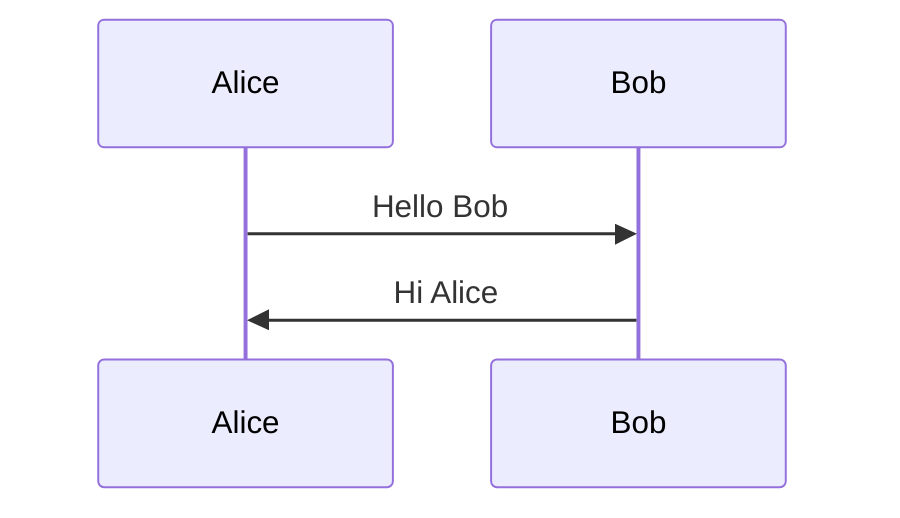
```

- [ ] **Step 2: Create test-seq-arrows.md**

```markdown
# Test: Arrow Styles

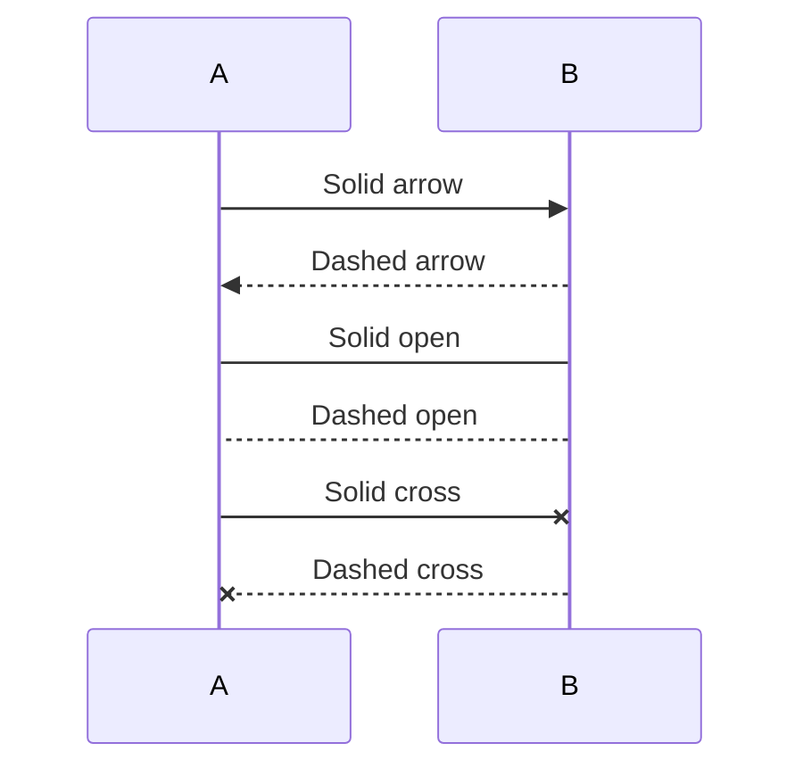
```

- [ ] **Step 3: Create test-seq-multi.md**

```markdown
# Test: Multiple Participants

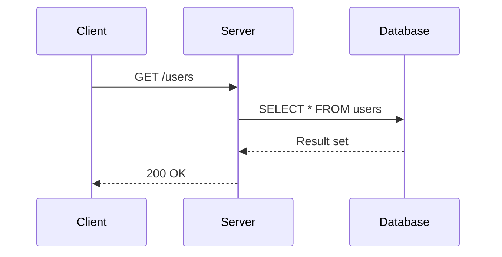
```

- [ ] **Step 4: Create test-seq-self.md**

```markdown
# Test: Self Message

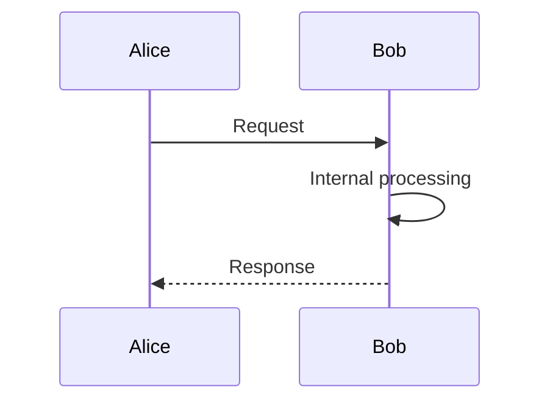
```

- [ ] **Step 5: Create test-seq-activate.md**

```markdown
# Test: Activation

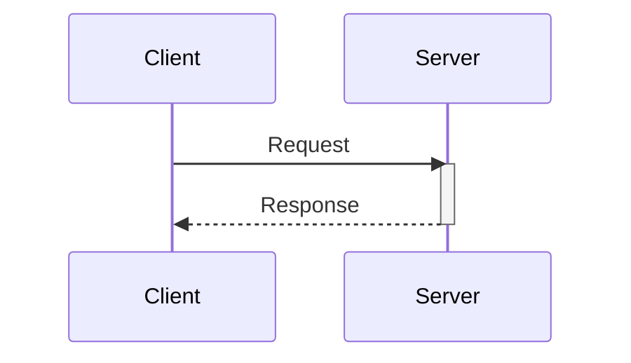
```

- [ ] **Step 6: Create test-seq-notes.md**

```markdown
# Test: Notes

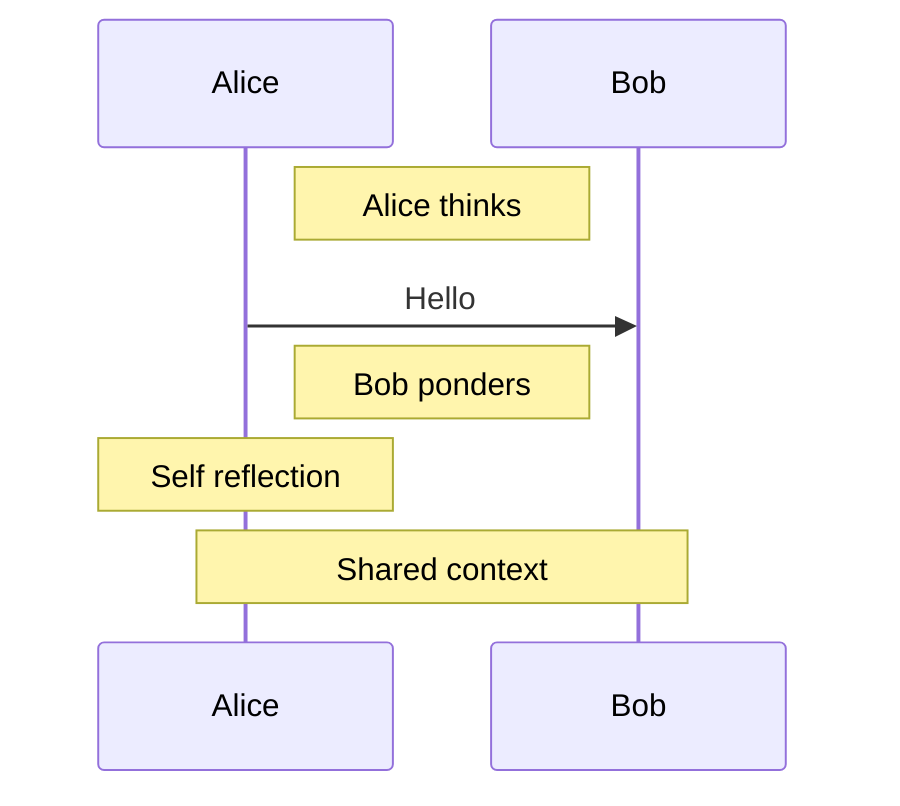
```

- [ ] **Step 7: Create test-seq-loop.md**

```markdown
# Test: Loop Fragment

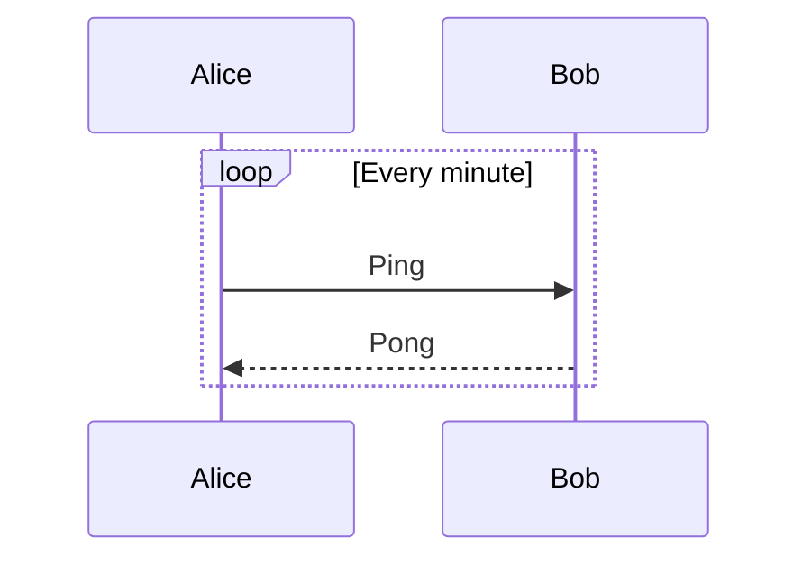
```

- [ ] **Step 8: Create test-seq-alt.md**

```markdown
# Test: Alt Fragment

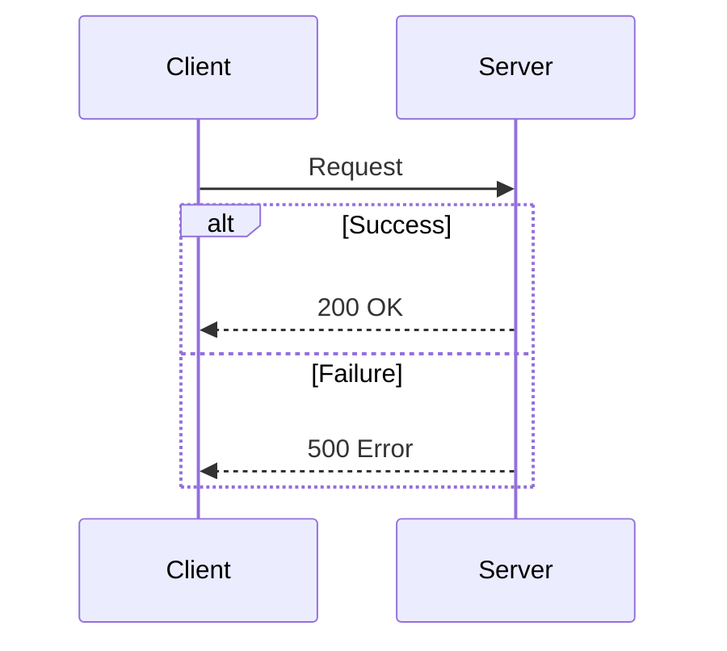
```

- [ ] **Step 9: Create test-seq-opt.md**

```markdown
# Test: Opt Fragment

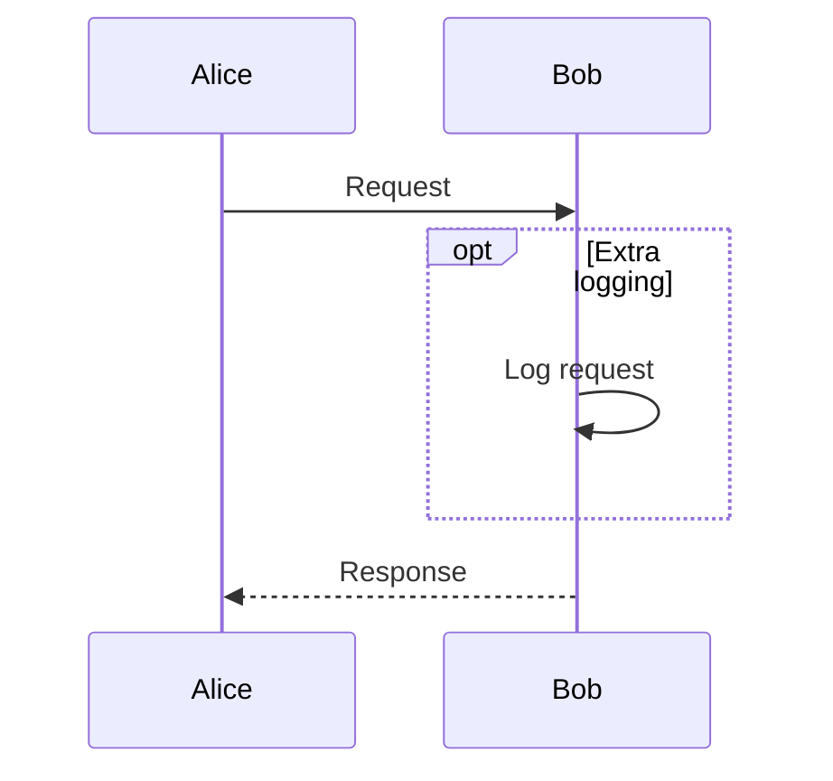
```

- [ ] **Step 10: Create test-seq-par.md**

```markdown
# Test: Par Fragment

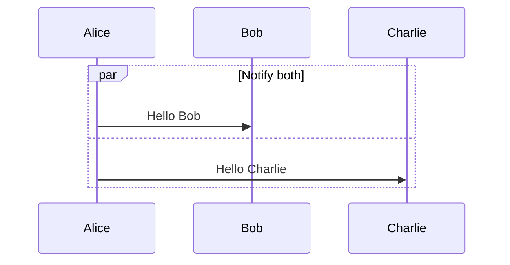
```

- [ ] **Step 11: Create test-seq-nested.md**

```markdown
# Test: Nested Fragments

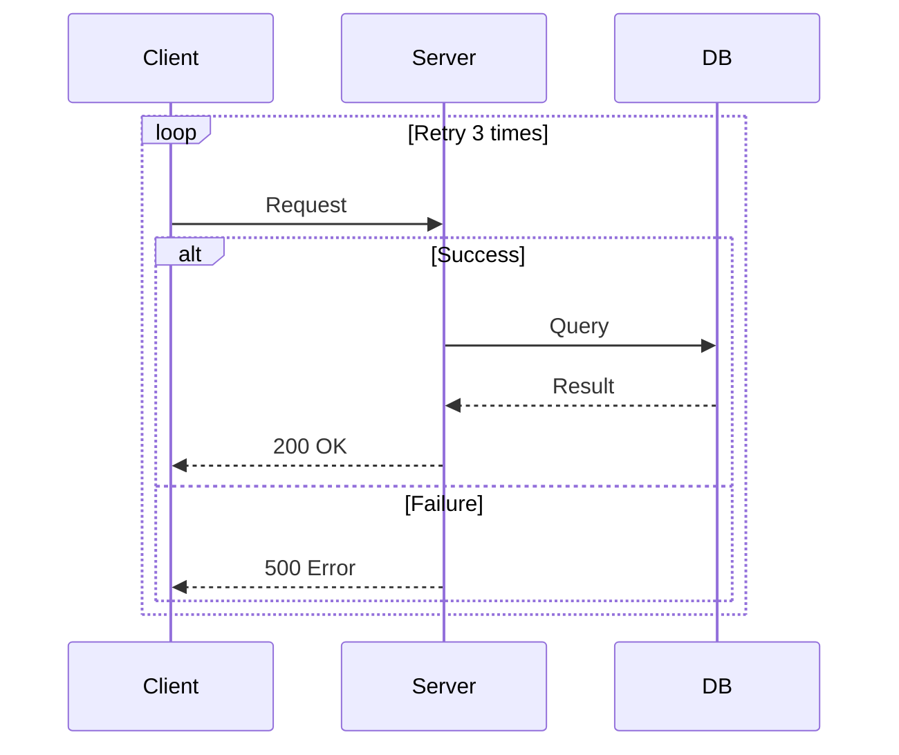
```

- [ ] **Step 12: Create test-seq-autonumber.md**

```markdown
# Test: Autonumber

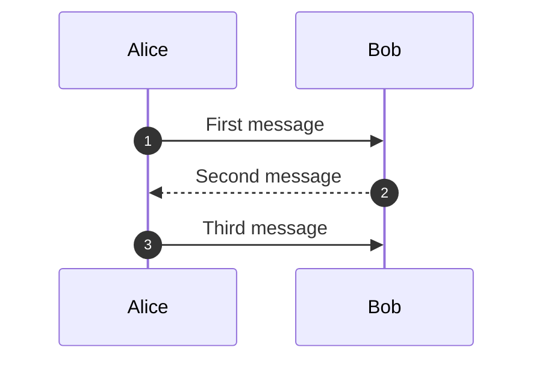
```

- [ ] **Step 13: Create test-seq-implicit.md**

```markdown
# Test: Implicit Participants

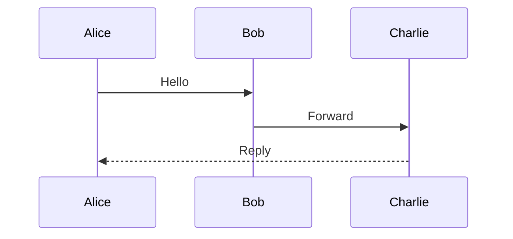
```

- [ ] **Step 14: Create test-seq-complex.md**

```markdown
# Test: Complex Sequence (API Auth Flow)

```mermaid
sequenceDiagram
    autonumber
    participant Client
    participant Gateway
    participant Auth
    participant API
    participant DB

    Client->>Gateway: POST /login
    Gateway->>Auth: Validate credentials
    activate Auth
    Auth->>DB: SELECT user
    DB-->>Auth: User record

    alt Valid credentials
        Auth->>Auth: Generate JWT
        Auth-->>Gateway: 200 + token
        deactivate Auth
        Gateway-->>Client: Set-Cookie: token

        Client->>Gateway: GET /data
        Gateway->>Auth: Verify token
        activate Auth
        Auth-->>Gateway: Token valid
        deactivate Auth
        Gateway->>API: Forward request
        activate API
        API->>DB: Query data
        DB-->>API: Results
        API-->>Gateway: 200 OK
        deactivate API
        Gateway-->>Client: 200 OK

    else Invalid credentials
        Auth-->>Gateway: 401 Unauthorized
        deactivate Auth
        Gateway-->>Client: 401 Unauthorized
    end

    Note over Client,Gateway: Connection closed
```
```

- [ ] **Step 15: Commit test fixtures**

```bash
git add docs/examples/test-seq-*.md
git commit -m "test: add 14 sequence diagram test fixtures"
```

---

### Task 2: Make Canvas pub(crate) and add sequence module skeleton

**Files:**
- Modify: `src/mermaid/ascii.rs:8` (Canvas visibility)
- Modify: `src/mermaid/mod.rs` (add module + dispatch)
- Create: `src/mermaid/sequence/mod.rs`
- Create: `src/mermaid/sequence/parse.rs`
- Create: `src/mermaid/sequence/layout.rs`
- Create: `src/mermaid/sequence/ascii.rs`

- [ ] **Step 1: Make Canvas pub(crate)**

In `src/mermaid/ascii.rs`, change line 8:

```rust
pub(crate) struct Canvas {
```

Also make the fields accessible — change `Canvas::new`, `Canvas::set`, `Canvas::draw_text`, `Canvas::to_lines` — they already have `pub` on the methods, but the struct itself needs `pub(crate)`. No method changes needed since they're `pub` within the `pub(crate)` struct.

- [ ] **Step 2: Create sequence/mod.rs with data structures**

Create `src/mermaid/sequence/mod.rs`:

```rust
pub mod ascii;
pub mod layout;
pub mod parse;

#[derive(Debug, Clone, PartialEq)]
pub struct SequenceDiagram {
    pub participants: Vec<Participant>,
    pub events: Vec<Event>,
    pub autonumber: bool,
}

#[derive(Debug, Clone, PartialEq)]
pub struct Participant {
    pub id: String,
    pub label: String,
}

#[derive(Debug, Clone, PartialEq)]
pub enum Event {
    Message {
        from: String,
        to: String,
        label: String,
        arrow: ArrowStyle,
    },
    Note {
        position: NotePosition,
        participants: Vec<String>,
        text: String,
    },
    Activate {
        participant: String,
    },
    Deactivate {
        participant: String,
    },
    Fragment {
        kind: FragmentKind,
        label: String,
        sections: Vec<FragmentSection>,
    },
}

#[derive(Debug, Clone, PartialEq)]
pub struct FragmentSection {
    pub label: Option<String>,
    pub events: Vec<Event>,
}

#[derive(Debug, Clone, PartialEq)]
pub enum ArrowStyle {
    SolidArrow,
    DashedArrow,
    SolidOpen,
    DashedOpen,
    SolidCross,
    DashedCross,
}

#[derive(Debug, Clone, PartialEq)]
pub enum NotePosition {
    RightOf,
    LeftOf,
    Over,
}

#[derive(Debug, Clone, PartialEq)]
pub enum FragmentKind {
    Loop,
    Alt,
    Opt,
    Par,
}
```

- [ ] **Step 3: Create sequence/parse.rs stub**

Create `src/mermaid/sequence/parse.rs`:

```rust
use anyhow::bail;

use super::{SequenceDiagram, Participant, Event};

pub fn parse_sequence(input: &str) -> anyhow::Result<SequenceDiagram> {
    let mut lines = input.lines().peekable();

    // First non-blank, non-comment line must be "sequenceDiagram"
    let found_header = loop {
        match lines.next() {
            None => break false,
            Some(line) => {
                let trimmed = line.trim();
                if trimmed.is_empty() || trimmed.starts_with("%%") {
                    continue;
                }
                break trimmed == "sequenceDiagram";
            }
        }
    };

    if !found_header {
        bail!("Expected 'sequenceDiagram' declaration");
    }

    Ok(SequenceDiagram {
        participants: vec![],
        events: vec![],
        autonumber: false,
    })
}
```

- [ ] **Step 4: Create sequence/layout.rs stub**

Create `src/mermaid/sequence/layout.rs`:

```rust
use super::{ArrowStyle, FragmentKind, NotePosition, SequenceDiagram};

#[derive(Debug, Clone)]
pub struct SequenceLayout {
    pub participants: Vec<PositionedParticipant>,
    pub messages: Vec<PositionedMessage>,
    pub notes: Vec<PositionedNote>,
    pub activations: Vec<PositionedActivation>,
    pub fragments: Vec<PositionedFragment>,
    pub width: usize,
    pub height: usize,
}

#[derive(Debug, Clone)]
pub struct PositionedParticipant {
    pub label: String,
    pub x: usize,
    pub y: usize,
    pub width: usize,
    pub center_x: usize,
}

#[derive(Debug, Clone)]
pub struct PositionedMessage {
    pub from_x: usize,
    pub to_x: usize,
    pub y: usize,
    pub label: String,
    pub arrow: ArrowStyle,
    pub self_message: bool,
}

#[derive(Debug, Clone)]
pub struct PositionedNote {
    pub x: usize,
    pub y: usize,
    pub width: usize,
    pub height: usize,
    pub text: String,
}

#[derive(Debug, Clone)]
pub struct PositionedActivation {
    pub x: usize,
    pub y_start: usize,
    pub y_end: usize,
}

#[derive(Debug, Clone)]
pub struct PositionedFragment {
    pub x: usize,
    pub y: usize,
    pub width: usize,
    pub height: usize,
    pub kind: FragmentKind,
    pub label: String,
    pub section_dividers: Vec<(usize, Option<String>)>,
}

pub fn layout(diagram: &SequenceDiagram) -> SequenceLayout {
    let _ = diagram;
    SequenceLayout {
        participants: vec![],
        messages: vec![],
        notes: vec![],
        activations: vec![],
        fragments: vec![],
        width: 0,
        height: 0,
    }
}
```

- [ ] **Step 5: Create sequence/ascii.rs stub**

Create `src/mermaid/sequence/ascii.rs`:

```rust
use super::layout::SequenceLayout;
use crate::mermaid::ascii::Canvas;

pub fn render(layout: &SequenceLayout) -> Vec<String> {
    if layout.width == 0 || layout.height == 0 {
        return vec![];
    }

    let canvas = Canvas::new(layout.width, layout.height);
    let mut lines = canvas.to_lines();
    while lines.last().map(|l| l.is_empty()).unwrap_or(false) {
        lines.pop();
    }
    lines
}
```

- [ ] **Step 6: Add module and dispatch to mermaid/mod.rs**

Replace the contents of `src/mermaid/mod.rs`:

```rust
pub mod ascii;
pub mod layout;
pub mod parse;
pub mod sequence;

#[derive(Debug, Clone, PartialEq)]
pub enum Direction {
    TopDown,
    BottomTop,
    LeftRight,
    RightLeft,
}

#[derive(Debug, Clone, PartialEq)]
pub enum NodeShape {
    Rect,
    Rounded,
    Diamond,
    Circle,
}

#[derive(Debug, Clone, PartialEq)]
pub enum EdgeStyle {
    Arrow,
    Line,
    Dotted,
    Thick,
}

#[derive(Debug, Clone, PartialEq)]
pub struct Node {
    pub id: String,
    pub label: String,
    pub shape: NodeShape,
}

#[derive(Debug, Clone, PartialEq)]
pub struct Edge {
    pub from: String,
    pub to: String,
    pub label: Option<String>,
    pub style: EdgeStyle,
}

#[derive(Debug, Clone, PartialEq)]
pub struct FlowChart {
    pub direction: Direction,
    pub nodes: Vec<Node>,
    pub edges: Vec<Edge>,
}

/// Returns (ascii_lines, node_count, edge_count)
pub fn render_mermaid(content: &str) -> anyhow::Result<(Vec<String>, usize, usize)> {
    // Detect diagram type from first non-blank, non-comment line
    let first_line = content
        .lines()
        .map(|l| l.trim())
        .find(|l| !l.is_empty() && !l.starts_with("%%"))
        .unwrap_or("");

    if first_line == "sequenceDiagram" {
        let diagram = sequence::parse::parse_sequence(content)?;
        let participant_count = diagram.participants.len();
        let event_count = diagram.events.len();
        let laid_out = sequence::layout::layout(&diagram);
        let lines = sequence::ascii::render(&laid_out);
        Ok((lines, participant_count, event_count))
    } else {
        let chart = parse::parse_flowchart(content)?;
        let node_count = chart.nodes.len();
        let edge_count = chart.edges.len();
        let positioned = layout::layout(&chart);
        let lines = ascii::render(&positioned);
        Ok((lines, node_count, edge_count))
    }
}
```

- [ ] **Step 7: Build and run tests**

```bash
cargo build
cargo test
```

Expected: compiles, all 59 existing tests pass. Running `mdx docs/examples/test-seq-basic.md --no-pager` should produce empty diagram output (stub returns empty).

- [ ] **Step 8: Commit**

```bash
git add src/mermaid/ascii.rs src/mermaid/mod.rs src/mermaid/sequence/
git commit -m "feat: add sequence diagram module skeleton with dispatch"
```

---

### Task 3: Parse participants and basic messages

**Files:**
- Modify: `src/mermaid/sequence/parse.rs`
- Test: `src/mermaid/sequence/parse.rs` (inline tests)

- [ ] **Step 1: Write failing tests for participant parsing and basic messages**

Add to the bottom of `src/mermaid/sequence/parse.rs`:

```rust
#[cfg(test)]
mod tests {
    use super::*;
    use crate::mermaid::sequence::{ArrowStyle, Event, Participant};

    #[test]
    fn test_parse_explicit_participants() {
        let input = "sequenceDiagram\n    participant A as Alice\n    participant B as Bob\n";
        let diagram = parse_sequence(input).unwrap();
        assert_eq!(diagram.participants.len(), 2);
        assert_eq!(diagram.participants[0].id, "A");
        assert_eq!(diagram.participants[0].label, "Alice");
        assert_eq!(diagram.participants[1].id, "B");
        assert_eq!(diagram.participants[1].label, "Bob");
    }

    #[test]
    fn test_parse_participant_no_alias() {
        let input = "sequenceDiagram\n    participant Alice\n";
        let diagram = parse_sequence(input).unwrap();
        assert_eq!(diagram.participants[0].id, "Alice");
        assert_eq!(diagram.participants[0].label, "Alice");
    }

    #[test]
    fn test_parse_actor_treated_as_participant() {
        let input = "sequenceDiagram\n    actor A as Alice\n";
        let diagram = parse_sequence(input).unwrap();
        assert_eq!(diagram.participants[0].id, "A");
        assert_eq!(diagram.participants[0].label, "Alice");
    }

    #[test]
    fn test_parse_solid_arrow_message() {
        let input = "sequenceDiagram\n    participant A\n    participant B\n    A->>B: Hello\n";
        let diagram = parse_sequence(input).unwrap();
        assert_eq!(diagram.events.len(), 1);
        if let Event::Message { from, to, label, arrow } = &diagram.events[0] {
            assert_eq!(from, "A");
            assert_eq!(to, "B");
            assert_eq!(label, "Hello");
            assert_eq!(*arrow, ArrowStyle::SolidArrow);
        } else {
            panic!("Expected Message event");
        }
    }

    #[test]
    fn test_parse_all_arrow_styles() {
        let input = "\
sequenceDiagram
    participant A
    participant B
    A->>B: solid arrow
    B-->>A: dashed arrow
    A->B: solid open
    B-->A: dashed open
    A-xB: solid cross
    B--xA: dashed cross
";
        let diagram = parse_sequence(input).unwrap();
        assert_eq!(diagram.events.len(), 6);

        let arrows: Vec<ArrowStyle> = diagram.events.iter().map(|e| {
            if let Event::Message { arrow, .. } = e { arrow.clone() } else { panic!() }
        }).collect();

        assert_eq!(arrows, vec![
            ArrowStyle::SolidArrow,
            ArrowStyle::DashedArrow,
            ArrowStyle::SolidOpen,
            ArrowStyle::DashedOpen,
            ArrowStyle::SolidCross,
            ArrowStyle::DashedCross,
        ]);
    }

    #[test]
    fn test_parse_implicit_participants() {
        let input = "sequenceDiagram\n    Alice->>Bob: Hello\n    Bob->>Charlie: Forward\n";
        let diagram = parse_sequence(input).unwrap();
        assert_eq!(diagram.participants.len(), 3);
        assert_eq!(diagram.participants[0].id, "Alice");
        assert_eq!(diagram.participants[1].id, "Bob");
        assert_eq!(diagram.participants[2].id, "Charlie");
    }

    #[test]
    fn test_parse_comments_ignored() {
        let input = "sequenceDiagram\n    %% this is a comment\n    participant A\n";
        let diagram = parse_sequence(input).unwrap();
        assert_eq!(diagram.participants.len(), 1);
    }

    #[test]
    fn test_parse_missing_header() {
        let input = "graph TD\n    A --> B\n";
        let result = parse_sequence(input);
        assert!(result.is_err());
    }
}
```

- [ ] **Step 2: Run tests to verify they fail**

```bash
cargo test --lib mermaid::sequence::parse::tests
```

Expected: tests fail (parser stub returns empty diagram).

- [ ] **Step 3: Implement participant and message parsing**

Replace the body of `parse_sequence` in `src/mermaid/sequence/parse.rs`:

```rust
use std::collections::HashMap;

use anyhow::{bail, Context};

use super::{
    ArrowStyle, Event, FragmentKind, FragmentSection, NotePosition, Participant, SequenceDiagram,
};

pub fn parse_sequence(input: &str) -> anyhow::Result<SequenceDiagram> {
    let mut lines = input.lines().peekable();

    // First non-blank, non-comment line must be "sequenceDiagram"
    let found_header = loop {
        match lines.next() {
            None => break false,
            Some(line) => {
                let trimmed = line.trim();
                if trimmed.is_empty() || trimmed.starts_with("%%") {
                    continue;
                }
                break trimmed == "sequenceDiagram";
            }
        }
    };

    if !found_header {
        bail!("Expected 'sequenceDiagram' declaration");
    }

    let mut participant_order: Vec<String> = Vec::new();
    let mut participant_map: HashMap<String, Participant> = HashMap::new();
    let mut events: Vec<Event> = Vec::new();
    let mut autonumber = false;

    let remaining: Vec<&str> = lines.collect();
    parse_events(
        &remaining,
        &mut participant_order,
        &mut participant_map,
        &mut events,
        &mut autonumber,
    )?;

    let participants: Vec<Participant> = participant_order
        .iter()
        .map(|id| participant_map[id].clone())
        .collect();

    Ok(SequenceDiagram {
        participants,
        events,
        autonumber,
    })
}

fn register_participant(
    id: &str,
    label: &str,
    order: &mut Vec<String>,
    map: &mut HashMap<String, Participant>,
) {
    if !map.contains_key(id) {
        order.push(id.to_string());
        map.insert(
            id.to_string(),
            Participant {
                id: id.to_string(),
                label: label.to_string(),
            },
        );
    }
}

fn parse_events(
    lines: &[&str],
    participant_order: &mut Vec<String>,
    participant_map: &mut HashMap<String, Participant>,
    events: &mut Vec<Event>,
    autonumber: &mut bool,
) -> anyhow::Result<()> {
    let mut i = 0;
    let mut fragment_stack: Vec<(FragmentKind, String, Vec<FragmentSection>)> = Vec::new();

    while i < lines.len() {
        let trimmed = lines[i].trim();
        i += 1;

        if trimmed.is_empty() || trimmed.starts_with("%%") {
            continue;
        }

        if trimmed == "autonumber" {
            *autonumber = true;
            continue;
        }

        // participant / actor
        if let Some(rest) = trimmed
            .strip_prefix("participant ")
            .or_else(|| trimmed.strip_prefix("actor "))
        {
            let rest = rest.trim();
            if let Some(as_pos) = rest.find(" as ") {
                let id = rest[..as_pos].trim();
                let label = rest[as_pos + 4..].trim();
                register_participant(id, label, participant_order, participant_map);
            } else {
                register_participant(rest, rest, participant_order, participant_map);
            }
            continue;
        }

        // activate / deactivate
        if let Some(rest) = trimmed.strip_prefix("activate ") {
            let participant = rest.trim().to_string();
            let event = Event::Activate { participant };
            push_event(&mut fragment_stack, events, event);
            continue;
        }
        if let Some(rest) = trimmed.strip_prefix("deactivate ") {
            let participant = rest.trim().to_string();
            let event = Event::Deactivate { participant };
            push_event(&mut fragment_stack, events, event);
            continue;
        }

        // Note
        if trimmed.starts_with("Note ") {
            let event = parse_note(trimmed)
                .with_context(|| format!("Failed to parse note: {:?}", trimmed))?;
            push_event(&mut fragment_stack, events, event);
            continue;
        }

        // Fragment start: loop, alt, opt, par
        if let Some(rest) = trimmed.strip_prefix("loop ") {
            let label = rest.trim().to_string();
            let first_section = FragmentSection { label: None, events: vec![] };
            fragment_stack.push((FragmentKind::Loop, label, vec![first_section]));
            continue;
        }
        if let Some(rest) = trimmed.strip_prefix("alt ") {
            let label = rest.trim().to_string();
            let first_section = FragmentSection { label: None, events: vec![] };
            fragment_stack.push((FragmentKind::Alt, label, vec![first_section]));
            continue;
        }
        if let Some(rest) = trimmed.strip_prefix("opt ") {
            let label = rest.trim().to_string();
            let first_section = FragmentSection { label: None, events: vec![] };
            fragment_stack.push((FragmentKind::Opt, label, vec![first_section]));
            continue;
        }
        if let Some(rest) = trimmed.strip_prefix("par ") {
            let label = rest.trim().to_string();
            let first_section = FragmentSection { label: None, events: vec![] };
            fragment_stack.push((FragmentKind::Par, label, vec![first_section]));
            continue;
        }

        // else / and (new section in current fragment)
        if trimmed.starts_with("else") || trimmed.starts_with("and") {
            if let Some((_kind, _label, sections)) = fragment_stack.last_mut() {
                let section_label = if trimmed == "else" || trimmed == "and" {
                    None
                } else if let Some(rest) = trimmed.strip_prefix("else ") {
                    Some(rest.trim().to_string())
                } else if let Some(rest) = trimmed.strip_prefix("and ") {
                    Some(rest.trim().to_string())
                } else {
                    None
                };
                sections.push(FragmentSection {
                    label: section_label,
                    events: vec![],
                });
            }
            continue;
        }

        // end (close fragment)
        if trimmed == "end" {
            if let Some((kind, label, sections)) = fragment_stack.pop() {
                let event = Event::Fragment { kind, label, sections };
                push_event(&mut fragment_stack, events, event);
            }
            continue;
        }

        // Message: try to parse A->>B: text
        if let Some(event) = try_parse_message(trimmed, participant_order, participant_map) {
            push_event(&mut fragment_stack, events, event);
            continue;
        }

        // Unknown line — skip silently
    }

    Ok(())
}

fn push_event(
    fragment_stack: &mut [(FragmentKind, String, Vec<FragmentSection>)],
    top_events: &mut Vec<Event>,
    event: Event,
) {
    if let Some((_kind, _label, sections)) = fragment_stack.last_mut() {
        if let Some(section) = sections.last_mut() {
            section.events.push(event);
        }
    } else {
        top_events.push(event);
    }
}

fn parse_note(line: &str) -> anyhow::Result<Event> {
    // "Note right of A: text"
    // "Note left of A: text"
    // "Note over A: text"
    // "Note over A,B: text"
    let rest = line.strip_prefix("Note ").unwrap();

    let (position, after_pos) = if let Some(r) = rest.strip_prefix("right of ") {
        (NotePosition::RightOf, r)
    } else if let Some(r) = rest.strip_prefix("left of ") {
        (NotePosition::LeftOf, r)
    } else if let Some(r) = rest.strip_prefix("over ") {
        (NotePosition::Over, r)
    } else {
        bail!("Unknown note position in: {:?}", line);
    };

    let colon_pos = after_pos
        .find(':')
        .with_context(|| format!("Note missing ':' in: {:?}", line))?;
    let participant_str = after_pos[..colon_pos].trim();
    let text = after_pos[colon_pos + 1..].trim().to_string();

    let participants: Vec<String> = participant_str
        .split(',')
        .map(|s| s.trim().to_string())
        .collect();

    Ok(Event::Note {
        position,
        participants,
        text,
    })
}

const ARROW_PATTERNS: &[(&str, ArrowStyle)] = &[
    ("-->>", ArrowStyle::DashedArrow),
    ("->>", ArrowStyle::SolidArrow),
    ("-->", ArrowStyle::DashedOpen),
    ("--x", ArrowStyle::DashedCross),
    ("->", ArrowStyle::SolidOpen),
    ("-x", ArrowStyle::SolidCross),
];

fn try_parse_message(
    line: &str,
    participant_order: &mut Vec<String>,
    participant_map: &mut HashMap<String, Participant>,
) -> Option<Event> {
    for (pattern, style) in ARROW_PATTERNS {
        if let Some(arrow_pos) = line.find(pattern) {
            let from = line[..arrow_pos].trim();
            let after_arrow = &line[arrow_pos + pattern.len()..];

            // After arrow: "B: message text"
            let colon_pos = after_arrow.find(':')?;
            let to = after_arrow[..colon_pos].trim();
            let label = after_arrow[colon_pos + 1..].trim();

            if from.is_empty() || to.is_empty() {
                return None;
            }

            // Register implicit participants
            register_participant(from, from, participant_order, participant_map);
            register_participant(to, to, participant_order, participant_map);

            return Some(Event::Message {
                from: from.to_string(),
                to: to.to_string(),
                label: label.to_string(),
                arrow: style.clone(),
            });
        }
    }
    None
}
```

- [ ] **Step 4: Run tests to verify they pass**

```bash
cargo test --lib mermaid::sequence::parse::tests
```

Expected: all 8 tests pass.

- [ ] **Step 5: Commit**

```bash
git add src/mermaid/sequence/parse.rs
git commit -m "feat: implement sequence diagram parser with participants, messages, notes, fragments"
```

---

### Task 4: Layout engine — participant columns and basic messages

**Files:**
- Modify: `src/mermaid/sequence/layout.rs`

- [ ] **Step 1: Write failing layout tests**

Add to the bottom of `src/mermaid/sequence/layout.rs`:

```rust
#[cfg(test)]
mod tests {
    use super::*;
    use crate::mermaid::sequence::{ArrowStyle, Event, Participant, SequenceDiagram};

    fn make_diagram(participants: Vec<(&str, &str)>, events: Vec<Event>) -> SequenceDiagram {
        SequenceDiagram {
            participants: participants
                .into_iter()
                .map(|(id, label)| Participant {
                    id: id.to_string(),
                    label: label.to_string(),
                })
                .collect(),
            events,
            autonumber: false,
        }
    }

    #[test]
    fn test_two_participants_positioned() {
        let diagram = make_diagram(
            vec![("A", "Alice"), ("B", "Bob")],
            vec![],
        );
        let result = layout(&diagram);
        assert_eq!(result.participants.len(), 2);
        assert!(
            result.participants[0].center_x < result.participants[1].center_x,
            "Alice should be left of Bob"
        );
    }

    #[test]
    fn test_three_participants_ordered() {
        let diagram = make_diagram(
            vec![("A", "Alice"), ("B", "Bob"), ("C", "Charlie")],
            vec![],
        );
        let result = layout(&diagram);
        assert!(result.participants[0].center_x < result.participants[1].center_x);
        assert!(result.participants[1].center_x < result.participants[2].center_x);
    }

    #[test]
    fn test_message_between_participants() {
        let diagram = make_diagram(
            vec![("A", "Alice"), ("B", "Bob")],
            vec![Event::Message {
                from: "A".to_string(),
                to: "B".to_string(),
                label: "Hello".to_string(),
                arrow: ArrowStyle::SolidArrow,
            }],
        );
        let result = layout(&diagram);
        assert_eq!(result.messages.len(), 1);
        assert!(result.messages[0].from_x < result.messages[0].to_x);
        assert!(result.height > 0);
    }

    #[test]
    fn test_self_message_detected() {
        let diagram = make_diagram(
            vec![("A", "Alice")],
            vec![Event::Message {
                from: "A".to_string(),
                to: "A".to_string(),
                label: "Think".to_string(),
                arrow: ArrowStyle::SolidArrow,
            }],
        );
        let result = layout(&diagram);
        assert_eq!(result.messages.len(), 1);
        assert!(result.messages[0].self_message);
    }

    #[test]
    fn test_layout_dimensions_nonzero() {
        let diagram = make_diagram(
            vec![("A", "Alice"), ("B", "Bob")],
            vec![Event::Message {
                from: "A".to_string(),
                to: "B".to_string(),
                label: "Hello".to_string(),
                arrow: ArrowStyle::SolidArrow,
            }],
        );
        let result = layout(&diagram);
        assert!(result.width > 0, "Width should be > 0");
        assert!(result.height > 0, "Height should be > 0");
    }
}
```

- [ ] **Step 2: Run tests to verify they fail**

```bash
cargo test --lib mermaid::sequence::layout::tests
```

Expected: fail (stub returns empty layout).

- [ ] **Step 3: Implement layout for participants and messages**

Replace the `layout` function and add helpers in `src/mermaid/sequence/layout.rs`:

```rust
use std::collections::HashMap;

use super::{ArrowStyle, Event, FragmentKind, NotePosition, SequenceDiagram};

// ... keep all the struct definitions from the stub ...

const PARTICIPANT_PADDING: usize = 4;
const MIN_COLUMN_GAP: usize = 16;
const PARTICIPANT_BOX_HEIGHT: usize = 3;
const MESSAGE_HEIGHT: usize = 2;
const SELF_MESSAGE_HEIGHT: usize = 3;

pub fn layout(diagram: &SequenceDiagram) -> SequenceLayout {
    if diagram.participants.is_empty() {
        return SequenceLayout {
            participants: vec![],
            messages: vec![],
            notes: vec![],
            activations: vec![],
            fragments: vec![],
            width: 0,
            height: 0,
        };
    }

    // Build participant index
    let participant_index: HashMap<&str, usize> = diagram
        .participants
        .iter()
        .enumerate()
        .map(|(i, p)| (p.id.as_str(), i))
        .collect();

    let n = diagram.participants.len();

    // Compute column widths: each participant box width = label + padding
    let box_widths: Vec<usize> = diagram
        .participants
        .iter()
        .map(|p| p.label.len() + PARTICIPANT_PADDING)
        .collect();

    // Compute minimum gap between adjacent participants based on message labels
    let mut neighbor_gaps = vec![MIN_COLUMN_GAP; n.saturating_sub(1)];
    compute_message_gaps(
        &diagram.events,
        &participant_index,
        &box_widths,
        &mut neighbor_gaps,
    );

    // Assign x positions
    let mut center_xs: Vec<usize> = vec![0; n];
    center_xs[0] = box_widths[0] / 2;
    for i in 1..n {
        let prev_right = center_xs[i - 1] + box_widths[i - 1] / 2;
        let gap = neighbor_gaps[i - 1];
        center_xs[i] = prev_right + gap + box_widths[i] / 2;
    }

    let positioned_participants: Vec<PositionedParticipant> = diagram
        .participants
        .iter()
        .enumerate()
        .map(|(i, p)| PositionedParticipant {
            label: p.label.clone(),
            x: center_xs[i] - box_widths[i] / 2,
            y: 0,
            width: box_widths[i],
            center_x: center_xs[i],
        })
        .collect();

    // Vertical pass: walk events and assign y positions
    let mut current_y = PARTICIPANT_BOX_HEIGHT + 1;
    let mut messages = Vec::new();
    let mut notes = Vec::new();
    let mut activations = Vec::new();
    let mut fragments = Vec::new();
    let mut activation_stack: HashMap<String, Vec<usize>> = HashMap::new();

    layout_events(
        &diagram.events,
        &participant_index,
        &center_xs,
        &box_widths,
        &mut current_y,
        &mut messages,
        &mut notes,
        &mut activations,
        &mut fragments,
        &mut activation_stack,
    );

    let total_width = positioned_participants
        .last()
        .map(|p| p.x + p.width)
        .unwrap_or(0)
        + 2;

    let total_height = current_y + 1;

    SequenceLayout {
        participants: positioned_participants,
        messages,
        notes,
        activations,
        fragments,
        width: total_width,
        height: total_height,
    }
}

fn compute_message_gaps(
    events: &[Event],
    participant_index: &HashMap<&str, usize>,
    box_widths: &[usize],
    neighbor_gaps: &mut [usize],
) {
    for event in events {
        match event {
            Event::Message { from, to, label, .. } => {
                if let (Some(&fi), Some(&ti)) =
                    (participant_index.get(from.as_str()), participant_index.get(to.as_str()))
                {
                    if fi != ti {
                        let (lo, hi) = if fi < ti { (fi, ti) } else { (ti, fi) };
                        // Label must fit between the two participants
                        let needed = label.len() + 4;
                        // Distribute across the gaps between lo and hi
                        let gap_count = hi - lo;
                        let per_gap = (needed + gap_count - 1) / gap_count;
                        for g in lo..hi {
                            neighbor_gaps[g] = neighbor_gaps[g].max(per_gap);
                        }
                    }
                }
            }
            Event::Fragment { sections, .. } => {
                for section in sections {
                    compute_message_gaps(
                        &section.events,
                        participant_index,
                        box_widths,
                        neighbor_gaps,
                    );
                }
            }
            _ => {}
        }
    }
}

fn layout_events(
    events: &[Event],
    participant_index: &HashMap<&str, usize>,
    center_xs: &[usize],
    box_widths: &[usize],
    current_y: &mut usize,
    messages: &mut Vec<PositionedMessage>,
    notes: &mut Vec<PositionedNote>,
    activations: &mut Vec<PositionedActivation>,
    fragments: &mut Vec<PositionedFragment>,
    activation_stack: &mut HashMap<String, Vec<usize>>,
) {
    for event in events {
        match event {
            Event::Message { from, to, label, arrow } => {
                let self_message = from == to;
                let from_idx = participant_index.get(from.as_str()).copied().unwrap_or(0);
                let to_idx = participant_index.get(to.as_str()).copied().unwrap_or(0);

                let from_x = center_xs[from_idx];
                let to_x = center_xs[to_idx];

                messages.push(PositionedMessage {
                    from_x,
                    to_x,
                    y: *current_y,
                    label: label.clone(),
                    arrow: arrow.clone(),
                    self_message,
                });

                *current_y += if self_message {
                    SELF_MESSAGE_HEIGHT
                } else {
                    MESSAGE_HEIGHT
                };
            }
            Event::Note { position, participants, text } => {
                let first_idx = participants
                    .first()
                    .and_then(|p| participant_index.get(p.as_str()).copied())
                    .unwrap_or(0);

                let note_width = text.len() + 4;
                let note_height = 3;

                let x = match position {
                    NotePosition::RightOf => center_xs[first_idx] + 2,
                    NotePosition::LeftOf => center_xs[first_idx].saturating_sub(note_width + 2),
                    NotePosition::Over => {
                        if participants.len() >= 2 {
                            let last_idx = participants
                                .last()
                                .and_then(|p| participant_index.get(p.as_str()).copied())
                                .unwrap_or(first_idx);
                            let mid = (center_xs[first_idx] + center_xs[last_idx]) / 2;
                            mid.saturating_sub(note_width / 2)
                        } else {
                            center_xs[first_idx].saturating_sub(note_width / 2)
                        }
                    }
                };

                notes.push(PositionedNote {
                    x,
                    y: *current_y,
                    width: note_width,
                    height: note_height,
                    text: text.clone(),
                });
                *current_y += note_height;
            }
            Event::Activate { participant } => {
                activation_stack
                    .entry(participant.clone())
                    .or_default()
                    .push(*current_y);
            }
            Event::Deactivate { participant } => {
                if let Some(stack) = activation_stack.get_mut(participant.as_str()) {
                    if let Some(y_start) = stack.pop() {
                        let idx = participant_index
                            .get(participant.as_str())
                            .copied()
                            .unwrap_or(0);
                        activations.push(PositionedActivation {
                            x: center_xs[idx],
                            y_start,
                            y_end: *current_y,
                        });
                    }
                }
            }
            Event::Fragment { kind, label, sections } => {
                let frag_y = *current_y;
                *current_y += 1; // header row

                let mut section_dividers = Vec::new();

                for (s_idx, section) in sections.iter().enumerate() {
                    if s_idx > 0 {
                        section_dividers.push((*current_y, section.label.clone()));
                        *current_y += 1; // divider row
                    }
                    layout_events(
                        &section.events,
                        participant_index,
                        center_xs,
                        box_widths,
                        current_y,
                        messages,
                        notes,
                        activations,
                        fragments,
                        activation_stack,
                    );
                }

                *current_y += 1; // footer row

                // Fragment spans all participants (simplified)
                let frag_x = center_xs
                    .first()
                    .copied()
                    .unwrap_or(0)
                    .saturating_sub(box_widths[0] / 2 + 1);
                let last_idx = center_xs.len() - 1;
                let frag_right = center_xs[last_idx] + box_widths[last_idx] / 2 + 1;
                let frag_width = frag_right.saturating_sub(frag_x) + 1;

                fragments.push(PositionedFragment {
                    x: frag_x,
                    y: frag_y,
                    width: frag_width,
                    height: *current_y - frag_y,
                    kind: kind.clone(),
                    label: label.clone(),
                    section_dividers,
                });
            }
        }
    }
}
```

- [ ] **Step 4: Run tests to verify they pass**

```bash
cargo test --lib mermaid::sequence::layout::tests
```

Expected: all 5 tests pass.

- [ ] **Step 5: Commit**

```bash
git add src/mermaid/sequence/layout.rs
git commit -m "feat: implement sequence diagram layout engine"
```

---

### Task 5: ASCII renderer — lifelines, participant boxes, and messages

**Files:**
- Modify: `src/mermaid/sequence/ascii.rs`

- [ ] **Step 1: Write failing render test**

Add to the bottom of `src/mermaid/sequence/ascii.rs`:

```rust
#[cfg(test)]
mod tests {
    use super::*;
    use crate::mermaid::sequence::{
        parse::parse_sequence,
        layout::layout as seq_layout,
    };

    fn render_fixture(input: &str) -> String {
        let diagram = parse_sequence(input).unwrap();
        let laid_out = seq_layout(&diagram);
        let lines = render(&laid_out);
        lines.join("\n")
    }

    #[test]
    fn test_basic_render_has_participants() {
        let output = render_fixture(
            "sequenceDiagram\n    participant Alice\n    participant Bob\n    Alice->>Bob: Hello\n",
        );
        assert!(output.contains("Alice"), "Should contain participant Alice");
        assert!(output.contains("Bob"), "Should contain participant Bob");
    }

    #[test]
    fn test_basic_render_has_message_label() {
        let output = render_fixture(
            "sequenceDiagram\n    participant Alice\n    participant Bob\n    Alice->>Bob: Hello\n",
        );
        assert!(output.contains("Hello"), "Should contain message label");
    }

    #[test]
    fn test_render_has_arrow_chars() {
        let output = render_fixture(
            "sequenceDiagram\n    participant A\n    participant B\n    A->>B: Test\n",
        );
        // Should contain arrow characters (>> for solid arrow)
        assert!(
            output.contains(">>") || output.contains("─"),
            "Should contain arrow characters"
        );
    }

    #[test]
    fn test_render_has_lifelines() {
        let output = render_fixture(
            "sequenceDiagram\n    participant A\n    participant B\n    A->>B: Test\n",
        );
        // Lifelines are dashed vertical lines (│ characters below participant boxes)
        let lines: Vec<&str> = output.lines().collect();
        // Lines below the participant box row should have │ for lifelines
        assert!(
            lines.iter().any(|l| l.contains('│')),
            "Should contain lifeline characters"
        );
    }
}
```

- [ ] **Step 2: Run tests to verify they fail**

```bash
cargo test --lib mermaid::sequence::ascii::tests
```

Expected: fail (stub renders empty canvas).

- [ ] **Step 3: Implement the renderer**

Replace `src/mermaid/sequence/ascii.rs`:

```rust
use super::layout::{
    PositionedActivation, PositionedFragment, PositionedMessage, PositionedNote,
    PositionedParticipant, SequenceLayout,
};
use crate::mermaid::ascii::Canvas;
use crate::mermaid::sequence::ArrowStyle;

pub fn render(layout: &SequenceLayout) -> Vec<String> {
    if layout.width == 0 || layout.height == 0 {
        return vec![];
    }

    let mut canvas = Canvas::new(layout.width + 4, layout.height + 2);

    // 1. Draw lifelines (dashed vertical lines)
    for p in &layout.participants {
        for y in (p.y + 3)..layout.height {
            canvas.set(p.center_x, y, '│');
        }
    }

    // 2. Draw activations
    for act in &layout.activations {
        draw_activation(&mut canvas, act);
    }

    // 3. Draw fragments
    for frag in &layout.fragments {
        draw_fragment(&mut canvas, frag);
    }

    // 4. Draw messages
    for msg in &layout.messages {
        draw_message(&mut canvas, msg);
    }

    // 5. Draw notes
    for note in &layout.notes {
        draw_note(&mut canvas, note);
    }

    // 6. Draw participant boxes last (on top)
    for p in &layout.participants {
        draw_participant_box(&mut canvas, p);
    }

    let mut lines = canvas.to_lines();
    while lines.last().map(|l| l.is_empty()).unwrap_or(false) {
        lines.pop();
    }
    lines
}

fn draw_participant_box(canvas: &mut Canvas, p: &PositionedParticipant) {
    let x = p.x;
    let y = p.y;
    let w = p.width;

    // Clear area
    for row in 0..3 {
        for col in 0..w {
            canvas.set(x + col, y + row, ' ');
        }
    }

    // Top border
    canvas.set(x, y, '┌');
    for i in 1..w - 1 {
        canvas.set(x + i, y, '─');
    }
    canvas.set(x + w - 1, y, '┐');

    // Middle: borders + label
    canvas.set(x, y + 1, '│');
    canvas.set(x + w - 1, y + 1, '│');
    let label_x = x + (w - p.label.len()) / 2;
    canvas.draw_text(label_x, y + 1, &p.label);

    // Bottom border
    canvas.set(x, y + 2, '└');
    for i in 1..w - 1 {
        canvas.set(x + i, y + 2, '─');
    }
    canvas.set(x + w - 1, y + 2, '┘');
}

fn draw_message(canvas: &mut Canvas, msg: &PositionedMessage) {
    if msg.self_message {
        draw_self_message(canvas, msg);
        return;
    }

    let left_to_right = msg.from_x < msg.to_x;
    let (x_start, x_end) = if left_to_right {
        (msg.from_x + 1, msg.to_x - 1)
    } else {
        (msg.to_x + 1, msg.from_x - 1)
    };

    let is_dashed = matches!(
        msg.arrow,
        ArrowStyle::DashedArrow | ArrowStyle::DashedOpen | ArrowStyle::DashedCross
    );

    // Draw label above arrow line
    let label_y = msg.y;
    let arrow_y = msg.y + 1;
    let mid_x = (x_start + x_end) / 2;
    let label_x = mid_x.saturating_sub(msg.label.len() / 2);
    canvas.draw_text(label_x, label_y, &msg.label);

    // Draw arrow line
    if is_dashed {
        let mut x = x_start;
        while x <= x_end {
            canvas.set(x, arrow_y, '─');
            if x + 1 <= x_end {
                canvas.set(x + 1, arrow_y, ' ');
            }
            x += 2;
        }
    } else {
        for x in x_start..=x_end {
            canvas.set(x, arrow_y, '─');
        }
    }

    // Draw arrowhead
    let (head_str, head_x) = match (&msg.arrow, left_to_right) {
        (ArrowStyle::SolidArrow | ArrowStyle::DashedArrow, true) => (">>", x_end),
        (ArrowStyle::SolidArrow | ArrowStyle::DashedArrow, false) => ("<<", x_start),
        (ArrowStyle::SolidOpen | ArrowStyle::DashedOpen, true) => (">", x_end),
        (ArrowStyle::SolidOpen | ArrowStyle::DashedOpen, false) => ("<", x_start),
        (ArrowStyle::SolidCross | ArrowStyle::DashedCross, true) => ("x", x_end),
        (ArrowStyle::SolidCross | ArrowStyle::DashedCross, false) => ("x", x_start),
    };

    if left_to_right {
        let hx = head_x + 1 - head_str.len();
        canvas.draw_text(hx, arrow_y, head_str);
    } else {
        canvas.draw_text(head_x, arrow_y, head_str);
    }
}

fn draw_self_message(canvas: &mut Canvas, msg: &PositionedMessage) {
    let x = msg.from_x;
    let y = msg.y;

    // Row 0: outgoing stub + label
    canvas.set(x + 1, y, '─');
    canvas.set(x + 2, y, '─');
    canvas.set(x + 3, y, '┐');
    canvas.draw_text(x + 5, y, &msg.label);

    // Row 1: vertical drop
    canvas.set(x + 3, y + 1, '│');

    // Row 2: return arrow
    let head = match &msg.arrow {
        ArrowStyle::SolidArrow | ArrowStyle::DashedArrow => "<",
        ArrowStyle::SolidOpen | ArrowStyle::DashedOpen => "<",
        ArrowStyle::SolidCross | ArrowStyle::DashedCross => "x",
    };
    canvas.draw_text(x + 1, y + 2, head);
    canvas.set(x + 2, y + 2, '─');
    canvas.set(x + 3, y + 2, '┘');
}

fn draw_note(canvas: &mut Canvas, note: &PositionedNote) {
    let x = note.x;
    let y = note.y;
    let w = note.width;
    let h = note.height;

    // Clear area
    for row in 0..h {
        for col in 0..w {
            canvas.set(x + col, y + row, ' ');
        }
    }

    // Top border
    canvas.set(x, y, '┌');
    for i in 1..w - 1 {
        canvas.set(x + i, y, '─');
    }
    canvas.set(x + w - 1, y, '┐');

    // Text row
    canvas.set(x, y + 1, '│');
    canvas.set(x + w - 1, y + 1, '│');
    let text_x = x + (w - note.text.len()) / 2;
    canvas.draw_text(text_x, y + 1, &note.text);

    // Bottom border
    canvas.set(x, y + h - 1, '└');
    for i in 1..w - 1 {
        canvas.set(x + i, y + h - 1, '─');
    }
    canvas.set(x + w - 1, y + h - 1, '┘');
}

fn draw_activation(canvas: &mut Canvas, act: &PositionedActivation) {
    let x = act.x;
    // Draw 3-char wide box: x-1, x, x+1
    let left = x.saturating_sub(1);
    let right = x + 1;

    canvas.set(left, act.y_start, '┌');
    canvas.set(x, act.y_start, '─');
    canvas.set(right, act.y_start, '┐');

    for y in (act.y_start + 1)..act.y_end {
        canvas.set(left, y, '│');
        canvas.set(right, y, '│');
    }

    canvas.set(left, act.y_end, '└');
    canvas.set(x, act.y_end, '─');
    canvas.set(right, act.y_end, '┘');
}

fn draw_fragment(canvas: &mut Canvas, frag: &PositionedFragment) {
    let x = frag.x;
    let y = frag.y;
    let w = frag.width;
    let h = frag.height;

    // Header label
    let kind_str = match frag.kind {
        super::FragmentKind::Loop => "loop",
        super::FragmentKind::Alt => "alt",
        super::FragmentKind::Opt => "opt",
        super::FragmentKind::Par => "par",
    };

    // Top border with label
    canvas.set(x, y, '┌');
    let header = format!(" {} [{}] ", kind_str, frag.label);
    canvas.draw_text(x + 1, y, &header);
    let header_end = x + 1 + header.len();
    for i in header_end..x + w - 1 {
        canvas.set(i, y, '─');
    }
    canvas.set(x + w - 1, y, '┐');

    // Left and right borders
    for row in 1..h - 1 {
        canvas.set(x, y + row, '│');
        canvas.set(x + w - 1, y + row, '│');
    }

    // Section dividers
    for (div_y, div_label) in &frag.section_dividers {
        canvas.set(x, *div_y, '├');
        if let Some(label) = div_label {
            let div_text = format!(" [{}] ", label);
            canvas.draw_text(x + 1, *div_y, &div_text);
            let div_end = x + 1 + div_text.len();
            for i in div_end..x + w - 1 {
                canvas.set(i, *div_y, '─');
            }
        } else {
            for i in 1..w - 1 {
                canvas.set(x + i, *div_y, '─');
            }
        }
        canvas.set(x + w - 1, *div_y, '┤');
    }

    // Bottom border
    canvas.set(x, y + h - 1, '└');
    for i in 1..w - 1 {
        canvas.set(x + i, y + h - 1, '─');
    }
    canvas.set(x + w - 1, y + h - 1, '┘');
}
```

- [ ] **Step 4: Run tests to verify they pass**

```bash
cargo test --lib mermaid::sequence::ascii::tests
```

Expected: all 4 tests pass.

- [ ] **Step 5: Run full test suite**

```bash
cargo test
```

Expected: all tests pass (59 existing + new sequence tests).

- [ ] **Step 6: Visual validation — run test fixtures**

```bash
cargo build --release
for f in docs/examples/test-seq-*.md; do
    echo "=== $(basename $f) ==="
    ./target/release/mdx "$f" --no-pager 2>&1 | sed 's/\x1b\[[0-9;]*m//g'
    echo
done
```

Inspect output for each fixture. This is the start of the visual feedback loop. Fix rendering issues iteratively.

- [ ] **Step 7: Commit**

```bash
git add src/mermaid/sequence/ascii.rs
git commit -m "feat: implement sequence diagram ASCII renderer"
```

---

### Task 6: Visual iteration pass

After the initial implementation in Tasks 2-5, run all 14 fixtures and fix rendering issues. This task is the iterative feedback loop — same process used for flowcharts.

**Files:**
- Modify: `src/mermaid/sequence/layout.rs` (spacing, positioning fixes)
- Modify: `src/mermaid/sequence/ascii.rs` (rendering fixes)

- [ ] **Step 1: Run all sequence fixtures**

```bash
cargo build --release
for f in docs/examples/test-seq-*.md; do
    echo "=== $(basename $f) ==="
    ./target/release/mdx "$f" --no-pager 2>&1 | sed 's/\x1b\[[0-9;]*m//g'
    echo
done
```

- [ ] **Step 2: Catalog visual issues**

For each fixture, note problems: misaligned arrows, overlapping text, missing elements, wrong spacing, lifeline gaps, etc.

- [ ] **Step 3: Fix issues iteratively**

For each issue: fix code → `cargo build --release` → re-run affected fixture → verify improvement. Repeat until all 14 fixtures render correctly.

Priority order:
1. Basic messages render correctly (test-seq-basic, test-seq-arrows)
2. Multi-participant spacing (test-seq-multi)
3. Self-messages (test-seq-self)
4. Notes (test-seq-notes)
5. Activations (test-seq-activate)
6. Fragments (test-seq-loop, test-seq-alt, test-seq-opt, test-seq-par)
7. Nesting (test-seq-nested)
8. Autonumber (test-seq-autonumber)
9. Complex integration (test-seq-complex)

- [ ] **Step 4: Run full test suite**

```bash
cargo test
```

All tests must pass.

- [ ] **Step 5: Commit**

```bash
git add -A
git commit -m "fix: iterate on sequence diagram rendering quality"
```

---

### Task 7: Add autonumber support

**Files:**
- Modify: `src/mermaid/sequence/layout.rs`

- [ ] **Step 1: Write failing test**

Add to layout tests:

```rust
#[test]
fn test_autonumber_prefixes_labels() {
    let diagram = SequenceDiagram {
        participants: vec![
            Participant { id: "A".to_string(), label: "A".to_string() },
            Participant { id: "B".to_string(), label: "B".to_string() },
        ],
        events: vec![
            Event::Message {
                from: "A".to_string(),
                to: "B".to_string(),
                label: "First".to_string(),
                arrow: ArrowStyle::SolidArrow,
            },
            Event::Message {
                from: "B".to_string(),
                to: "A".to_string(),
                label: "Second".to_string(),
                arrow: ArrowStyle::DashedArrow,
            },
        ],
        autonumber: true,
    };
    let result = layout(&diagram);
    assert_eq!(result.messages[0].label, "1. First");
    assert_eq!(result.messages[1].label, "2. Second");
}
```

- [ ] **Step 2: Run test to verify it fails**

```bash
cargo test --lib mermaid::sequence::layout::tests::test_autonumber_prefixes_labels
```

- [ ] **Step 3: Implement autonumber**

In the `layout` function, before calling `layout_events`, add a counter. Modify `layout_events` to accept `&mut usize` counter and `autonumber: bool`. When a Message event is encountered and autonumber is true, prefix the label with `"{counter}. "` and increment.

Add parameters to `layout_events`:
```rust
fn layout_events(
    events: &[Event],
    participant_index: &HashMap<&str, usize>,
    center_xs: &[usize],
    box_widths: &[usize],
    current_y: &mut usize,
    messages: &mut Vec<PositionedMessage>,
    notes: &mut Vec<PositionedNote>,
    activations: &mut Vec<PositionedActivation>,
    fragments: &mut Vec<PositionedFragment>,
    activation_stack: &mut HashMap<String, Vec<usize>>,
    autonumber: bool,
    message_counter: &mut usize,
)
```

In the `Event::Message` arm, before pushing:
```rust
let display_label = if autonumber {
    *message_counter += 1;
    format!("{}. {}", *message_counter, label)
} else {
    label.clone()
};
```

Use `display_label` instead of `label.clone()` in the `PositionedMessage`.

- [ ] **Step 4: Run test to verify it passes**

```bash
cargo test --lib mermaid::sequence::layout::tests
```

- [ ] **Step 5: Visual validation**

```bash
cargo build --release
./target/release/mdx docs/examples/test-seq-autonumber.md --no-pager 2>&1 | sed 's/\x1b\[[0-9;]*m//g'
```

Should show numbered messages.

- [ ] **Step 6: Commit**

```bash
git add src/mermaid/sequence/layout.rs
git commit -m "feat: add autonumber support for sequence diagrams"
```

---

### Task 8: Integration test and final validation

**Files:**
- Modify: `tests/integration.rs`

- [ ] **Step 1: Add integration test for sequence diagram**

Add to `tests/integration.rs`:

```rust
#[test]
fn test_sequence_diagram_renders() {
    let dir = tempdir().unwrap();
    let file = dir.path().join("test.md");
    std::fs::write(
        &file,
        "# Test\n\n```mermaid\nsequenceDiagram\n    participant Alice\n    participant Bob\n    Alice->>Bob: Hello\n```\n",
    )
    .unwrap();

    let output = Command::new(env!("CARGO_BIN_EXE_mdx"))
        .arg(file.to_str().unwrap())
        .arg("--no-pager")
        .output()
        .expect("Failed to run mdx");

    let stdout = String::from_utf8_lossy(&output.stdout);
    assert!(stdout.contains("Alice"), "Should render participant Alice");
    assert!(stdout.contains("Bob"), "Should render participant Bob");
    assert!(stdout.contains("Hello"), "Should render message label");
}
```

- [ ] **Step 2: Run integration tests**

```bash
cargo test --test integration
```

Expected: pass.

- [ ] **Step 3: Final validation — all fixtures**

```bash
cargo build --release
for f in docs/examples/test-seq-*.md; do
    echo "=== $(basename $f) ==="
    ./target/release/mdx "$f" --no-pager 2>&1 | sed 's/\x1b\[[0-9;]*m//g'
    echo
done
```

All 14 fixtures should render correctly.

- [ ] **Step 4: Full test suite**

```bash
cargo test
```

All tests pass.

- [ ] **Step 5: Commit**

```bash
git add tests/integration.rs
git commit -m "test: add sequence diagram integration test"
```
