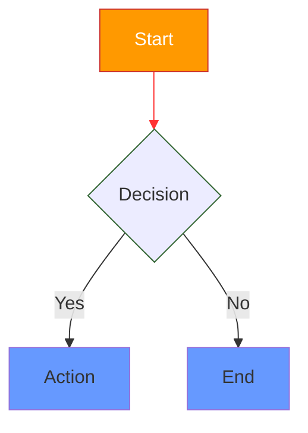

# Mermaid Diagram Color Support Implementation Plan

> **For agentic workers:** REQUIRED SUB-SKILL: Use superpowers:subagent-driven-development (recommended) or superpowers:executing-plans to implement this plan task-by-task. Steps use checkbox (`- [ ]`) syntax for tracking.

**Goal:** Parse Mermaid style directives (`style`, `classDef`/`class`, `linkStyle`) and render colored ASCII diagrams through the existing styled pipeline, with hex colors resolved to nearest theme palette match.

**Architecture:** Extend the parser to capture style directives, refactor the ASCII canvas from `Vec<Vec<char>>` to a styled grid of `(char, SpanStyle)` cells, thread theme through the mermaid render path, and update `RenderedBlock::Diagram` to carry `Vec<StyledLine>` instead of `Vec<String>`.

**Tech Stack:** Rust, ratatui (TUI), existing `SpanStyle`/`StyledLine`/`Color` types from `src/render.rs`

**Spec:** `docs/superpowers/specs/2026-04-22-mermaid-color-support-design.md`

---

### Task 1: Color Parsing Utility Module

Create a shared color-parsing module that converts hex strings and CSS named colors to `Color::Rgb`.

**Files:**
- Create: `src/mermaid/color.rs`
- Modify: `src/mermaid/mod.rs:1` (add `pub mod color;`)

- [ ] **Step 1: Write failing tests for color parsing**

In `src/mermaid/color.rs`:

```rust
#[cfg(test)]
mod tests {
    use super::*;
    use crate::render::Color;

    #[test]
    fn test_parse_hex_6_digit() {
        assert_eq!(parse_color("#ff9900"), Some(Color::Rgb(255, 153, 0)));
    }

    #[test]
    fn test_parse_hex_3_digit() {
        assert_eq!(parse_color("#f90"), Some(Color::Rgb(255, 153, 0)));
    }

    #[test]
    fn test_parse_named_red() {
        assert_eq!(parse_color("red"), Some(Color::Rgb(255, 0, 0)));
    }

    #[test]
    fn test_parse_named_blue() {
        assert_eq!(parse_color("blue"), Some(Color::Rgb(0, 0, 255)));
    }

    #[test]
    fn test_parse_invalid_returns_none() {
        assert_eq!(parse_color("not-a-color"), None);
        assert_eq!(parse_color("#xyz"), None);
        assert_eq!(parse_color(""), None);
    }

    #[test]
    fn test_parse_named_gray_and_grey() {
        assert_eq!(parse_color("gray"), parse_color("grey"));
    }
}
```

- [ ] **Step 2: Run tests to verify they fail**

Run: `cargo test --lib mermaid::color -- --nocapture 2>&1 | head -30`
Expected: compilation error — `parse_color` not defined.

- [ ] **Step 3: Implement parse_color**

In `src/mermaid/color.rs`:

```rust
use crate::render::Color;

/// Parse a CSS color string (hex or named) into a Color::Rgb.
/// Returns None for invalid/unrecognized values.
pub fn parse_color(input: &str) -> Option<Color> {
    let input = input.trim();

    if let Some(hex) = input.strip_prefix('#') {
        parse_hex(hex)
    } else {
        parse_named(input)
    }
}

fn parse_hex(hex: &str) -> Option<Color> {
    match hex.len() {
        6 => {
            let r = u8::from_str_radix(&hex[0..2], 16).ok()?;
            let g = u8::from_str_radix(&hex[2..4], 16).ok()?;
            let b = u8::from_str_radix(&hex[4..6], 16).ok()?;
            Some(Color::Rgb(r, g, b))
        }
        3 => {
            let r = u8::from_str_radix(&hex[0..1], 16).ok()? * 17;
            let g = u8::from_str_radix(&hex[1..2], 16).ok()? * 17;
            let b = u8::from_str_radix(&hex[2..3], 16).ok()? * 17;
            Some(Color::Rgb(r, g, b))
        }
        _ => None,
    }
}

fn parse_named(name: &str) -> Option<Color> {
    match name.to_lowercase().as_str() {
        "red" => Some(Color::Rgb(255, 0, 0)),
        "green" => Some(Color::Rgb(0, 128, 0)),
        "blue" => Some(Color::Rgb(0, 0, 255)),
        "cyan" => Some(Color::Rgb(0, 255, 255)),
        "magenta" => Some(Color::Rgb(255, 0, 255)),
        "yellow" => Some(Color::Rgb(255, 255, 0)),
        "white" => Some(Color::Rgb(255, 255, 255)),
        "black" => Some(Color::Rgb(0, 0, 0)),
        "orange" => Some(Color::Rgb(255, 165, 0)),
        "purple" => Some(Color::Rgb(128, 0, 128)),
        "pink" => Some(Color::Rgb(255, 192, 203)),
        "gray" | "grey" => Some(Color::Rgb(128, 128, 128)),
        _ => None,
    }
}
```

- [ ] **Step 4: Register the module**

In `src/mermaid/mod.rs`, add at line 1:

```rust
pub mod color;
```

- [ ] **Step 5: Run tests to verify they pass**

Run: `cargo test --lib mermaid::color -- --nocapture`
Expected: all 7 tests PASS.

- [ ] **Step 6: Commit**

```bash
git add src/mermaid/color.rs src/mermaid/mod.rs
git commit -m "feat(mermaid): add color parsing module for hex and CSS named colors"
```

---

### Task 2: Color Resolution — Nearest Theme Match

Add a function that resolves any `Color::Rgb` to the nearest color in the active theme palette using euclidean distance in RGB space.

**Files:**
- Modify: `src/mermaid/color.rs`
- Modify: `src/theme.rs:4-15` (add diagram palette slots)

- [ ] **Step 1: Extend Theme with 5 diagram palette slots**

In `src/theme.rs`, add fields to the `Theme` struct after `diagram_collapsed`:

```rust
pub diagram_node_fill: Color,
pub diagram_node_border: Color,
pub diagram_node_text: Color,
pub diagram_edge_stroke: Color,
pub diagram_edge_label: Color,
```

Add values to `CLAY`:

```rust
diagram_node_fill: Color::Rgb(160, 120, 60),
diagram_node_border: Color::Rgb(180, 90, 60),
diagram_node_text: Color::Rgb(190, 180, 160),
diagram_edge_stroke: Color::Rgb(120, 160, 80),
diagram_edge_label: Color::Rgb(130, 140, 110),
```

Add values to `HEARTH`:

```rust
diagram_node_fill: Color::Rgb(200, 160, 80),
diagram_node_border: Color::Rgb(200, 100, 50),
diagram_node_text: Color::Rgb(210, 200, 180),
diagram_edge_stroke: Color::Rgb(100, 170, 90),
diagram_edge_label: Color::Rgb(150, 140, 120),
```

- [ ] **Step 2: Add `all_colors()` method to Theme**

In `src/theme.rs`, add a method to `impl Theme`:

```rust
/// Returns all RGB colors in this theme's palette for nearest-match resolution.
pub fn all_colors(&self) -> Vec<&Color> {
    let mut colors: Vec<&Color> = Vec::new();
    for c in &self.heading {
        colors.push(c);
    }
    colors.extend_from_slice(&[
        &self.body,
        &self.bold,
        &self.italic,
        &self.link,
        &self.inline_code,
        &self.horizontal_rule,
        &self.diagram_border,
        &self.diagram_collapsed,
        &self.diagram_node_fill,
        &self.diagram_node_border,
        &self.diagram_node_text,
        &self.diagram_edge_stroke,
        &self.diagram_edge_label,
    ]);
    colors
}
```

- [ ] **Step 3: Run existing tests to make sure nothing breaks**

Run: `cargo test --lib theme`
Expected: all existing theme tests PASS.

- [ ] **Step 4: Write failing tests for resolve_color**

In `src/mermaid/color.rs`, add to the test module:

```rust
use crate::theme::Theme;

#[test]
fn test_resolve_pure_red_to_nearest_clay() {
    let theme = Theme::default_theme();
    let resolved = resolve_color(&Color::Rgb(255, 0, 0), theme);
    // Pure red should resolve to Clay Red (180, 90, 60) — the closest warm red
    assert_eq!(resolved, Color::Rgb(180, 90, 60));
}

#[test]
fn test_resolve_exact_match_returns_same() {
    let theme = Theme::default_theme();
    // Olive green is exactly in the Clay palette
    let olive = Color::Rgb(120, 160, 80);
    let resolved = resolve_color(&olive, theme);
    assert_eq!(resolved, olive);
}

#[test]
fn test_resolve_white_to_nearest() {
    let theme = Theme::default_theme();
    let resolved = resolve_color(&Color::Rgb(255, 255, 255), theme);
    // White should resolve to the lightest theme color — body (190, 180, 160)
    // or similar. Just check it returns a valid Color::Rgb.
    assert!(matches!(resolved, Color::Rgb(_, _, _)));
}
```

- [ ] **Step 5: Run tests to verify they fail**

Run: `cargo test --lib mermaid::color::tests::test_resolve -- --nocapture 2>&1 | head -20`
Expected: compilation error — `resolve_color` not defined.

- [ ] **Step 6: Implement resolve_color**

In `src/mermaid/color.rs`, add:

```rust
use crate::theme::Theme;

fn color_to_rgb(color: &Color) -> (f64, f64, f64) {
    match color {
        Color::Rgb(r, g, b) => (*r as f64, *g as f64, *b as f64),
        // Named colors shouldn't appear in theme palettes, but handle gracefully
        Color::Red => (255.0, 0.0, 0.0),
        Color::Green => (0.0, 128.0, 0.0),
        Color::Blue => (0.0, 0.0, 255.0),
        Color::Yellow => (255.0, 255.0, 0.0),
        Color::Magenta => (255.0, 0.0, 255.0),
        Color::Cyan => (0.0, 255.0, 255.0),
        Color::White => (255.0, 255.0, 255.0),
        Color::BrightYellow => (255.0, 255.0, 128.0),
        Color::BrightCyan => (128.0, 255.0, 255.0),
        Color::BrightMagenta => (255.0, 128.0, 255.0),
        Color::DarkGray => (128.0, 128.0, 128.0),
    }
}

/// Resolve a color to the nearest color in the theme's palette using
/// euclidean distance in RGB space.
pub fn resolve_color(color: &Color, theme: &Theme) -> Color {
    let (r, g, b) = color_to_rgb(color);

    let mut best_color = color.clone();
    let mut best_dist = f64::MAX;

    for candidate in theme.all_colors() {
        let (cr, cg, cb) = color_to_rgb(candidate);
        let dist = (r - cr).powi(2) + (g - cg).powi(2) + (b - cb).powi(2);
        if dist < best_dist {
            best_dist = dist;
            best_color = candidate.clone();
        }
    }

    best_color
}
```

- [ ] **Step 7: Run tests to verify they pass**

Run: `cargo test --lib mermaid::color -- --nocapture`
Expected: all tests PASS.

- [ ] **Step 8: Commit**

```bash
git add src/mermaid/color.rs src/theme.rs
git commit -m "feat(mermaid): add theme palette extension and nearest-color resolution"
```

---

### Task 3: Style Data Structures and Flowchart Style Parsing

Add `NodeStyle` and `MermaidEdgeStyle` types, extend `Node`/`Edge` with optional style fields, and parse `style`, `classDef`, `class`, and `linkStyle` directives in the flowchart parser.

**Files:**
- Modify: `src/mermaid/mod.rs:30-50` (add style fields to `Node` and `Edge`, add style types)
- Modify: `src/mermaid/parse.rs` (parse style directives)

- [ ] **Step 1: Add style types to mod.rs**

In `src/mermaid/mod.rs`, add after the `EdgeStyle` enum (after line 28):

```rust
#[derive(Debug, Clone, PartialEq, Default)]
pub struct NodeStyle {
    pub fill: Option<crate::render::Color>,
    pub stroke: Option<crate::render::Color>,
    pub color: Option<crate::render::Color>,
}

#[derive(Debug, Clone, PartialEq, Default)]
pub struct MermaidEdgeStyle {
    pub stroke: Option<crate::render::Color>,
    pub label_color: Option<crate::render::Color>,
}
```

- [ ] **Step 2: Add style fields to Node and Edge**

In `src/mermaid/mod.rs`, update the `Node` struct:

```rust
#[derive(Debug, Clone, PartialEq)]
pub struct Node {
    pub id: String,
    pub label: String,
    pub shape: NodeShape,
    pub node_style: Option<NodeStyle>,
}
```

Update the `Edge` struct:

```rust
#[derive(Debug, Clone, PartialEq)]
pub struct Edge {
    pub from: String,
    pub to: String,
    pub label: Option<String>,
    pub style: EdgeStyle,
    pub edge_style: Option<MermaidEdgeStyle>,
}
```

- [ ] **Step 3: Fix all compilation errors from the new fields**

Every place that constructs a `Node` or `Edge` needs the new fields. Update:

In `src/mermaid/parse.rs`, in `parse_node_term` (lines 160, 171, 188, 196, 206, 214), add `node_style: None` to every `Node { ... }` construction.

In `parse_statement` (line 117), add `edge_style: None` to the `Edge { ... }` construction:

```rust
edges.push(Edge {
    from: prev_node.id.clone(),
    to: next_node.id.clone(),
    label,
    style,
    edge_style: None,
});
```

In `src/mermaid/layout.rs` test helpers (line 448-461), add `node_style: None` and `edge_style: None`:

```rust
fn make_node(id: &str, label: &str) -> Node {
    Node {
        id: id.to_string(),
        label: label.to_string(),
        shape: NodeShape::Rect,
        node_style: None,
    }
}

fn make_edge(from: &str, to: &str) -> Edge {
    Edge {
        from: from.to_string(),
        to: to.to_string(),
        label: None,
        style: EdgeStyle::Arrow,
        edge_style: None,
    }
}
```

- [ ] **Step 4: Verify compilation**

Run: `cargo check 2>&1 | head -30`
Expected: no errors.

- [ ] **Step 5: Write failing tests for style directive parsing**

In `src/mermaid/parse.rs`, add to the test module:

```rust
use crate::render::Color;

#[test]
fn test_parse_style_directive() {
    let input = "graph TD\n    A[Start]\n    style A fill:#ff9900,stroke:#333,color:#fff\n";
    let chart = flowchart(input);
    assert_eq!(chart.nodes.len(), 1);
    let node = &chart.nodes[0];
    let style = node.node_style.as_ref().expect("node should have style");
    assert_eq!(style.fill, Some(Color::Rgb(255, 153, 0)));
    assert_eq!(style.stroke, Some(Color::Rgb(51, 51, 51)));
    assert_eq!(style.color, Some(Color::Rgb(255, 255, 255)));
}

#[test]
fn test_parse_classdef_and_class() {
    let input = "graph TD\n    A[Start]\n    B[End]\n    classDef highlight fill:#f9f,stroke:#333\n    class A,B highlight\n";
    let chart = flowchart(input);
    let a_style = chart.nodes[0].node_style.as_ref().expect("A should have style");
    let b_style = chart.nodes[1].node_style.as_ref().expect("B should have style");
    assert_eq!(a_style.fill, Some(Color::Rgb(255, 153, 255)));
    assert_eq!(b_style.fill, Some(Color::Rgb(255, 153, 255)));
}

#[test]
fn test_parse_linkstyle() {
    let input = "graph TD\n    A --> B\n    B --> C\n    linkStyle 0 stroke:#ff3\n";
    let chart = flowchart(input);
    let edge0_style = chart.edges[0].edge_style.as_ref().expect("edge 0 should have style");
    assert_eq!(edge0_style.stroke, Some(Color::Rgb(255, 255, 51)));
    assert!(chart.edges[1].edge_style.is_none(), "edge 1 should have no style");
}

#[test]
fn test_style_directive_invalid_color_ignored() {
    let input = "graph TD\n    A[Start]\n    style A fill:notacolor\n";
    let chart = flowchart(input);
    let style = chart.nodes[0].node_style.as_ref().expect("node should have style");
    assert_eq!(style.fill, None, "invalid color should be None");
}
```

- [ ] **Step 6: Run tests to verify they fail**

Run: `cargo test --lib mermaid::parse::tests::test_parse_style -- --nocapture 2>&1 | head -20`
Expected: FAIL — style directives not parsed yet.

- [ ] **Step 7: Implement style directive parsing**

In `src/mermaid/parse.rs`, add these imports at the top:

```rust
use super::{MermaidEdgeStyle, NodeStyle};
use super::color::parse_color;
```

Add a `classDefs` HashMap and a `link_styles` Vec to `parse_flowchart`. Modify the function body: after the main parsing loop, apply `classDef`/`class` and `linkStyle` directives. Add a helper to parse the property list.

Replace the body of `parse_flowchart` from the line `for line in lines {` through the end of the function with:

```rust
    let mut class_defs: HashMap<String, NodeStyle> = HashMap::new();
    let mut class_assignments: Vec<(Vec<String>, String)> = Vec::new(); // (node_ids, class_name)
    let mut link_styles: Vec<(usize, MermaidEdgeStyle)> = Vec::new();
    let mut node_styles: Vec<(String, NodeStyle)> = Vec::new(); // (node_id, style)

    for line in lines {
        let trimmed = line.trim();
        if trimmed.is_empty() || trimmed.starts_with("%%") {
            continue;
        }

        // style A fill:#f9f,stroke:#333,color:#000
        if let Some(rest) = trimmed.strip_prefix("style ") {
            if let Some((id, props)) = rest.split_once(' ') {
                let style = parse_node_style_props(props);
                node_styles.push((id.to_string(), style));
            }
            continue;
        }

        // classDef className fill:#f9f,stroke:#333
        if let Some(rest) = trimmed.strip_prefix("classDef ") {
            if let Some((name, props)) = rest.split_once(' ') {
                let style = parse_node_style_props(props);
                class_defs.insert(name.to_string(), style);
            }
            continue;
        }

        // class A,B className
        if let Some(rest) = trimmed.strip_prefix("class ") {
            if let Some((ids_str, class_name)) = rest.rsplit_once(' ') {
                let ids: Vec<String> = ids_str.split(',').map(|s| s.trim().to_string()).collect();
                class_assignments.push((ids, class_name.to_string()));
            }
            continue;
        }

        // linkStyle 0 stroke:#ff3
        if let Some(rest) = trimmed.strip_prefix("linkStyle ") {
            if let Some((idx_str, props)) = rest.split_once(' ') {
                if let Ok(idx) = idx_str.parse::<usize>() {
                    let style = parse_edge_style_props(props);
                    link_styles.push((idx, style));
                }
            }
            continue;
        }

        parse_statement(trimmed, &mut node_order, &mut node_map, &mut edges)
            .with_context(|| format!("Failed to parse line: {:?}", trimmed))?;
    }

    // Apply class assignments to nodes
    for (ids, class_name) in &class_assignments {
        if let Some(class_style) = class_defs.get(class_name) {
            for id in ids {
                if let Some(node) = node_map.get_mut(id) {
                    node.node_style = Some(class_style.clone());
                }
            }
        }
    }

    // Apply inline style directives (override class styles)
    for (id, style) in &node_styles {
        if let Some(node) = node_map.get_mut(id) {
            let existing = node.node_style.get_or_insert_with(NodeStyle::default);
            if style.fill.is_some() {
                existing.fill = style.fill.clone();
            }
            if style.stroke.is_some() {
                existing.stroke = style.stroke.clone();
            }
            if style.color.is_some() {
                existing.color = style.color.clone();
            }
        }
    }

    // Apply link styles to edges
    for (idx, style) in &link_styles {
        if let Some(edge) = edges.get_mut(*idx) {
            edge.edge_style = Some(style.clone());
        }
    }

    let nodes: Vec<Node> = node_order.iter().map(|id| node_map[id].clone()).collect();

    Ok(FlowChart {
        direction,
        nodes,
        edges,
    })
```

Add these helper functions before the tests module:

```rust
fn parse_node_style_props(props: &str) -> NodeStyle {
    let mut style = NodeStyle::default();
    for prop in props.split(',') {
        let prop = prop.trim();
        if let Some((key, value)) = prop.split_once(':') {
            let key = key.trim();
            let value = value.trim();
            match key {
                "fill" => style.fill = parse_color(value),
                "stroke" => style.stroke = parse_color(value),
                "color" => style.color = parse_color(value),
                _ => {} // ignore unknown properties
            }
        }
    }
    style
}

fn parse_edge_style_props(props: &str) -> MermaidEdgeStyle {
    let mut style = MermaidEdgeStyle::default();
    for prop in props.split(',') {
        let prop = prop.trim();
        if let Some((key, value)) = prop.split_once(':') {
            let key = key.trim();
            let value = value.trim();
            match key {
                "stroke" => style.stroke = parse_color(value),
                "color" => style.label_color = parse_color(value),
                _ => {}
            }
        }
    }
    style
}
```

- [ ] **Step 8: Run tests to verify they pass**

Run: `cargo test --lib mermaid::parse -- --nocapture`
Expected: all tests PASS (new + existing).

- [ ] **Step 9: Commit**

```bash
git add src/mermaid/mod.rs src/mermaid/parse.rs
git commit -m "feat(mermaid): parse style, classDef, class, and linkStyle directives"
```

---

### Task 4: Sequence Diagram Style Parsing

Extend the sequence diagram parser to handle `style`, `classDef`/`class`, and `linkStyle` directives.

**Files:**
- Modify: `src/mermaid/sequence/mod.rs:6-16` (add style field to Participant)
- Modify: `src/mermaid/sequence/parse.rs` (parse style directives)

- [ ] **Step 1: Add style field to Participant and message-level style storage**

In `src/mermaid/sequence/mod.rs`, update `Participant`:

```rust
#[derive(Debug, Clone, PartialEq)]
pub struct Participant {
    pub id: String,
    pub label: String,
    pub style: Option<crate::mermaid::NodeStyle>,
}
```

Update `Event::Message` to add an edge_style field:

```rust
Message {
    from: String,
    to: String,
    label: String,
    arrow: ArrowStyle,
    edge_style: Option<crate::mermaid::MermaidEdgeStyle>,
},
```

- [ ] **Step 2: Fix all compilation errors from the new fields**

In `src/mermaid/sequence/parse.rs`:

- Every `Participant { id, label }` construction needs `style: None` added
- Every `Event::Message { from, to, label, arrow }` construction needs `edge_style: None` added

In `src/mermaid/sequence/layout.rs` — any pattern matching on `Event::Message` needs the new field. Add `edge_style: _` or `edge_style` to the destructured pattern.

In `src/mermaid/sequence/ascii.rs` — no direct pattern matching on types, uses layout types instead. No changes needed.

In the sequence parse test module — update pattern matches like:

```rust
if let Event::Message { from, to, label, arrow, .. } = &diagram.events[0]
```

(Add `..` to ignore the new field in existing test patterns.)

- [ ] **Step 3: Verify compilation**

Run: `cargo check 2>&1 | head -30`
Expected: no errors.

- [ ] **Step 4: Write failing tests for sequence style parsing**

In `src/mermaid/sequence/parse.rs`, add to the test module:

```rust
use crate::render::Color;

#[test]
fn test_parse_sequence_style_participant() {
    let input = "sequenceDiagram\n    participant A\n    participant B\n    style A fill:#ff9900,stroke:#333\n    A->>B: Hello\n";
    let diagram = parse_sequence(input).unwrap();
    let a_style = diagram.participants[0].style.as_ref().expect("A should have style");
    assert_eq!(a_style.fill, Some(Color::Rgb(255, 153, 0)));
    assert!(diagram.participants[1].style.is_none());
}

#[test]
fn test_parse_sequence_linkstyle() {
    let input = "sequenceDiagram\n    participant A\n    participant B\n    A->>B: Hello\n    B->>A: World\n    linkStyle 0 stroke:#f00\n";
    let diagram = parse_sequence(input).unwrap();
    if let Event::Message { edge_style, .. } = &diagram.events[0] {
        let es = edge_style.as_ref().expect("message 0 should have edge style");
        assert_eq!(es.stroke, Some(Color::Rgb(255, 0, 0)));
    } else {
        panic!("Expected Message event");
    }
    if let Event::Message { edge_style, .. } = &diagram.events[1] {
        assert!(edge_style.is_none(), "message 1 should have no style");
    }
}

#[test]
fn test_parse_sequence_classdef_and_class() {
    let input = "sequenceDiagram\n    participant A\n    participant B\n    classDef server fill:#0f0\n    class A server\n    A->>B: Hello\n";
    let diagram = parse_sequence(input).unwrap();
    let a_style = diagram.participants[0].style.as_ref().expect("A should have style");
    assert_eq!(a_style.fill, Some(Color::Rgb(0, 255, 0)));
}
```

- [ ] **Step 5: Run tests to verify they fail**

Run: `cargo test --lib mermaid::sequence::parse::tests::test_parse_sequence_style -- --nocapture 2>&1 | head -20`
Expected: FAIL — style directives not parsed in sequence parser.

- [ ] **Step 6: Implement sequence style directive parsing**

In `src/mermaid/sequence/parse.rs`, add these imports:

```rust
use crate::mermaid::{MermaidEdgeStyle, NodeStyle};
use crate::mermaid::color::parse_color;
```

In `parse_sequence`, add state variables before the main loop:

```rust
let mut class_defs: std::collections::HashMap<String, NodeStyle> = std::collections::HashMap::new();
let mut class_assignments: Vec<(Vec<String>, String)> = Vec::new();
let mut node_styles: Vec<(String, NodeStyle)> = Vec::new();
let mut link_styles: Vec<(usize, MermaidEdgeStyle)> = Vec::new();
let mut message_index: usize = 0;
```

Inside the main loop, before the message parsing (before `if let Some(event) = parse_message(...)`), add directive handling:

```rust
// style ParticipantId fill:#f9f,stroke:#333
if let Some(rest) = line.strip_prefix("style ") {
    if let Some((id, props)) = rest.split_once(' ') {
        let style = parse_node_style_props(props);
        node_styles.push((id.trim().to_string(), style));
    }
    continue;
}

// classDef className fill:#f9f
if let Some(rest) = line.strip_prefix("classDef ") {
    if let Some((name, props)) = rest.split_once(' ') {
        let style = parse_node_style_props(props);
        class_defs.insert(name.trim().to_string(), style);
    }
    continue;
}

// class A,B className
if let Some(rest) = line.strip_prefix("class ") {
    if let Some((ids_str, class_name)) = rest.rsplit_once(' ') {
        let ids: Vec<String> = ids_str.split(',').map(|s| s.trim().to_string()).collect();
        class_assignments.push((ids, class_name.trim().to_string()));
    }
    continue;
}

// linkStyle 0 stroke:#ff3
if let Some(rest) = line.strip_prefix("linkStyle ") {
    if let Some((idx_str, props)) = rest.split_once(' ') {
        if let Ok(idx) = idx_str.parse::<usize>() {
            let style = parse_edge_style_props(props);
            link_styles.push((idx, style));
        }
    }
    continue;
}
```

In the message parsing block, increment `message_index` when a message event is pushed:

Where `push_event!(event);` is called for messages, wrap to also track index. The simplest approach: increment `message_index` after the `if let Some(event) = parse_message(...)` block:

```rust
if let Some(event) = parse_message(line, &mut participants) {
    push_event!(event);
    message_index += 1;
    continue;
}
```

After the main loop and before the final `Ok(...)`, apply the styles:

```rust
// Apply class assignments to participants
for (ids, class_name) in &class_assignments {
    if let Some(class_style) = class_defs.get(class_name) {
        for id in ids {
            if let Some(p) = participants.iter_mut().find(|p| p.id == *id) {
                p.style = Some(class_style.clone());
            }
        }
    }
}

// Apply inline style directives (override class)
for (id, style) in &node_styles {
    if let Some(p) = participants.iter_mut().find(|p| p.id == *id) {
        let existing = p.style.get_or_insert_with(NodeStyle::default);
        if style.fill.is_some() { existing.fill = style.fill.clone(); }
        if style.stroke.is_some() { existing.stroke = style.stroke.clone(); }
        if style.color.is_some() { existing.color = style.color.clone(); }
    }
}

// Apply link styles to messages
let mut msg_idx = 0usize;
fn apply_link_styles_to_events(events: &mut [Event], link_styles: &[(usize, MermaidEdgeStyle)], msg_idx: &mut usize) {
    for event in events.iter_mut() {
        if let Event::Message { edge_style, .. } = event {
            if let Some((_, style)) = link_styles.iter().find(|(i, _)| *i == *msg_idx) {
                *edge_style = Some(style.clone());
            }
            *msg_idx += 1;
        }
    }
}
apply_link_styles_to_events(&mut top_events, &link_styles, &mut msg_idx);
```

Add the helper functions (same logic as flowchart versions, can be module-level):

```rust
fn parse_node_style_props(props: &str) -> NodeStyle {
    let mut style = NodeStyle::default();
    for prop in props.split(',') {
        let prop = prop.trim();
        if let Some((key, value)) = prop.split_once(':') {
            match key.trim() {
                "fill" => style.fill = parse_color(value.trim()),
                "stroke" => style.stroke = parse_color(value.trim()),
                "color" => style.color = parse_color(value.trim()),
                _ => {}
            }
        }
    }
    style
}

fn parse_edge_style_props(props: &str) -> MermaidEdgeStyle {
    let mut style = MermaidEdgeStyle::default();
    for prop in props.split(',') {
        let prop = prop.trim();
        if let Some((key, value)) = prop.split_once(':') {
            match key.trim() {
                "stroke" => style.stroke = parse_color(value.trim()),
                "color" => style.label_color = parse_color(value.trim()),
                _ => {}
            }
        }
    }
    style
}
```

- [ ] **Step 7: Run tests to verify they pass**

Run: `cargo test --lib mermaid::sequence::parse -- --nocapture`
Expected: all tests PASS.

- [ ] **Step 8: Commit**

```bash
git add src/mermaid/sequence/mod.rs src/mermaid/sequence/parse.rs
git commit -m "feat(mermaid): parse style directives in sequence diagrams"
```

---

### Task 5: Styled Canvas — Refactor from `Vec<Vec<char>>` to Styled Grid

Convert the `Canvas` to store `(char, SpanStyle)` per cell and output `Vec<StyledLine>`.

**Files:**
- Modify: `src/mermaid/ascii.rs:8-44` (Canvas struct and methods)

- [ ] **Step 1: Write failing test for styled canvas output**

In `src/mermaid/ascii.rs`, add to the test module:

```rust
use crate::render::{Color, SpanStyle};

#[test]
fn test_canvas_to_styled_lines() {
    let mut canvas = Canvas::new(10, 1);
    let style = SpanStyle {
        fg: Some(Color::Rgb(255, 0, 0)),
        ..Default::default()
    };
    canvas.set_styled(0, 0, 'A', &style);
    canvas.set_styled(1, 0, 'B', &style);
    canvas.set(2, 0, 'C'); // unstyled

    let lines = canvas.to_styled_lines();
    assert_eq!(lines.len(), 1);
    // Should have 2 spans: "AB" in red, "C" unstyled
    let spans = &lines[0].spans;
    assert!(spans.len() >= 2, "Expected at least 2 spans, got {}", spans.len());
    assert_eq!(spans[0].text, "AB");
    assert_eq!(spans[0].style.fg, Some(Color::Rgb(255, 0, 0)));
    assert_eq!(spans[1].text, "C");
    assert_eq!(spans[1].style, SpanStyle::default());
}

#[test]
fn test_canvas_styled_lines_trims_trailing_default() {
    let mut canvas = Canvas::new(10, 1);
    canvas.set(0, 0, 'X');
    // Rest are spaces with default style — should be trimmed
    let lines = canvas.to_styled_lines();
    assert_eq!(lines.len(), 1);
    let total_text: String = lines[0].spans.iter().map(|s| s.text.as_str()).collect();
    assert_eq!(total_text, "X");
}
```

- [ ] **Step 2: Run tests to verify they fail**

Run: `cargo test --lib mermaid::ascii::tests::test_canvas_styled -- --nocapture 2>&1 | head -20`
Expected: compilation error — `set_styled` and `to_styled_lines` not defined.

- [ ] **Step 3: Refactor Canvas to styled grid**

In `src/mermaid/ascii.rs`, replace the Canvas struct and impl:

```rust
use crate::render::{SpanStyle, StyledLine, StyledSpan};

#[derive(Clone)]
struct Cell {
    ch: char,
    style: SpanStyle,
}

impl Default for Cell {
    fn default() -> Self {
        Cell {
            ch: ' ',
            style: SpanStyle::default(),
        }
    }
}

pub(crate) struct Canvas {
    grid: Vec<Vec<Cell>>,
    width: usize,
    height: usize,
}

impl Canvas {
    pub fn new(width: usize, height: usize) -> Self {
        Canvas {
            grid: vec![vec![Cell::default(); width]; height],
            width,
            height,
        }
    }

    pub fn set(&mut self, x: usize, y: usize, ch: char) {
        if x < self.width && y < self.height {
            self.grid[y][x].ch = ch;
            self.grid[y][x].style = SpanStyle::default();
        }
    }

    pub fn set_styled(&mut self, x: usize, y: usize, ch: char, style: &SpanStyle) {
        if x < self.width && y < self.height {
            self.grid[y][x].ch = ch;
            self.grid[y][x].style = style.clone();
        }
    }

    pub fn draw_text(&mut self, x: usize, y: usize, text: &str) {
        for (i, ch) in text.chars().enumerate() {
            self.set(x + i, y, ch);
        }
    }

    pub fn draw_text_styled(&mut self, x: usize, y: usize, text: &str, style: &SpanStyle) {
        for (i, ch) in text.chars().enumerate() {
            self.set_styled(x + i, y, ch, style);
        }
    }

    pub fn to_lines(&self) -> Vec<String> {
        self.grid
            .iter()
            .map(|row| {
                let s: String = row.iter().map(|c| c.ch).collect();
                s.trim_end().to_string()
            })
            .collect()
    }

    pub fn to_styled_lines(&self) -> Vec<StyledLine> {
        self.grid
            .iter()
            .map(|row| {
                // Find the last non-space cell (trim trailing spaces)
                let last_non_space = row
                    .iter()
                    .rposition(|c| c.ch != ' ' || c.style != SpanStyle::default())
                    .map(|i| i + 1)
                    .unwrap_or(0);

                let row = &row[..last_non_space];

                if row.is_empty() {
                    return StyledLine::empty();
                }

                // Group consecutive cells with the same style into spans
                let mut spans: Vec<StyledSpan> = Vec::new();
                let mut current_text = String::new();
                let mut current_style = row[0].style.clone();

                for cell in row {
                    if cell.style == current_style {
                        current_text.push(cell.ch);
                    } else {
                        if !current_text.is_empty() {
                            spans.push(StyledSpan {
                                text: current_text,
                                style: current_style,
                            });
                        }
                        current_text = String::from(cell.ch);
                        current_style = cell.style.clone();
                    }
                }

                if !current_text.is_empty() {
                    spans.push(StyledSpan {
                        text: current_text,
                        style: current_style,
                    });
                }

                StyledLine { spans }
            })
            .collect()
    }
}
```

- [ ] **Step 4: Run tests to verify they pass**

Run: `cargo test --lib mermaid::ascii -- --nocapture`
Expected: all tests PASS (new styled tests + existing tests using `to_lines()`).

- [ ] **Step 5: Commit**

```bash
git add src/mermaid/ascii.rs
git commit -m "feat(mermaid): refactor canvas to styled grid with per-cell SpanStyle"
```

---

### Task 6: Thread Styles Through Flowchart Layout and Rendering

Pass `NodeStyle`/`MermaidEdgeStyle` from parsed nodes/edges through layout to positioned nodes/edges, then apply colors in the drawing functions.

**Files:**
- Modify: `src/mermaid/layout.rs:7-37` (add style fields to PositionedNode/PositionedEdge)
- Modify: `src/mermaid/ascii.rs:50-210` (drawing functions accept styles)
- Modify: `src/mermaid/ascii.rs:418+` (render function passes styles)

- [ ] **Step 1: Add style fields to PositionedNode and PositionedEdge**

In `src/mermaid/layout.rs`, update `PositionedNode`:

```rust
#[derive(Debug, Clone)]
pub struct PositionedNode {
    #[allow(dead_code)]
    pub id: String,
    pub label: String,
    pub shape: super::NodeShape,
    pub x: usize,
    pub y: usize,
    pub width: usize,
    pub height: usize,
    pub compact: bool,
    pub node_style: Option<super::NodeStyle>,
}
```

Update `PositionedEdge`:

```rust
#[derive(Debug, Clone)]
pub struct PositionedEdge {
    #[allow(dead_code)]
    pub from: String,
    #[allow(dead_code)]
    pub to: String,
    pub label: Option<String>,
    pub style: super::EdgeStyle,
    pub points: Vec<(usize, usize)>,
    pub edge_style: Option<super::MermaidEdgeStyle>,
}
```

- [ ] **Step 2: Pass styles through in layout()**

In `src/mermaid/layout.rs`, in the `layout` function, update the positioned node construction (around line 355):

```rust
node_style: node.node_style.clone(),
```

Update the positioned edge construction (around line 425):

```rust
edge_style: edge.edge_style.clone(),
```

- [ ] **Step 3: Fix test helper in layout.rs**

Update `make_positioned_node` in `src/mermaid/ascii.rs` tests to add:

```rust
node_style: None,
```

- [ ] **Step 4: Verify compilation**

Run: `cargo check 2>&1 | head -30`
Expected: no errors.

- [ ] **Step 5: Write failing test for styled flowchart rendering**

In `src/mermaid/ascii.rs` tests:

```rust
#[test]
fn test_render_styled_node_has_colored_spans() {
    use crate::mermaid::NodeStyle;
    use crate::render::Color;

    let node = PositionedNode {
        id: "A".to_string(),
        label: "Hi".to_string(),
        shape: NodeShape::Rect,
        x: 0,
        y: 0,
        width: 6,
        height: 3,
        compact: false,
        node_style: Some(NodeStyle {
            fill: None,
            stroke: Some(Color::Rgb(180, 90, 60)),
            color: Some(Color::Rgb(190, 180, 160)),
        }),
    };
    let layout = LayoutResult {
        nodes: vec![node],
        edges: vec![],
        width: 6,
        height: 3,
    };
    let styled_lines = render_styled(&layout);
    assert!(!styled_lines.is_empty());
    // The border chars should have the stroke color
    let top_line = &styled_lines[0];
    let has_stroke_color = top_line.spans.iter().any(|s| {
        s.style.fg == Some(Color::Rgb(180, 90, 60))
    });
    assert!(has_stroke_color, "Border should have stroke color, got: {:?}", top_line.spans);
}
```

- [ ] **Step 6: Run test to verify it fails**

Run: `cargo test --lib mermaid::ascii::tests::test_render_styled -- --nocapture 2>&1 | head -20`
Expected: compilation error — `render_styled` not defined.

- [ ] **Step 7: Update drawing functions to accept and apply styles**

In `src/mermaid/ascii.rs`, add a helper to build SpanStyle from NodeStyle components:

```rust
use super::NodeStyle;
use super::MermaidEdgeStyle;

fn stroke_style(node_style: &Option<NodeStyle>) -> SpanStyle {
    match node_style {
        Some(ns) => {
            let fg = ns.stroke.clone().or_else(|| ns.fill.clone());
            SpanStyle { fg, ..Default::default() }
        }
        None => SpanStyle::default(),
    }
}

fn label_style(node_style: &Option<NodeStyle>) -> SpanStyle {
    match node_style {
        Some(ns) if ns.color.is_some() => SpanStyle {
            fg: ns.color.clone(),
            ..Default::default()
        },
        _ => SpanStyle::default(),
    }
}

fn edge_line_style(edge_style: &Option<MermaidEdgeStyle>) -> SpanStyle {
    match edge_style {
        Some(es) if es.stroke.is_some() => SpanStyle {
            fg: es.stroke.clone(),
            ..Default::default()
        },
        _ => SpanStyle::default(),
    }
}

fn edge_label_style(edge_style: &Option<MermaidEdgeStyle>) -> SpanStyle {
    match edge_style {
        Some(es) => {
            let fg = es.label_color.clone().or_else(|| es.stroke.clone());
            SpanStyle { fg, ..Default::default() }
        }
        None => SpanStyle::default(),
    }
}
```

Update `draw_rect` to use styled canvas methods. Change signature:

```rust
fn draw_rect(canvas: &mut Canvas, node: &PositionedNode) {
    let ss = stroke_style(&node.node_style);
    let ls = label_style(&node.node_style);
    // ... existing code, but replace canvas.set(x, y, ch) with
    // canvas.set_styled(x, y, ch, &ss) for border chars
    // and canvas.draw_text_styled(label_x, y + mid_row, &node.label, &ls) for label
```

Apply the same pattern to `draw_rounded`, `draw_diamond`, `draw_compact_diamond`. For each:
- Border chars use `stroke_style`
- Label text uses `label_style`

For edges, update `apply_edge_style` to use `edge_line_style`. Update `draw_arrowhead` and `draw_edge_label` similarly. These functions need access to the `PositionedEdge.edge_style` field. The connectivity grid rendering (step 2 in `render`) also needs to pass edge styles — for the box-drawing chars from the connectivity grid, apply the edge_line_style of the edges that contributed to each cell.

For simplicity, apply edge coloring in `apply_edge_style` and `draw_arrowhead` (which already have the edge reference). The connectivity grid chars (step 2) stay unstyled since multiple edges can share cells — only dedicated edge style overrides (dotted/thick) and arrowheads get colored.

Actually, let's revise: to color all edge segments (not just dotted/thick), we need a per-edge pass after connectivity rendering. Add a new function:

```rust
fn color_edge_segments(canvas: &mut Canvas, edge: &PositionedEdge) {
    let style = edge_line_style(&edge.edge_style);
    if style.fg.is_none() {
        return;
    }
    for seg in 0..edge.points.len().saturating_sub(1) {
        let (x0, y0) = edge.points[seg];
        let (x1, y1) = edge.points[seg + 1];

        if x0 == x1 {
            let (y_start, y_end) = if y0 <= y1 { (y0, y1) } else { (y1, y0) };
            for y in y_start..=y_end {
                if x0 < canvas.width && y < canvas.height {
                    let cell = &canvas.grid[y][x0];
                    if cell.ch != ' ' {
                        canvas.set_styled(x0, y, cell.ch, &style);
                    }
                }
            }
        } else if y0 == y1 {
            let (x_start, x_end) = if x0 <= x1 { (x0, x1) } else { (x1, x0) };
            for x in x_start..=x_end {
                if x < canvas.width && y0 < canvas.height {
                    let cell = &canvas.grid[y0][x];
                    if cell.ch != ' ' {
                        canvas.set_styled(x, y0, cell.ch, &style);
                    }
                }
            }
        }
    }
}
```

Note: `canvas.grid` is private. To make this work, either add a getter `canvas.get(x, y) -> char` or make grid `pub(crate)`. Add a getter:

```rust
impl Canvas {
    pub fn get(&self, x: usize, y: usize) -> char {
        if x < self.width && y < self.height {
            self.grid[y][x].ch
        } else {
            ' '
        }
    }
}
```

- [ ] **Step 8: Add render_styled function**

Add `render_styled` that returns `Vec<StyledLine>` alongside the existing `render`:

```rust
pub fn render_styled(layout: &LayoutResult) -> Vec<StyledLine> {
    let extra_width = 10;
    let extra_height = 2;

    let canvas_width = layout.width + extra_width;
    let canvas_height = layout.height + extra_height;

    if canvas_width == 0 || canvas_height == 0 {
        return vec![];
    }

    let mut canvas = Canvas::new(canvas_width, canvas_height);

    // 1. Build connectivity grid
    let mut conn = vec![vec![0u8; canvas_width]; canvas_height];
    for edge in &layout.edges {
        mark_edge_connectivity(&mut conn, &edge.points, canvas_width, canvas_height);
    }

    // 2. Draw box-drawing chars from connectivity
    for (y, row) in conn.iter().enumerate() {
        for (x, &bits) in row.iter().enumerate() {
            if bits != 0 {
                canvas.set(x, y, connectivity_to_char(bits));
            }
        }
    }

    // 3. Apply edge-specific styles (dotted / thick)
    for edge in &layout.edges {
        apply_edge_style(&mut canvas, &conn, edge);
    }

    // 3b. Color edge segments
    for edge in &layout.edges {
        color_edge_segments(&mut canvas, edge);
    }

    // 4. Draw arrowheads
    for edge in &layout.edges {
        draw_arrowhead(&mut canvas, edge);
    }

    // 5. Draw edge labels
    for edge in &layout.edges {
        draw_edge_label(&mut canvas, edge);
    }

    // 6. Draw nodes on top
    for node in &layout.nodes {
        draw_node(&mut canvas, node);
    }

    let mut lines = canvas.to_styled_lines();
    while lines.last().map(|l| l.spans.is_empty()).unwrap_or(false) {
        lines.pop();
    }
    lines
}
```

Update `draw_arrowhead` to apply edge style:

After placing the arrowhead char, if the edge has an edge_style, re-set with styled:

```rust
fn draw_arrowhead(canvas: &mut Canvas, edge: &PositionedEdge) {
    // ... existing logic to determine arrow position and char ...
    // After each canvas.set(x, y, arrow_char), add:
    let style = edge_line_style(&edge.edge_style);
    if style.fg.is_some() {
        // Re-apply with style (the set already placed the char)
        canvas.set_styled(x, y, arrow_char, &style);
    }
}
```

Update `draw_edge_label` similarly — use `edge_label_style` and `draw_text_styled`.

- [ ] **Step 9: Run tests**

Run: `cargo test --lib mermaid::ascii -- --nocapture`
Expected: all tests PASS.

- [ ] **Step 10: Commit**

```bash
git add src/mermaid/layout.rs src/mermaid/ascii.rs
git commit -m "feat(mermaid): thread styles through layout and apply colors in flowchart rendering"
```

---

### Task 7: Thread Styles Through Sequence Diagram Layout and Rendering

Same treatment for sequence diagrams: pass styles from parsed types through layout to positioned types, apply in ascii rendering.

**Files:**
- Modify: `src/mermaid/sequence/layout.rs` (add style fields to positioned types, pass through)
- Modify: `src/mermaid/sequence/ascii.rs` (use styled canvas methods)

- [ ] **Step 1: Add style fields to sequence positioned types**

In `src/mermaid/sequence/layout.rs`, find `PositionedParticipant` and add:

```rust
pub style: Option<crate::mermaid::NodeStyle>,
```

Find `PositionedMessage` and add:

```rust
pub edge_style: Option<crate::mermaid::MermaidEdgeStyle>,
```

- [ ] **Step 2: Pass styles through in the layout function**

In the layout function, where `PositionedParticipant` instances are created, add:

```rust
style: participant.style.clone(),
```

Where `PositionedMessage` instances are created from `Event::Message`, add:

```rust
edge_style: edge_style.clone(),
```

- [ ] **Step 3: Verify compilation**

Run: `cargo check 2>&1 | head -30`
Expected: no errors.

- [ ] **Step 4: Apply styles in sequence ascii rendering**

In `src/mermaid/sequence/ascii.rs`:

Add imports:

```rust
use crate::render::SpanStyle;
use crate::mermaid::{NodeStyle, MermaidEdgeStyle};
```

Update `draw_participant_box` to use styled methods for border and label when the participant has a style. Use the same `stroke_style`/`label_style` helper pattern — import or duplicate the helpers:

```rust
fn stroke_style(style: &Option<NodeStyle>) -> SpanStyle {
    match style {
        Some(ns) => {
            let fg = ns.stroke.clone().or_else(|| ns.fill.clone());
            SpanStyle { fg, ..Default::default() }
        }
        None => SpanStyle::default(),
    }
}

fn label_style(style: &Option<NodeStyle>) -> SpanStyle {
    match style {
        Some(ns) if ns.color.is_some() => SpanStyle {
            fg: ns.color.clone(),
            ..Default::default()
        },
        _ => SpanStyle::default(),
    }
}

fn edge_line_style(style: &Option<MermaidEdgeStyle>) -> SpanStyle {
    match style {
        Some(es) if es.stroke.is_some() => SpanStyle {
            fg: es.stroke.clone(),
            ..Default::default()
        },
        _ => SpanStyle::default(),
    }
}

fn edge_label_style_fn(style: &Option<MermaidEdgeStyle>) -> SpanStyle {
    match style {
        Some(es) => {
            let fg = es.label_color.clone().or_else(|| es.stroke.clone());
            SpanStyle { fg, ..Default::default() }
        }
        None => SpanStyle::default(),
    }
}
```

Update `draw_participant_box`: use `set_styled` for border chars with `stroke_style(&p.style)` and `draw_text_styled` for the label with `label_style(&p.style)`.

Update `draw_message` and `draw_self_message`: use `set_styled` for arrow/line chars with `edge_line_style(&msg.edge_style)` and `draw_text_styled` for the label with `edge_label_style_fn(&msg.edge_style)`.

Add a `render_styled` function that mirrors `render` but calls `canvas.to_styled_lines()`:

```rust
pub fn render_styled(layout: &SequenceLayout) -> Vec<crate::render::StyledLine> {
    // Same body as render() but call canvas.to_styled_lines() instead of canvas.to_lines()
    // ... (copy render body, change the return)
}
```

- [ ] **Step 5: Run tests**

Run: `cargo test --lib mermaid::sequence -- --nocapture`
Expected: all tests PASS.

- [ ] **Step 6: Commit**

```bash
git add src/mermaid/sequence/layout.rs src/mermaid/sequence/ascii.rs
git commit -m "feat(mermaid): thread styles through sequence diagram layout and rendering"
```

---

### Task 8: Color Resolution at Render Time and Updated render_mermaid

Wire up color resolution in the top-level `render_mermaid` function. Resolve parsed colors to nearest theme match before passing to the renderers.

**Files:**
- Modify: `src/mermaid/mod.rs:52-75` (update render_mermaid signature and logic)

- [ ] **Step 1: Write failing test**

In `src/mermaid/mod.rs`, add a test module if not present, or add to existing tests:

```rust
#[cfg(test)]
mod tests {
    use super::*;
    use crate::theme::Theme;
    use crate::render::StyledLine;

    #[test]
    fn test_render_mermaid_with_theme_returns_styled_lines() {
        let input = "graph TD\n    A[Start] --> B[End]\n    style A stroke:#ff0000\n";
        let theme = Theme::default_theme();
        let (lines, node_count, edge_count) = render_mermaid(input, theme).unwrap();
        assert_eq!(node_count, 2);
        assert_eq!(edge_count, 1);
        // Should have styled lines, and at least one span with a non-default style
        let has_color = lines.iter().any(|line| {
            line.spans.iter().any(|s| s.style.fg.is_some())
        });
        assert!(has_color, "Styled node should produce colored spans");
    }

    #[test]
    fn test_render_mermaid_unstyled_is_plain() {
        let input = "graph TD\n    A --> B\n";
        let theme = Theme::default_theme();
        let (lines, _, _) = render_mermaid(input, theme).unwrap();
        // All spans should have default style (no color)
        let all_plain = lines.iter().all(|line| {
            line.spans.iter().all(|s| s.style == crate::render::SpanStyle::default())
        });
        assert!(all_plain, "Unstyled diagram should have no colors");
    }
}
```

- [ ] **Step 2: Run tests to verify they fail**

Run: `cargo test --lib mermaid::tests -- --nocapture 2>&1 | head -20`
Expected: compilation error — `render_mermaid` doesn't accept a theme parameter.

- [ ] **Step 3: Update render_mermaid**

In `src/mermaid/mod.rs`, update the function:

```rust
use crate::render::StyledLine;
use crate::theme::Theme;

/// Returns (styled_lines, node_count, edge_count)
pub fn render_mermaid(content: &str, theme: &Theme) -> anyhow::Result<(Vec<StyledLine>, usize, usize)> {
    let first_line = content
        .lines()
        .map(|l| l.trim())
        .find(|l| !l.is_empty() && !l.starts_with("%%"))
        .unwrap_or("");

    if first_line == "sequenceDiagram" {
        let mut diagram = sequence::parse::parse_sequence(content)?;
        let participant_count = diagram.participants.len();
        let event_count = diagram.events.len();

        // Resolve colors to nearest theme match
        for p in &mut diagram.participants {
            if let Some(ref mut style) = p.style {
                resolve_node_style(style, theme);
            }
        }
        resolve_event_styles(&mut diagram.events, theme);

        let laid_out = sequence::layout::layout(&diagram);
        let lines = sequence::ascii::render_styled(&laid_out);
        Ok((lines, participant_count, event_count))
    } else {
        let mut chart = parse::parse_flowchart(content)?;
        let node_count = chart.nodes.len();
        let edge_count = chart.edges.len();

        // Resolve colors to nearest theme match
        for node in &mut chart.nodes {
            if let Some(ref mut style) = node.node_style {
                resolve_node_style(style, theme);
            }
        }
        for edge in &mut chart.edges {
            if let Some(ref mut style) = edge.edge_style {
                resolve_edge_style(style, theme);
            }
        }

        let positioned = layout::layout(&chart);
        let lines = ascii::render_styled(&positioned);
        Ok((lines, node_count, edge_count))
    }
}

fn resolve_node_style(style: &mut NodeStyle, theme: &Theme) {
    if let Some(ref c) = style.fill {
        style.fill = Some(color::resolve_color(c, theme));
    }
    if let Some(ref c) = style.stroke {
        style.stroke = Some(color::resolve_color(c, theme));
    }
    if let Some(ref c) = style.color {
        style.color = Some(color::resolve_color(c, theme));
    }
}

fn resolve_edge_style(style: &mut MermaidEdgeStyle, theme: &Theme) {
    if let Some(ref c) = style.stroke {
        style.stroke = Some(color::resolve_color(c, theme));
    }
    if let Some(ref c) = style.label_color {
        style.label_color = Some(color::resolve_color(c, theme));
    }
}

fn resolve_event_styles(events: &mut [sequence::Event], theme: &Theme) {
    for event in events.iter_mut() {
        if let sequence::Event::Message { edge_style, .. } = event {
            if let Some(ref mut style) = edge_style {
                resolve_edge_style(style, theme);
            }
        }
    }
}
```

- [ ] **Step 4: Run tests**

Run: `cargo test --lib mermaid -- --nocapture`
Expected: all tests PASS.

- [ ] **Step 5: Commit**

```bash
git add src/mermaid/mod.rs
git commit -m "feat(mermaid): resolve colors to nearest theme match at render time"
```

---

### Task 9: Update Render Pipeline — RenderedBlock, Pager, Pipe Output, Watch

Change `RenderedBlock::Diagram` to carry `Vec<StyledLine>`, update all consumers.

**Files:**
- Modify: `src/render.rs:57-69` (RenderedBlock enum)
- Modify: `src/render.rs:248-317` (MermaidBlock rendering)
- Modify: `src/pager.rs:105-120` (FlatLine enum)
- Modify: `src/pager.rs:171-243` (rebuild_flat_lines)
- Modify: `src/pager.rs:339-399` (flat_line_to_ratatui)
- Modify: `src/main.rs:112-137` (pipe_output)
- Modify: `src/watch.rs:75-79` (MermaidCacheEntry)
- Modify: `src/watch.rs:95-166` (diff_and_render)

- [ ] **Step 1: Update RenderedBlock::Diagram**

In `src/render.rs`, change:

```rust
Diagram {
    lines: Vec<StyledLine>,
    node_count: usize,
    edge_count: usize,
},
```

- [ ] **Step 2: Update render_blocks MermaidBlock handling**

In `src/render.rs`, update the `MermaidMode::Render` arm (around line 265). Change `mermaid::render_mermaid(content)` to `mermaid::render_mermaid(content, theme)`:

```rust
MermaidMode::Render => match mermaid::render_mermaid(content, theme) {
    Ok((lines, node_count, edge_count)) => {
        out.push(RenderedBlock::Diagram {
            lines,
            node_count,
            edge_count,
        });
    }
    // ... error handling unchanged
},
```

Same for `MermaidMode::Split` arm.

- [ ] **Step 3: Update FlatLine in pager.rs**

```rust
DiagramAscii(StyledLine),
```

Add import: `use crate::render::StyledLine;` (if not already imported).

- [ ] **Step 4: Update rebuild_flat_lines in pager.rs**

The `is_wide` check on diagram lines needs updating since they're now `StyledLine` not `String`. Add a helper to get display width:

```rust
fn styled_line_display_len(line: &StyledLine) -> usize {
    line.spans.iter().map(|s| s.text.len()).sum()
}
```

Update the diagram branch in `rebuild_flat_lines`:

```rust
RenderedBlock::Diagram { lines, node_count, edge_count } => {
    let is_tall = lines.len() > height_threshold;
    let is_wide = lines.iter().any(|l| styled_line_display_len(l) > width_limit);
    // ... rest is same but DiagramAscii takes StyledLine now
    self.flat_lines.push(FlatLine::DiagramAscii(line.clone()));
}
```

- [ ] **Step 5: Update flat_line_to_ratatui in pager.rs**

```rust
FlatLine::DiagramAscii(styled_line) => {
    if self.is_in_active_block(flat_line_index) {
        let mut spans = vec![
            Span::styled("▎", Style::default().fg(collapsed_color)),
        ];
        spans.extend(styled_line.spans.iter().map(span_to_ratatui));
        Line::from(spans)
    } else {
        styled_line_to_ratatui(styled_line)
    }
}
```

- [ ] **Step 6: Update pipe_output in main.rs**

```rust
render::RenderedBlock::Diagram { lines, .. } => {
    for line in lines {
        writeln!(stdout, "{}", render::styled_line_to_ansi(line, no_color))?;
    }
    writeln!(stdout)?;
}
```

- [ ] **Step 7: Update watch.rs MermaidCacheEntry and diff_and_render**

In `src/watch.rs`, update `MermaidCacheEntry`:

```rust
struct MermaidCacheEntry {
    lines: Vec<crate::render::StyledLine>,
    node_count: usize,
    edge_count: usize,
}
```

Update the cache insertion and retrieval in `diff_and_render` — the types align now since `RenderedBlock::Diagram.lines` is `Vec<StyledLine>`.

- [ ] **Step 8: Verify full compilation**

Run: `cargo check 2>&1 | head -30`
Expected: no errors.

- [ ] **Step 9: Run full test suite**

Run: `cargo test 2>&1 | tail -20`
Expected: all tests PASS.

- [ ] **Step 10: Commit**

```bash
git add src/render.rs src/pager.rs src/main.rs src/watch.rs
git commit -m "feat(mermaid): update render pipeline to carry styled diagram lines"
```

---

### Task 10: Integration Tests and Example Files

Add end-to-end tests and example markdown files demonstrating the color support.

**Files:**
- Create: `docs/examples/flowchart-styled.md`
- Create: `docs/examples/sequence-styled.md`
- Modify: `src/mermaid/mod.rs` (integration test)

- [ ] **Step 1: Create styled flowchart example**

Create `docs/examples/flowchart-styled.md`:

````markdown
# Styled Flowchart


````

- [ ] **Step 2: Create styled sequence diagram example**

Create `docs/examples/sequence-styled.md`:

````markdown
# Styled Sequence Diagram

```mermaid
sequenceDiagram
    participant Client
    participant Server
    participant DB
    Client->>Server: Request
    Server->>DB: Query
    DB->>Server: Result
    Server->>Client: Response
    style Client fill:#ff9900,stroke:#333
    style Server stroke:#336633
    style DB fill:#6699ff
    linkStyle 0 stroke:#ff3333
    linkStyle 3 stroke:#33cc33
```
````

- [ ] **Step 3: Write integration test**

In `src/mermaid/mod.rs` tests, add:

```rust
#[test]
fn test_render_styled_flowchart_end_to_end() {
    let input = "graph TD\n    A[Start] --> B[End]\n    style A stroke:#ff0000\n    classDef blue fill:#0000ff\n    class B blue\n    linkStyle 0 stroke:#00ff00\n";
    let theme = Theme::default_theme();
    let (lines, node_count, edge_count) = render_mermaid(input, theme).unwrap();
    assert_eq!(node_count, 2);
    assert_eq!(edge_count, 1);
    assert!(!lines.is_empty());
    // Verify colors are present and are theme colors (not raw input colors)
    let all_colors: Vec<_> = lines.iter()
        .flat_map(|l| l.spans.iter())
        .filter_map(|s| s.style.fg.clone())
        .collect();
    assert!(!all_colors.is_empty(), "Should have colored spans");
    // All colors should be from the theme palette, not raw #ff0000
    for color in &all_colors {
        if let crate::render::Color::Rgb(r, g, b) = color {
            assert!(
                !(*r == 255 && *g == 0 && *b == 0),
                "Raw red should be resolved to nearest theme color, not passed through"
            );
        }
    }
}

#[test]
fn test_render_styled_sequence_end_to_end() {
    let input = "sequenceDiagram\n    participant A\n    participant B\n    A->>B: Hello\n    style A stroke:#ff0000\n    linkStyle 0 stroke:#00ff00\n";
    let theme = Theme::default_theme();
    let (lines, participant_count, event_count) = render_mermaid(input, theme).unwrap();
    assert_eq!(participant_count, 2);
    assert_eq!(event_count, 1);
    assert!(!lines.is_empty());
}
```

- [ ] **Step 4: Run all tests**

Run: `cargo test 2>&1 | tail -20`
Expected: all tests PASS.

- [ ] **Step 5: Run the tool manually to verify**

Run: `cargo run -- docs/examples/flowchart-styled.md --no-pager 2>&1 | head -30`
Expected: ASCII flowchart with ANSI color codes visible in terminal output.

Run: `cargo run -- docs/examples/sequence-styled.md --no-pager 2>&1 | head -30`
Expected: ASCII sequence diagram with ANSI color codes.

- [ ] **Step 6: Commit**

```bash
git add docs/examples/flowchart-styled.md docs/examples/sequence-styled.md src/mermaid/mod.rs
git commit -m "feat(mermaid): add integration tests and styled diagram examples"
```

---

### Task 11: Final Verification

Run the full test suite, check for warnings, and verify the feature works in both pager and pipe modes.

**Files:** None (verification only)

- [ ] **Step 1: Run full test suite**

Run: `cargo test`
Expected: all tests PASS.

- [ ] **Step 2: Check for warnings**

Run: `cargo clippy -- -W clippy::all 2>&1 | head -40`
Expected: no warnings in changed files.

- [ ] **Step 3: Test pipe mode with styled flowchart**

Run: `cargo run -- docs/examples/flowchart-styled.md --no-pager`
Expected: colored ASCII output with ANSI escape codes.

- [ ] **Step 4: Test pipe mode with NO_COLOR**

Run: `NO_COLOR=1 cargo run -- docs/examples/flowchart-styled.md --no-pager`
Expected: monochrome ASCII output, no escape codes.

- [ ] **Step 5: Test pager mode**

Run: `cargo run -- docs/examples/flowchart-styled.md`
Expected: interactive pager renders colored diagram.

- [ ] **Step 6: Test unstyled diagrams still work**

Run: `cargo run -- docs/examples/flowchart-simple.md --no-pager`
Expected: monochrome ASCII output, identical to before this feature.

- [ ] **Step 7: Commit any fixups if needed, then final commit**

```bash
git add -A
git commit -m "feat(mermaid): color support for mermaid diagrams — complete"
```
