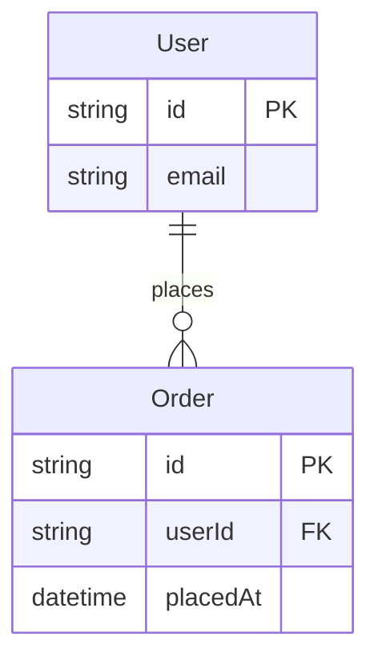
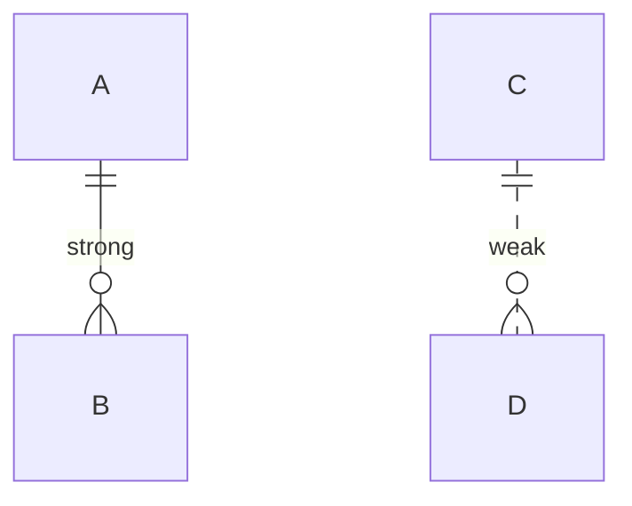

# ER Diagram Support Implementation Plan

> **For agentic workers:** REQUIRED SUB-SKILL: Use superpowers:subagent-driven-development (recommended) or superpowers:executing-plans to implement this plan task-by-task. Steps use checkbox (`- [ ]`) syntax for tracking.

**Goal:** Add Mermaid `erDiagram` support to mdx, rendering entities with typed attributes, PK/FK markers, wrapped comments, identifying/non-identifying relationships, and ASCII crow's foot cardinality.

**Architecture:** New `src/mermaid/er/` module hosts ER types, parser, layout adapter, and painter. Layout reuses the existing `mermaid::layout::layout` via a new `NodeShape::EntityBox` and an `Option<er::Entity>` payload on `Node`. Direction is adaptive: try `LeftRight`, fall back to `TopDown` if the laid-out width exceeds the terminal width.

**Tech Stack:** Rust 2024 edition, `anyhow` for errors, `insta` for snapshot tests, existing internal crates `mermaid`, `render`, `theme`.

**Spec:** `docs/superpowers/specs/2026-04-25-er-diagrams-design.md`

---

## File Structure

**Created:**
- `src/mermaid/er/mod.rs` — ER types: `ErDiagram`, `Entity`, `Attribute`, `KeyKind`, `Relationship`, `Cardinality`, `EntityLine`, `EntityLineKind`, `ErEdgeMeta`
- `src/mermaid/er/parse.rs` — `parse_er(content: &str) -> Result<ErDiagram>`
- `src/mermaid/er/layout.rs` — `to_flowchart(&ErDiagram, max_box_width: usize) -> FlowChart`
- `src/mermaid/er/ascii.rs` — `paint_entity` and `paint_cardinality` painters
- `docs/examples/er-minimal.md` — snapshot fixture (small ER)
- `docs/examples/er-full.md` — snapshot fixture (the `complex-flow-chart-example.md` ER block)
- `docs/examples/er-identifying.md` — snapshot fixture (`--` vs `..`)

**Modified:**
- `src/mermaid/mod.rs` — re-export `er` module, extend `Node` with `entity: Option<er::Entity>`, extend `Edge` with `er_meta: Option<er::ErEdgeMeta>`, add `NodeShape::EntityBox`, dispatch `erDiagram` in `render_mermaid`, change `render_mermaid` signature to take `terminal_width: usize`.
- `src/mermaid/parse.rs` — initialize new fields to `None` on flowchart-side `Node`/`Edge` construction.
- `src/mermaid/layout.rs` — `node_dimensions` branch for `EntityBox`; `route_edge` and downstream untouched.
- `src/mermaid/ascii.rs` — per-node paint dispatch: if `entity.is_some()`, call `er::ascii::paint_entity`; per-edge paint dispatch: if `er_meta.is_some()`, call `er::ascii::paint_cardinality` instead of arrowhead.
- `src/render.rs` — pass `width` (already available) to `render_mermaid` calls; update `render_blocks` test calls.
- `src/mermaid/sequence/parse.rs` — no change required (sequence has its own type tree).
- `tests/snapshots.rs` — add three new ER snapshot tests.
- `tests/integration.rs` — add ER end-to-end test.
- `README.md` — flip ER from "not yet supported" to supported, add minimal example.
- `docs/USAGE.md` — add ER syntax section.
- `CHANGELOG.md` — add `0.1.8` entry.
- `Cargo.toml` — bump version to `0.1.8`.

---

### Task 1: Stub the `er` module and extend shared types

**Files:**
- Create: `src/mermaid/er/mod.rs`
- Modify: `src/mermaid/mod.rs`
- Modify: `src/mermaid/parse.rs` (initialize new fields to `None`)

- [ ] **Step 1: Create the `er` module skeleton with type definitions**

Create `src/mermaid/er/mod.rs`:

```rust
pub mod ascii;
pub mod layout;
pub mod parse;

#[derive(Debug, Clone, PartialEq)]
pub struct ErDiagram {
    pub direction: super::Direction,
    /// True when the source contained an explicit `direction ...` line.
    /// When false, `render_mermaid` chooses adaptively (LR with TD fallback).
    pub direction_explicit: bool,
    pub entities: Vec<Entity>,
    pub relationships: Vec<Relationship>,
}

#[derive(Debug, Clone, PartialEq)]
pub struct Entity {
    pub name: String,
    pub attributes: Vec<Attribute>,
    /// Populated by the layout adapter.
    pub rendered_lines: Vec<EntityLine>,
    pub width: usize,
    pub height: usize,
}

#[derive(Debug, Clone, PartialEq)]
pub struct Attribute {
    pub ty: String,
    pub name: String,
    pub key: KeyKind,
    pub comment: Option<String>,
}

#[derive(Debug, Clone, Copy, PartialEq, Eq)]
pub enum KeyKind {
    None,
    Pk,
    Fk,
    PkFk,
}

#[derive(Debug, Clone, PartialEq)]
pub struct Relationship {
    pub left: String,
    pub right: String,
    pub left_card: Cardinality,
    pub right_card: Cardinality,
    pub identifying: bool,
    pub label: Option<String>,
}

#[derive(Debug, Clone, Copy, PartialEq, Eq)]
pub enum Cardinality {
    ZeroOrOne,
    ExactlyOne,
    ZeroOrMany,
    OneOrMany,
}

#[derive(Debug, Clone, PartialEq)]
pub struct EntityLine {
    pub kind: EntityLineKind,
    pub text: String,
}

#[derive(Debug, Clone, Copy, PartialEq, Eq)]
pub enum EntityLineKind {
    Header,
    Separator,
    AttrRow,
    CommentRow,
}

/// Carried on `Edge` for ER edges so the painter can draw cardinality glyphs.
#[derive(Debug, Clone, PartialEq)]
pub struct ErEdgeMeta {
    pub left_card: Cardinality,
    pub right_card: Cardinality,
    pub identifying: bool,
}
```

Create empty stubs so the module compiles:

`src/mermaid/er/parse.rs`:
```rust
use anyhow::Result;
use super::ErDiagram;

pub fn parse_er(_content: &str) -> Result<ErDiagram> {
    anyhow::bail!("ER parsing not implemented")
}

#[cfg(test)]
mod tests {}
```

`src/mermaid/er/layout.rs`:
```rust
use super::ErDiagram;
use crate::mermaid::FlowChart;

pub fn to_flowchart(_diagram: &ErDiagram, _max_box_width: usize) -> FlowChart {
    FlowChart {
        direction: crate::mermaid::Direction::TopDown,
        nodes: Vec::new(),
        edges: Vec::new(),
        subgraphs: Vec::new(),
    }
}

#[cfg(test)]
mod tests {}
```

`src/mermaid/er/ascii.rs`:
```rust
use crate::mermaid::layout::{LayoutResult, PositionedEdge, PositionedNode};

pub fn paint_entity(_canvas_lines: &mut [String], _node: &PositionedNode) {
    // Implemented in a later task.
}

pub fn paint_cardinality(_canvas_lines: &mut [String], _edge: &PositionedEdge) {
    // Implemented in a later task.
}

#[allow(dead_code)]
fn _unused(_l: &LayoutResult) {}

#[cfg(test)]
mod tests {}
```

- [ ] **Step 2: Extend `NodeShape`, `Node`, and `Edge` in `src/mermaid/mod.rs`**

Edit `src/mermaid/mod.rs`. Add `pub mod er;` next to the other module declarations. Then change three structs/enums:

```rust
pub mod ascii;
pub mod color;
pub mod er;
pub mod layout;
pub mod parse;
pub mod sequence;
```

```rust
#[derive(Debug, Clone, PartialEq)]
pub enum NodeShape {
    Rect,
    Rounded,
    Diamond,
    Circle,
    EntityBox,
}
```

```rust
#[derive(Debug, Clone, PartialEq)]
pub struct Node {
    pub id: String,
    pub label: String,
    pub shape: NodeShape,
    pub node_style: Option<NodeStyle>,
    /// Set only for ER entity boxes; None for flowchart nodes.
    pub entity: Option<er::Entity>,
}
```

```rust
#[derive(Debug, Clone, PartialEq)]
pub struct Edge {
    pub from: String,
    pub to: String,
    pub label: Option<String>,
    pub style: EdgeStyle,
    pub edge_style: Option<MermaidEdgeStyle>,
    /// Set only for ER edges; None for flowchart edges.
    pub er_meta: Option<er::ErEdgeMeta>,
}
```

- [ ] **Step 3: Update flowchart parser to set `entity: None` and `er_meta: None`**

Run `cargo check 2>&1 | grep -E "missing field|expected.*Node|expected.*Edge"` to find all `Node { ... }` and `Edge { ... }` literals. Add `entity: None` to every `Node` literal and `er_meta: None` to every `Edge` literal in `src/mermaid/parse.rs`.

If a literal lives elsewhere (sequence, tests), do the same.

- [ ] **Step 4: Update `layout.rs::node_dimensions` for `EntityBox`**

In `src/mermaid/layout.rs`, find `fn node_dimensions(label: &str, shape: &NodeShape, compact_diamond: bool) -> (usize, usize)`. Change the signature to accept the optional entity payload:

```rust
fn node_dimensions(
    label: &str,
    shape: &NodeShape,
    compact_diamond: bool,
    entity: Option<&super::er::Entity>,
) -> (usize, usize) {
    match shape {
        NodeShape::EntityBox => {
            if let Some(e) = entity {
                (e.width, e.height)
            } else {
                (label.len() + 4, 3)
            }
        }
        NodeShape::Rect | NodeShape::Rounded | NodeShape::Circle => (label.len() + 4, 3),
        NodeShape::Diamond => {
            if compact_diamond {
                (label.len() + 4, 3)
            } else {
                let inner_w = label.len() + 2;
                let half = inner_w.div_ceil(2);
                (inner_w + 2, half * 2 + 1)
            }
        }
    }
}
```

Update every call site within `layout.rs` to pass `node.entity.as_ref()`.

- [ ] **Step 5: `cargo build` to ensure the project compiles**

Run: `cargo build`
Expected: success, no warnings about unused imports.

- [ ] **Step 6: `cargo test` to ensure no regressions**

Run: `cargo test`
Expected: all existing tests pass.

- [ ] **Step 7: Commit**

```bash
git add src/mermaid/er src/mermaid/mod.rs src/mermaid/parse.rs src/mermaid/layout.rs
git commit -m "feat(mermaid): scaffold ER module and shared type extensions"
```

---

### Task 2: Thread `terminal_width` through `render_mermaid`

**Files:**
- Modify: `src/mermaid/mod.rs:77-167`
- Modify: `src/render.rs:265,292` and the test calls in the same file
- Modify: `src/mermaid/mod.rs:215-276` (existing tests)

- [ ] **Step 1: Change the `render_mermaid` signature**

In `src/mermaid/mod.rs`, update:

```rust
pub fn render_mermaid(
    content: &str,
    theme: &crate::theme::Theme,
    terminal_width: usize,
) -> anyhow::Result<(Vec<crate::render::StyledLine>, usize, usize)> {
    // existing body unchanged for now; terminal_width unused in flowchart/sequence branches
    let _ = terminal_width;
    // ... existing code ...
}
```

- [ ] **Step 2: Update `render.rs` call sites**

Edit `src/render.rs`. Find `mermaid::render_mermaid(content, theme)` (two production call sites, search for the literal string). Change both to:

```rust
mermaid::render_mermaid(content, theme, width as usize)
```

`width` is the `u16` parameter to `render_blocks` already in scope.

- [ ] **Step 3: Update existing `render_mermaid` unit tests in `src/mermaid/mod.rs`**

Find calls of the form `render_mermaid(input, theme)` in the `tests` module of `src/mermaid/mod.rs`. Change each to `render_mermaid(input, theme, 120)`.

- [ ] **Step 4: `cargo test` — confirm no regressions**

Run: `cargo test`
Expected: all existing tests pass.

- [ ] **Step 5: Commit**

```bash
git add src/mermaid/mod.rs src/render.rs
git commit -m "feat(mermaid): thread terminal_width into render_mermaid"
```

---

### Task 3: Dispatch `erDiagram` header in `render_mermaid`

**Files:**
- Modify: `src/mermaid/mod.rs:77-167`

- [ ] **Step 1: Write a failing test for ER dispatch**

Add to the `tests` module in `src/mermaid/mod.rs`:

```rust
#[test]
fn test_render_mermaid_dispatches_er_diagram() {
    let input = "erDiagram\n    A ||--o{ B : has\n";
    let theme = Theme::default_theme();
    // For now, ER dispatch returns the unimplemented bail from parse_er.
    let err = render_mermaid(input, theme, 120).unwrap_err();
    assert!(
        err.to_string().contains("not implemented") || err.to_string().contains("ER"),
        "unexpected error: {err}"
    );
}
```

- [ ] **Step 2: Run — confirm it fails because dispatch isn't wired**

Run: `cargo test test_render_mermaid_dispatches_er_diagram`
Expected: FAIL — current code parses `erDiagram` as a flowchart and errors with a different message.

- [ ] **Step 3: Add the dispatch branch**

In `src/mermaid/mod.rs::render_mermaid`, before the existing `if first_line == "sequenceDiagram"` branch, add:

```rust
if first_line == "erDiagram" {
    let _diagram = er::parse::parse_er(content)?;
    // Layout / paint wired in a later task; for now just propagate parse errors.
    anyhow::bail!("ER rendering not yet implemented");
}
```

- [ ] **Step 4: Run — confirm test passes**

Run: `cargo test test_render_mermaid_dispatches_er_diagram`
Expected: PASS.

- [ ] **Step 5: Commit**

```bash
git add src/mermaid/mod.rs
git commit -m "feat(mermaid): dispatch erDiagram header to ER parser"
```

---

### Task 4: Parse `erDiagram` header and direction extension

**Files:**
- Modify: `src/mermaid/er/parse.rs`

- [ ] **Step 1: Write failing tests for header parsing**

Replace the empty `tests` module in `src/mermaid/er/parse.rs`:

```rust
#[cfg(test)]
mod tests {
    use super::*;
    use crate::mermaid::Direction;

    #[test]
    fn test_parse_empty_diagram() {
        let d = parse_er("erDiagram\n").unwrap();
        assert_eq!(d.direction, Direction::TopDown);
        assert!(d.entities.is_empty());
        assert!(d.relationships.is_empty());
    }

    #[test]
    fn test_parse_explicit_direction_lr() {
        let d = parse_er("erDiagram\n    direction LR\n").unwrap();
        assert_eq!(d.direction, Direction::LeftRight);
    }

    #[test]
    fn test_parse_explicit_direction_td() {
        let d = parse_er("erDiagram\n    direction TD\n").unwrap();
        assert_eq!(d.direction, Direction::TopDown);
    }

    #[test]
    fn test_parse_skips_comments_before_header() {
        let d = parse_er("%% comment\n\nerDiagram\n").unwrap();
        assert!(d.entities.is_empty());
    }

    #[test]
    fn test_parse_missing_header_errors() {
        let err = parse_er("graph TD\n").unwrap_err();
        assert!(err.to_string().contains("erDiagram"));
    }
}
```

- [ ] **Step 2: Run — confirm tests fail**

Run: `cargo test --lib mermaid::er::parse`
Expected: FAIL (tests don't compile or all fail with "not implemented").

- [ ] **Step 3: Implement header + direction parsing**

Replace `src/mermaid/er/parse.rs` body:

```rust
use anyhow::{Result, bail};

use crate::mermaid::Direction;
use super::{ErDiagram};

pub fn parse_er(input: &str) -> Result<ErDiagram> {
    let mut lines = input.lines().peekable();

    // Header line.
    loop {
        match lines.next() {
            None => bail!("Empty input: expected `erDiagram` header"),
            Some(line) => {
                let trimmed = line.trim();
                if trimmed.is_empty() || trimmed.starts_with("%%") {
                    continue;
                }
                if trimmed != "erDiagram" {
                    bail!("Expected `erDiagram` header, got `{}`", trimmed);
                }
                break;
            }
        }
    }

    let mut direction = Direction::TopDown;

    for line in lines {
        let trimmed = line.trim();
        if trimmed.is_empty() || trimmed.starts_with("%%") {
            continue;
        }
        if let Some(rest) = trimmed.strip_prefix("direction ") {
            direction = match rest.trim() {
                "TD" | "TB" => Direction::TopDown,
                "BT" => Direction::BottomTop,
                "LR" => Direction::LeftRight,
                "RL" => Direction::RightLeft,
                other => bail!("Unknown direction: `{}`", other),
            };
            continue;
        }
        // Other lines parsed in later tasks.
    }

    Ok(ErDiagram {
        direction,
        direction_explicit,
        entities: Vec::new(),
        relationships: Vec::new(),
    })
}
```

Add `let mut direction_explicit = false;` next to the `let mut direction = Direction::TopDown;` declaration, and set `direction_explicit = true;` inside the `direction ` line branch right after assigning `direction`.

- [ ] **Step 4: Run — confirm tests pass**

Run: `cargo test --lib mermaid::er::parse`
Expected: 5 tests pass.

- [ ] **Step 5: Commit**

```bash
git add src/mermaid/er/parse.rs
git commit -m "feat(er): parse header and direction extension"
```

---

### Task 5: Parse relationships (cardinality + identifying + label)

**Files:**
- Modify: `src/mermaid/er/parse.rs`

- [ ] **Step 1: Write failing tests for relationships**

Append to the `tests` module in `src/mermaid/er/parse.rs`:

```rust
#[test]
fn test_parse_relationship_one_to_many_identifying() {
    let d = parse_er("erDiagram\n    A ||--o{ B : has\n").unwrap();
    assert_eq!(d.relationships.len(), 1);
    let r = &d.relationships[0];
    assert_eq!(r.left, "A");
    assert_eq!(r.right, "B");
    assert_eq!(r.left_card, Cardinality::ExactlyOne);
    assert_eq!(r.right_card, Cardinality::ZeroOrMany);
    assert!(r.identifying);
    assert_eq!(r.label.as_deref(), Some("has"));
}

#[test]
fn test_parse_relationship_non_identifying() {
    let d = parse_er("erDiagram\n    A ||..o{ B : maybe\n").unwrap();
    assert!(!d.relationships[0].identifying);
}

#[test]
fn test_parse_relationship_quoted_label() {
    let d = parse_er("erDiagram\n    A ||--|{ B : \"per-user pref\"\n").unwrap();
    assert_eq!(d.relationships[0].label.as_deref(), Some("per-user pref"));
}

#[test]
fn test_parse_relationship_no_label() {
    let d = parse_er("erDiagram\n    A }o--o{ B\n").unwrap();
    assert_eq!(d.relationships[0].label, None);
    assert_eq!(d.relationships[0].left_card, Cardinality::ZeroOrMany);
    assert_eq!(d.relationships[0].right_card, Cardinality::ZeroOrMany);
}

#[test]
fn test_parse_all_cardinality_tokens() {
    let pairs = [
        ("||", "||", Cardinality::ExactlyOne, Cardinality::ExactlyOne),
        ("o|", "|o", Cardinality::ZeroOrOne, Cardinality::ZeroOrOne),
        ("}o", "o{", Cardinality::ZeroOrMany, Cardinality::ZeroOrMany),
        ("}|", "|{", Cardinality::OneOrMany, Cardinality::OneOrMany),
    ];
    for (l, r, lc, rc) in pairs {
        let src = format!("erDiagram\n    A {l}--{r} B\n");
        let d = parse_er(&src).unwrap();
        assert_eq!(d.relationships[0].left_card, lc, "left {l}");
        assert_eq!(d.relationships[0].right_card, rc, "right {r}");
    }
}

#[test]
fn test_parse_relationship_creates_implicit_entities() {
    let d = parse_er("erDiagram\n    A ||--o{ B : x\n").unwrap();
    let names: Vec<&str> = d.entities.iter().map(|e| e.name.as_str()).collect();
    assert!(names.contains(&"A"));
    assert!(names.contains(&"B"));
}

#[test]
fn test_parse_unknown_cardinality_token_errors() {
    let err = parse_er("erDiagram\n    A xx--yy B\n").unwrap_err();
    assert!(err.to_string().contains("cardinality") || err.to_string().contains("xx"));
}
```

Add the `super::*` and the `Cardinality` import already covered.

- [ ] **Step 2: Run — confirm tests fail**

Run: `cargo test --lib mermaid::er::parse`
Expected: FAIL (relationships parsing not implemented).

- [ ] **Step 3: Implement relationship parsing**

Edit `src/mermaid/er/parse.rs` to add a relationship parser. Place this module-level helper above `parse_er`:

```rust
use super::{Cardinality, Entity, ErDiagram, KeyKind, Relationship};

/// Returns (left_card, right_card, identifying, after_op_idx) on success,
/// or None if no valid relationship operator is found.
fn try_parse_relationship_op(s: &str) -> Option<(Cardinality, Cardinality, bool, usize)> {
    // Operator forms: <LCARD><'--' or '..'><RCARD>
    // LCARD ∈ { "||", "o|", "}o", "}|" }
    // RCARD ∈ { "||", "|o", "o{", "|{" }
    const LEFT_TOKENS: &[(&str, Cardinality)] = &[
        ("||", Cardinality::ExactlyOne),
        ("o|", Cardinality::ZeroOrOne),
        ("}o", Cardinality::ZeroOrMany),
        ("}|", Cardinality::OneOrMany),
    ];
    const RIGHT_TOKENS: &[(&str, Cardinality)] = &[
        ("||", Cardinality::ExactlyOne),
        ("|o", Cardinality::ZeroOrOne),
        ("o{", Cardinality::ZeroOrMany),
        ("|{", Cardinality::OneOrMany),
    ];

    for (lt, lc) in LEFT_TOKENS {
        if !s.starts_with(lt) {
            continue;
        }
        let after_l = &s[lt.len()..];
        for (op, identifying) in [("--", true), ("..", false)] {
            if !after_l.starts_with(op) {
                continue;
            }
            let after_op = &after_l[op.len()..];
            for (rt, rc) in RIGHT_TOKENS {
                if after_op.starts_with(rt) {
                    let consumed = lt.len() + op.len() + rt.len();
                    return Some((*lc, *rc, identifying, consumed));
                }
            }
        }
    }
    None
}

fn parse_relationship_line(line: &str) -> Result<Option<Relationship>> {
    // Pattern: NAME <op> NAME (':' LABEL)?
    let line = line.trim();
    let (left, rest) = match line.split_once(char::is_whitespace) {
        Some(parts) => parts,
        None => return Ok(None),
    };
    let rest = rest.trim_start();

    let Some((lc, rc, identifying, consumed)) = try_parse_relationship_op(rest) else {
        // If the line doesn't contain a relationship operator, the caller will try
        // other line types (entity opener, etc.).
        return Ok(None);
    };
    let after_op = rest[consumed..].trim_start();

    let (right, label_part) = match after_op.split_once(char::is_whitespace) {
        Some(p) => p,
        None => (after_op, ""),
    };
    if right.is_empty() {
        bail!("Relationship missing right entity: `{}`", line);
    }

    let label = {
        let lp = label_part.trim_start();
        if let Some(after_colon) = lp.strip_prefix(':') {
            let raw = after_colon.trim();
            if raw.is_empty() {
                None
            } else if let Some(quoted) = raw.strip_prefix('"').and_then(|r| r.strip_suffix('"')) {
                Some(quoted.to_string())
            } else {
                Some(raw.to_string())
            }
        } else {
            None
        }
    };

    Ok(Some(Relationship {
        left: left.to_string(),
        right: right.to_string(),
        left_card: lc,
        right_card: rc,
        identifying,
        label,
    }))
}
```

Then update the body of `parse_er` to call it. Track entities-by-name and auto-create them:

```rust
pub fn parse_er(input: &str) -> Result<ErDiagram> {
    let mut lines = input.lines().peekable();

    // Header line.
    loop {
        match lines.next() {
            None => bail!("Empty input: expected `erDiagram` header"),
            Some(line) => {
                let trimmed = line.trim();
                if trimmed.is_empty() || trimmed.starts_with("%%") {
                    continue;
                }
                if trimmed != "erDiagram" {
                    bail!("Expected `erDiagram` header, got `{}`", trimmed);
                }
                break;
            }
        }
    }

    let mut direction = Direction::TopDown;
    let mut entity_order: Vec<String> = Vec::new();
    let mut entities: std::collections::HashMap<String, Entity> = std::collections::HashMap::new();
    let mut relationships: Vec<Relationship> = Vec::new();

    let mut ensure_entity = |name: &str,
                             entity_order: &mut Vec<String>,
                             entities: &mut std::collections::HashMap<String, Entity>| {
        if !entities.contains_key(name) {
            entity_order.push(name.to_string());
            entities.insert(
                name.to_string(),
                Entity {
                    name: name.to_string(),
                    attributes: Vec::new(),
                    rendered_lines: Vec::new(),
                    width: 0,
                    height: 0,
                },
            );
        }
    };

    for (lineno, line) in lines.enumerate() {
        let trimmed = line.trim();
        if trimmed.is_empty() || trimmed.starts_with("%%") {
            continue;
        }
        if let Some(rest) = trimmed.strip_prefix("direction ") {
            direction = match rest.trim() {
                "TD" | "TB" => Direction::TopDown,
                "BT" => Direction::BottomTop,
                "LR" => Direction::LeftRight,
                "RL" => Direction::RightLeft,
                other => bail!("Unknown direction: `{}`", other),
            };
            continue;
        }
        match parse_relationship_line(trimmed) {
            Ok(Some(rel)) => {
                ensure_entity(&rel.left, &mut entity_order, &mut entities);
                ensure_entity(&rel.right, &mut entity_order, &mut entities);
                relationships.push(rel);
                continue;
            }
            Ok(None) => {}
            Err(e) => return Err(e.context(format!("line {}", lineno + 2))),
        }

        // Detect malformed cardinality tokens early: a line containing `--` or `..`
        // that didn't parse as a relationship is an error.
        if trimmed.contains("--") || trimmed.contains("..") {
            bail!(
                "Unrecognized cardinality token on line {}: `{}`",
                lineno + 2,
                trimmed
            );
        }

        // Entity blocks parsed in a later task. For now, ignore other lines so the
        // header/relationship tests pass; entity-block tests will land next.
    }

    let entities_vec: Vec<Entity> = entity_order
        .into_iter()
        .map(|n| entities.remove(&n).unwrap())
        .collect();

    Ok(ErDiagram {
        direction,
        direction_explicit,
        entities: entities_vec,
        relationships,
    })
}
```

- [ ] **Step 4: Run — confirm relationship tests pass**

Run: `cargo test --lib mermaid::er::parse`
Expected: all parser tests pass (header + relationship suites).

- [ ] **Step 5: Commit**

```bash
git add src/mermaid/er/parse.rs
git commit -m "feat(er): parse relationships, cardinality tokens, identifying flag"
```

---

### Task 6: Parse entity blocks with typed attributes (no comments yet)

**Files:**
- Modify: `src/mermaid/er/parse.rs`

- [ ] **Step 1: Write failing tests for entity blocks**

Append to the `tests` module:

```rust
#[test]
fn test_parse_entity_block_basic() {
    let src = "erDiagram\n  Foo {\n    string id\n    int count\n  }\n";
    let d = parse_er(src).unwrap();
    assert_eq!(d.entities.len(), 1);
    let e = &d.entities[0];
    assert_eq!(e.name, "Foo");
    assert_eq!(e.attributes.len(), 2);
    assert_eq!(e.attributes[0].ty, "string");
    assert_eq!(e.attributes[0].name, "id");
    assert_eq!(e.attributes[0].key, KeyKind::None);
    assert_eq!(e.attributes[1].ty, "int");
    assert_eq!(e.attributes[1].name, "count");
}

#[test]
fn test_parse_entity_block_pk_fk() {
    let src = "erDiagram\n  Foo {\n    string id PK\n    string parentId FK\n  }\n";
    let d = parse_er(src).unwrap();
    assert_eq!(d.entities[0].attributes[0].key, KeyKind::Pk);
    assert_eq!(d.entities[0].attributes[1].key, KeyKind::Fk);
}

#[test]
fn test_parse_entity_block_pk_and_fk() {
    let src = "erDiagram\n  Foo {\n    string id PK,FK\n  }\n";
    let d = parse_er(src).unwrap();
    assert_eq!(d.entities[0].attributes[0].key, KeyKind::PkFk);
}

#[test]
fn test_parse_unclosed_entity_block_errors() {
    let src = "erDiagram\n  Foo {\n    string id\n";
    let err = parse_er(src).unwrap_err();
    assert!(err.to_string().contains("Foo") || err.to_string().contains("unclosed"));
}

#[test]
fn test_parse_entity_block_then_relationship() {
    let src = "erDiagram\n  Foo {\n    string id\n  }\n  Foo ||--o{ Bar : has\n";
    let d = parse_er(src).unwrap();
    assert_eq!(d.entities.len(), 2);
    assert_eq!(d.entities[0].name, "Foo");
    assert_eq!(d.entities[0].attributes.len(), 1);
    assert_eq!(d.entities[1].name, "Bar");
    assert_eq!(d.entities[1].attributes.len(), 0);
    assert_eq!(d.relationships.len(), 1);
}
```

- [ ] **Step 2: Run — confirm tests fail**

Run: `cargo test --lib mermaid::er::parse`
Expected: 5 new tests fail (entity blocks not parsed).

- [ ] **Step 3: Replace the per-line loop with a stateful parser**

Replace the `for (lineno, line) in lines.enumerate()` block in `parse_er` with a stateful loop that handles entity blocks. Keep the header/direction/relationship logic.

```rust
    let lines_vec: Vec<&str> = lines.collect();
    let mut i = 0;
    let line_offset = 2; // header was line 1; remaining lines start at 2 in user space

    while i < lines_vec.len() {
        let line = lines_vec[i];
        let trimmed = line.trim();
        i += 1;
        if trimmed.is_empty() || trimmed.starts_with("%%") {
            continue;
        }
        if let Some(rest) = trimmed.strip_prefix("direction ") {
            direction = match rest.trim() {
                "TD" | "TB" => Direction::TopDown,
                "BT" => Direction::BottomTop,
                "LR" => Direction::LeftRight,
                "RL" => Direction::RightLeft,
                other => bail!("Unknown direction: `{}`", other),
            };
            continue;
        }
        if let Some(rel) = parse_relationship_line(trimmed)? {
            ensure_entity(&rel.left, &mut entity_order, &mut entities);
            ensure_entity(&rel.right, &mut entity_order, &mut entities);
            relationships.push(rel);
            continue;
        }
        if let Some((name, rest_after_brace)) = parse_entity_opener(trimmed) {
            let mut attrs: Vec<Attribute> = Vec::new();
            // The opener may be `Name {` alone, or have content after `{` we ignore for now.
            let _ = rest_after_brace;
            let mut closed = false;
            while i < lines_vec.len() {
                let inner = lines_vec[i].trim();
                i += 1;
                if inner.is_empty() || inner.starts_with("%%") {
                    continue;
                }
                if inner == "}" {
                    closed = true;
                    break;
                }
                let attr = parse_attribute_line(inner)
                    .with_context(|| format!("line {}", i + line_offset - 1))?;
                attrs.push(attr);
            }
            if !closed {
                bail!("Unclosed entity block for `{}`", name);
            }
            ensure_entity(&name, &mut entity_order, &mut entities);
            let e = entities.get_mut(&name).unwrap();
            e.attributes = attrs;
            continue;
        }
        if trimmed.contains("--") || trimmed.contains("..") {
            bail!("Unrecognized cardinality token: `{}`", trimmed);
        }
        // Unknown line: ignore. Mermaid is forgiving here.
    }
```

Add helpers above `parse_er`:

```rust
fn parse_entity_opener(line: &str) -> Option<(String, String)> {
    // `Name {` or `Name{`
    let line = line.trim_end();
    let line = line.strip_suffix('{')?;
    let name = line.trim();
    if name.is_empty() {
        return None;
    }
    // Bareword check: identifier characters only.
    if !name.chars().all(|c| c.is_ascii_alphanumeric() || c == '_') {
        return None;
    }
    Some((name.to_string(), String::new()))
}

fn parse_attribute_line(line: &str) -> Result<Attribute> {
    // Format: TYPE NAME [PK | FK | PK,FK | FK,PK] [QUOTED_COMMENT]
    // Comments are added in the next task; here we accept lines without them.
    let mut rest = line.trim();
    let comment = if let Some(open) = rest.find('"') {
        let after = &rest[open + 1..];
        let close = after
            .find('"')
            .ok_or_else(|| anyhow::anyhow!("Unterminated comment in attribute: `{}`", line))?;
        let c = after[..close].to_string();
        rest = rest[..open].trim();
        Some(c)
    } else {
        None
    };

    let mut parts = rest.split_whitespace();
    let ty = parts
        .next()
        .ok_or_else(|| anyhow::anyhow!("Empty attribute line"))?
        .to_string();
    let name = parts
        .next()
        .ok_or_else(|| anyhow::anyhow!("Attribute missing name: `{}`", line))?
        .to_string();
    let key_token = parts.next();
    if parts.next().is_some() {
        bail!("Unexpected extra tokens in attribute: `{}`", line);
    }
    let key = match key_token {
        None => KeyKind::None,
        Some("PK") => KeyKind::Pk,
        Some("FK") => KeyKind::Fk,
        Some("PK,FK") | Some("FK,PK") => KeyKind::PkFk,
        Some(other) => bail!("Unknown key marker: `{}`", other),
    };
    Ok(Attribute {
        ty,
        name,
        key,
        comment,
    })
}
```

Add `use anyhow::Context;` to the imports at the top of the file.

- [ ] **Step 4: Run — confirm entity-block tests pass**

Run: `cargo test --lib mermaid::er::parse`
Expected: all parser tests (header + relationships + entity blocks) pass.

- [ ] **Step 5: Commit**

```bash
git add src/mermaid/er/parse.rs
git commit -m "feat(er): parse entity blocks with typed attributes and PK/FK"
```

---

### Task 7: Parse attribute comments

**Files:**
- Modify: `src/mermaid/er/parse.rs`

The previous task already accepted quoted comments to keep `parse_attribute_line` simple. This task adds explicit tests and an edge case (comment with internal commas/quotes).

- [ ] **Step 1: Write failing tests for comments**

Append to the `tests` module:

```rust
#[test]
fn test_parse_attribute_with_comment() {
    let src = "erDiagram\n  Foo {\n    string name \"the slug, lowercase\"\n  }\n";
    let d = parse_er(src).unwrap();
    let a = &d.entities[0].attributes[0];
    assert_eq!(a.ty, "string");
    assert_eq!(a.name, "name");
    assert_eq!(a.comment.as_deref(), Some("the slug, lowercase"));
}

#[test]
fn test_parse_attribute_pk_with_comment() {
    let src = "erDiagram\n  Foo {\n    string id PK \"primary key\"\n  }\n";
    let d = parse_er(src).unwrap();
    let a = &d.entities[0].attributes[0];
    assert_eq!(a.key, KeyKind::Pk);
    assert_eq!(a.comment.as_deref(), Some("primary key"));
}

#[test]
fn test_parse_attribute_unterminated_comment_errors() {
    let src = "erDiagram\n  Foo {\n    string id PK \"oops\n  }\n";
    let err = parse_er(src).unwrap_err();
    assert!(err.to_string().contains("Unterminated") || err.to_string().contains("comment"));
}
```

- [ ] **Step 2: Run — confirm tests pass (or fix what fails)**

Run: `cargo test --lib mermaid::er::parse`
Expected: PASS. (The previous task's `parse_attribute_line` already supports comments; if any test fails due to a single-line check on the unterminated case, ensure the parser detects unclosed quotes in that single line.)

If `test_parse_attribute_unterminated_comment_errors` is failing because the parser silently swallows the partial comment: fix `parse_attribute_line` to require both opening and closing `"` to be present in the same line.

- [ ] **Step 3: Commit**

```bash
git add src/mermaid/er/parse.rs
git commit -m "test(er): parser coverage for attribute comments"
```

---

### Task 8: Layout adapter — empty entities

**Files:**
- Modify: `src/mermaid/er/layout.rs`

- [ ] **Step 1: Write failing tests**

Replace the `tests` module in `src/mermaid/er/layout.rs`:

```rust
#[cfg(test)]
mod tests {
    use super::*;
    use crate::mermaid::Direction;
    use crate::mermaid::er::{Cardinality, ErDiagram, Entity, Relationship};

    fn empty_entity(name: &str) -> Entity {
        Entity {
            name: name.to_string(),
            attributes: Vec::new(),
            rendered_lines: Vec::new(),
            width: 0,
            height: 0,
        }
    }

    #[test]
    fn test_to_flowchart_empty_entity_box_dimensions() {
        let mut diag = ErDiagram {
            direction: Direction::TopDown,
            entities: vec![empty_entity("Foo")],
            relationships: Vec::new(),
        };
        let chart = to_flowchart(&mut diag, 50);
        assert_eq!(chart.nodes.len(), 1);
        let node = &chart.nodes[0];
        assert_eq!(node.shape, crate::mermaid::NodeShape::EntityBox);
        let entity = node.entity.as_ref().unwrap();
        // Width = name + borders + padding. "+ Foo +" with leading/trailing dash padding
        // and a 2-cell border on each side; concretely at least name.len() + 4.
        assert!(entity.width >= "Foo".len() + 4);
        assert!(entity.height >= 3); // top border + name row + bottom border
    }

    #[test]
    fn test_to_flowchart_relationship_becomes_edge() {
        let mut diag = ErDiagram {
            direction: Direction::TopDown,
            entities: vec![empty_entity("A"), empty_entity("B")],
            relationships: vec![Relationship {
                left: "A".into(),
                right: "B".into(),
                left_card: Cardinality::ExactlyOne,
                right_card: Cardinality::ZeroOrMany,
                identifying: true,
                label: Some("has".into()),
            }],
        };
        let chart = to_flowchart(&mut diag, 50);
        assert_eq!(chart.edges.len(), 1);
        let edge = &chart.edges[0];
        assert_eq!(edge.from, "A");
        assert_eq!(edge.to, "B");
        assert_eq!(edge.label.as_deref(), Some("has"));
        let meta = edge.er_meta.as_ref().unwrap();
        assert_eq!(meta.left_card, Cardinality::ExactlyOne);
        assert_eq!(meta.right_card, Cardinality::ZeroOrMany);
        assert!(meta.identifying);
    }

    #[test]
    fn test_to_flowchart_non_identifying_uses_dotted_style() {
        let mut diag = ErDiagram {
            direction: Direction::TopDown,
            entities: vec![empty_entity("A"), empty_entity("B")],
            relationships: vec![Relationship {
                left: "A".into(),
                right: "B".into(),
                left_card: Cardinality::ExactlyOne,
                right_card: Cardinality::ExactlyOne,
                identifying: false,
                label: None,
            }],
        };
        let chart = to_flowchart(&mut diag, 50);
        assert_eq!(chart.edges[0].style, crate::mermaid::EdgeStyle::Dotted);
    }
}
```

Note: tests now take `&mut ErDiagram` because the adapter writes back `rendered_lines`/`width`/`height`. Update the production signature accordingly.

- [ ] **Step 2: Run — confirm tests fail**

Run: `cargo test --lib mermaid::er::layout`
Expected: FAIL (stub returns empty FlowChart).

- [ ] **Step 3: Implement empty-entity layout**

Replace `src/mermaid/er/layout.rs`:

```rust
use super::{ErDiagram, EntityLine, EntityLineKind};
use crate::mermaid::{Edge, EdgeStyle, FlowChart, Node, NodeShape};

pub fn to_flowchart(diagram: &mut ErDiagram, max_box_width: usize) -> FlowChart {
    for entity in diagram.entities.iter_mut() {
        layout_entity(entity, max_box_width);
    }

    let nodes: Vec<Node> = diagram
        .entities
        .iter()
        .map(|e| Node {
            id: e.name.clone(),
            label: e.name.clone(),
            shape: NodeShape::EntityBox,
            node_style: None,
            entity: Some(e.clone()),
        })
        .collect();

    let edges: Vec<Edge> = diagram
        .relationships
        .iter()
        .map(|r| Edge {
            from: r.left.clone(),
            to: r.right.clone(),
            label: r.label.clone(),
            style: if r.identifying {
                EdgeStyle::Arrow
            } else {
                EdgeStyle::Dotted
            },
            edge_style: None,
            er_meta: Some(super::ErEdgeMeta {
                left_card: r.left_card,
                right_card: r.right_card,
                identifying: r.identifying,
            }),
        })
        .collect();

    FlowChart {
        direction: diagram.direction.clone(),
        nodes,
        edges,
        subgraphs: Vec::new(),
    }
}

fn layout_entity(entity: &mut super::Entity, _max_box_width: usize) {
    // Header row: " Name "
    let header = format!(" {} ", entity.name);
    // Separator and inner content for empty-attribute case is just the header.
    let inner_w = header.len();
    let width = inner_w + 2; // 1 border on each side
    let height = if entity.attributes.is_empty() {
        3 // top border, header, bottom border
    } else {
        // separator + per-attribute rows added in the next task; placeholder for now.
        3 + 1 + entity.attributes.len()
    };

    let mut lines = vec![EntityLine {
        kind: EntityLineKind::Header,
        text: header,
    }];
    if !entity.attributes.is_empty() {
        lines.push(EntityLine {
            kind: EntityLineKind::Separator,
            text: "-".repeat(inner_w),
        });
        for a in &entity.attributes {
            // Placeholder text; full row format lands in Task 9.
            lines.push(EntityLine {
                kind: EntityLineKind::AttrRow,
                text: format!(" {} {} ", a.ty, a.name),
            });
        }
    }

    entity.rendered_lines = lines;
    entity.width = width;
    entity.height = height;
}
```

- [ ] **Step 4: Run — confirm tests pass**

Run: `cargo test --lib mermaid::er::layout`
Expected: PASS.

- [ ] **Step 5: Commit**

```bash
git add src/mermaid/er/layout.rs
git commit -m "feat(er): layout adapter for empty entities and relationships"
```

---

### Task 9: Layout adapter — attribute rows with column alignment

**Files:**
- Modify: `src/mermaid/er/layout.rs`

- [ ] **Step 1: Write failing tests**

Append to the `tests` module:

```rust
#[test]
fn test_to_flowchart_attribute_columns_aligned() {
    use crate::mermaid::er::{Attribute, KeyKind};
    let mut diag = ErDiagram {
        direction: Direction::TopDown,
        entities: vec![Entity {
            name: "Foo".into(),
            attributes: vec![
                Attribute {
                    ty: "string".into(),
                    name: "id".into(),
                    key: KeyKind::Pk,
                    comment: None,
                },
                Attribute {
                    ty: "int".into(),
                    name: "ttlMillis".into(),
                    key: KeyKind::None,
                    comment: None,
                },
            ],
            rendered_lines: Vec::new(),
            width: 0,
            height: 0,
        }],
        relationships: Vec::new(),
    };
    let _ = to_flowchart(&mut diag, 50);
    let entity = diag.entities[0].clone();
    let attr_rows: Vec<&str> = entity
        .rendered_lines
        .iter()
        .filter(|l| l.kind == crate::mermaid::er::EntityLineKind::AttrRow)
        .map(|l| l.text.as_str())
        .collect();
    assert_eq!(attr_rows.len(), 2);
    // Both rows must have the type and name columns aligned (same start indices).
    let r0 = attr_rows[0];
    let r1 = attr_rows[1];
    let ty_col_0 = r0.find("string").unwrap();
    let ty_col_1 = r1.find("int").unwrap();
    assert_eq!(ty_col_0, ty_col_1, "type column not aligned: `{}` vs `{}`", r0, r1);
    let name_col_0 = r0.find("id").unwrap();
    let name_col_1 = r1.find("ttlMillis").unwrap();
    assert_eq!(name_col_0, name_col_1, "name column not aligned");
    // PK marker must appear in row 0 and not in row 1 at the same column.
    assert!(r0.contains("PK"));
    assert!(!r1.contains("PK"));
}
```

- [ ] **Step 2: Run — confirm test fails**

Run: `cargo test --lib mermaid::er::layout test_to_flowchart_attribute_columns_aligned`
Expected: FAIL (placeholder text format).

- [ ] **Step 3: Implement column alignment in `layout_entity`**

Replace `layout_entity` in `src/mermaid/er/layout.rs`:

```rust
fn key_str(k: super::KeyKind) -> &'static str {
    match k {
        super::KeyKind::None => "",
        super::KeyKind::Pk => "PK",
        super::KeyKind::Fk => "FK",
        super::KeyKind::PkFk => "PK,FK",
    }
}

fn layout_entity(entity: &mut super::Entity, _max_box_width: usize) {
    let key_w = entity
        .attributes
        .iter()
        .map(|a| key_str(a.key).len())
        .max()
        .unwrap_or(0);
    let ty_w = entity
        .attributes
        .iter()
        .map(|a| a.ty.len())
        .max()
        .unwrap_or(0);
    let name_w = entity
        .attributes
        .iter()
        .map(|a| a.name.len())
        .max()
        .unwrap_or(0);

    let header_text = format!(" {} ", entity.name);

    let attr_rows: Vec<String> = entity
        .attributes
        .iter()
        .map(|a| {
            // ` <KEY:key_w> <TY:ty_w> <NAME:name_w> `
            format!(
                " {:<kw$} {:<tw$} {:<nw$} ",
                key_str(a.key),
                a.ty,
                a.name,
                kw = key_w,
                tw = ty_w,
                nw = name_w,
            )
        })
        .collect();

    // Inner width = max of header and any attribute row.
    let inner_w = std::iter::once(header_text.len())
        .chain(attr_rows.iter().map(|r| r.len()))
        .max()
        .unwrap_or(0);
    let width = inner_w + 2; // 1 border on each side
    let height_attr_rows = attr_rows.len();
    let height = if entity.attributes.is_empty() {
        3
    } else {
        // top border + header + separator + N attribute rows + bottom border
        3 + 1 + height_attr_rows
    };

    let mut lines = vec![EntityLine {
        kind: EntityLineKind::Header,
        // Pad header to inner_w for clean rendering.
        text: pad_to(&header_text, inner_w),
    }];
    if !entity.attributes.is_empty() {
        lines.push(EntityLine {
            kind: EntityLineKind::Separator,
            text: "-".repeat(inner_w),
        });
        for r in attr_rows {
            lines.push(EntityLine {
                kind: EntityLineKind::AttrRow,
                text: pad_to(&r, inner_w),
            });
        }
    }

    entity.rendered_lines = lines;
    entity.width = width;
    entity.height = height;
}

fn pad_to(s: &str, width: usize) -> String {
    if s.len() >= width {
        s.to_string()
    } else {
        format!("{}{}", s, " ".repeat(width - s.len()))
    }
}
```

- [ ] **Step 4: Run — confirm tests pass**

Run: `cargo test --lib mermaid::er::layout`
Expected: PASS.

- [ ] **Step 5: Commit**

```bash
git add src/mermaid/er/layout.rs
git commit -m "feat(er): align attribute columns inside entity boxes"
```

---

### Task 10: Layout adapter — comment wrapping

**Files:**
- Modify: `src/mermaid/er/layout.rs`

- [ ] **Step 1: Write failing tests**

Append to the `tests` module:

```rust
#[test]
fn test_to_flowchart_short_comment_inlined() {
    use crate::mermaid::er::{Attribute, KeyKind, EntityLineKind};
    let mut diag = ErDiagram {
        direction: Direction::TopDown,
        entities: vec![Entity {
            name: "Foo".into(),
            attributes: vec![Attribute {
                ty: "string".into(),
                name: "id".into(),
                key: KeyKind::Pk,
                comment: Some("primary".into()),
            }],
            rendered_lines: Vec::new(),
            width: 0,
            height: 0,
        }],
        relationships: Vec::new(),
    };
    to_flowchart(&mut diag, 50);
    let lines = &diag.entities[0].rendered_lines;
    let attr = lines.iter().find(|l| l.kind == EntityLineKind::AttrRow).unwrap();
    assert!(attr.text.contains("primary"), "expected inlined comment, got `{}`", attr.text);
    assert_eq!(
        lines.iter().filter(|l| l.kind == EntityLineKind::CommentRow).count(),
        0
    );
}

#[test]
fn test_to_flowchart_long_comment_wraps_to_subsequent_rows() {
    use crate::mermaid::er::{Attribute, KeyKind, EntityLineKind};
    let mut diag = ErDiagram {
        direction: Direction::TopDown,
        entities: vec![Entity {
            name: "Foo".into(),
            attributes: vec![Attribute {
                ty: "int".into(),
                name: "ttlMs".into(),
                key: KeyKind::None,
                // Definitely wider than the budget at max_box_width=40.
                comment: Some(
                    "max age before discard, default ten days, applied at send time"
                        .into(),
                ),
            }],
            rendered_lines: Vec::new(),
            width: 0,
            height: 0,
        }],
        relationships: Vec::new(),
    };
    to_flowchart(&mut diag, 40);
    let lines = &diag.entities[0].rendered_lines;
    let comment_rows: Vec<&str> = lines
        .iter()
        .filter(|l| l.kind == EntityLineKind::CommentRow)
        .map(|l| l.text.as_str())
        .collect();
    assert!(comment_rows.len() >= 2, "expected wrapping, got {} rows", comment_rows.len());
    // Box width must be <= max_box_width.
    assert!(diag.entities[0].width <= 40, "box width {} exceeds max 40", diag.entities[0].width);
}
```

- [ ] **Step 2: Run — confirm tests fail**

Run: `cargo test --lib mermaid::er::layout`
Expected: FAIL (no comment rendering yet).

- [ ] **Step 3: Implement comment inlining + wrapping**

Update `layout_entity` in `src/mermaid/er/layout.rs`:

```rust
fn layout_entity(entity: &mut super::Entity, max_box_width: usize) {
    let key_w = entity
        .attributes
        .iter()
        .map(|a| key_str(a.key).len())
        .max()
        .unwrap_or(0);
    let ty_w = entity
        .attributes
        .iter()
        .map(|a| a.ty.len())
        .max()
        .unwrap_or(0);
    let name_w = entity
        .attributes
        .iter()
        .map(|a| a.name.len())
        .max()
        .unwrap_or(0);

    let header_text = format!(" {} ", entity.name);

    // Reserve space for a 1-cell border on each side and 1-cell padding.
    // ` KEY TY NAME ` = 1 + key_w + 1 + ty_w + 1 + name_w + 1
    let attr_prefix_w = 1 + key_w + 1 + ty_w + 1 + name_w + 1;
    // Available inner width must stay <= max_box_width - 2 (borders).
    let inner_max = max_box_width.saturating_sub(2);
    let inline_comment_budget = inner_max.saturating_sub(attr_prefix_w);
    // Continuation rows align under the NAME column; available width:
    let continuation_indent = 1 + key_w + 1 + ty_w + 1; // start of name column
    let continuation_budget = inner_max.saturating_sub(continuation_indent + 1);

    // Build attribute rows + their (optional) wrapped comment continuations.
    let mut row_lines: Vec<EntityLine> = Vec::new();
    let mut max_row_w = 0usize;

    for a in &entity.attributes {
        let base = format!(
            " {:<kw$} {:<tw$} {:<nw$} ",
            key_str(a.key),
            a.ty,
            a.name,
            kw = key_w,
            tw = ty_w,
            nw = name_w,
        );
        match &a.comment {
            None => {
                max_row_w = max_row_w.max(base.len());
                row_lines.push(EntityLine {
                    kind: EntityLineKind::AttrRow,
                    text: base,
                });
            }
            Some(c) => {
                if c.len() <= inline_comment_budget && inline_comment_budget > 0 {
                    let combined = format!("{}{} ", base, c);
                    max_row_w = max_row_w.max(combined.len());
                    row_lines.push(EntityLine {
                        kind: EntityLineKind::AttrRow,
                        text: combined,
                    });
                } else {
                    max_row_w = max_row_w.max(base.len());
                    row_lines.push(EntityLine {
                        kind: EntityLineKind::AttrRow,
                        text: base,
                    });
                    let pad = " ".repeat(continuation_indent);
                    for chunk in wrap_words(c, continuation_budget.max(1)) {
                        let line = format!("{}{} ", pad, chunk);
                        max_row_w = max_row_w.max(line.len());
                        row_lines.push(EntityLine {
                            kind: EntityLineKind::CommentRow,
                            text: line,
                        });
                    }
                }
            }
        }
    }

    let inner_w = std::iter::once(header_text.len())
        .chain(std::iter::once(max_row_w))
        .max()
        .unwrap_or(0)
        .min(inner_max.max(header_text.len()));

    let width = inner_w + 2;

    let mut lines = vec![EntityLine {
        kind: EntityLineKind::Header,
        text: pad_to(&header_text, inner_w),
    }];
    if !entity.attributes.is_empty() {
        lines.push(EntityLine {
            kind: EntityLineKind::Separator,
            text: "-".repeat(inner_w),
        });
        for mut r in row_lines {
            r.text = pad_to(&r.text, inner_w);
            lines.push(r);
        }
    }

    entity.height = lines.len() + 2; // borders top + bottom
    entity.rendered_lines = lines;
    entity.width = width;
}

fn wrap_words(text: &str, max_w: usize) -> Vec<String> {
    if max_w == 0 {
        return vec![text.to_string()];
    }
    let mut out: Vec<String> = Vec::new();
    let mut current = String::new();
    for word in text.split_whitespace() {
        if current.is_empty() {
            // Word longer than budget: hard-cut.
            if word.len() > max_w {
                let mut w = word;
                while w.len() > max_w {
                    let (head, tail) = w.split_at(max_w);
                    out.push(head.to_string());
                    w = tail;
                }
                current = w.to_string();
            } else {
                current = word.to_string();
            }
        } else if current.len() + 1 + word.len() <= max_w {
            current.push(' ');
            current.push_str(word);
        } else {
            out.push(std::mem::take(&mut current));
            // Re-enter the loop with this word as the start of a new line.
            if word.len() > max_w {
                let mut w = word;
                while w.len() > max_w {
                    let (head, tail) = w.split_at(max_w);
                    out.push(head.to_string());
                    w = tail;
                }
                current = w.to_string();
            } else {
                current = word.to_string();
            }
        }
    }
    if !current.is_empty() {
        out.push(current);
    }
    out
}
```

- [ ] **Step 4: Run — confirm tests pass**

Run: `cargo test --lib mermaid::er::layout`
Expected: PASS.

- [ ] **Step 5: Commit**

```bash
git add src/mermaid/er/layout.rs
git commit -m "feat(er): inline short comments and wrap long ones below attribute"
```

---

### Task 11: Painter — entity box rendering

**Files:**
- Modify: `src/mermaid/er/ascii.rs`
- Modify: `src/mermaid/ascii.rs` — dispatch to ER painter for `EntityBox` nodes

- [ ] **Step 1: Inspect existing flowchart node painter**

Read `src/mermaid/ascii.rs` around the function that draws `Rect` nodes (search for `NodeShape::Rect` and the surrounding paint loop). Note its `Canvas` API (`canvas.set(x, y, ch)` and `canvas.set_styled`).

Run: `grep -n "NodeShape::Rect\|paint_node\|fn paint\|fn render_styled" src/mermaid/ascii.rs`

- [ ] **Step 2: Write a failing integration-style test**

Add to `src/mermaid/er/ascii.rs`:

```rust
#[cfg(test)]
mod tests {
    use crate::mermaid::Direction;
    use crate::mermaid::er::{Cardinality, ErDiagram, Entity, ErEdgeMeta, Relationship};
    use crate::mermaid::er::layout::to_flowchart;

    fn make_entity(name: &str) -> Entity {
        Entity {
            name: name.to_string(),
            attributes: Vec::new(),
            rendered_lines: Vec::new(),
            width: 0,
            height: 0,
        }
    }

    #[test]
    fn test_entity_box_renders_name_and_borders() {
        let mut diag = ErDiagram {
            direction: Direction::LeftRight,
            entities: vec![make_entity("Foo")],
            relationships: Vec::new(),
        };
        let chart = to_flowchart(&mut diag, 40);
        let layout = crate::mermaid::layout::layout(&chart);
        let lines = crate::mermaid::ascii::render(&layout);
        let joined = lines.join("\n");
        assert!(joined.contains("Foo"), "expected entity name in render:\n{}", joined);
        assert!(joined.contains("+-"), "expected box top corner:\n{}", joined);
        assert!(joined.contains("|"), "expected box side border:\n{}", joined);
    }
}
```

Note: `crate::mermaid::ascii::render` is the existing plain (non-styled) renderer. If only `to_styled_lines` is public, switch the test to assemble plain text from styled spans.

- [ ] **Step 3: Run — confirm test fails**

Run: `cargo test --lib mermaid::er::ascii`
Expected: FAIL — entity boxes don't render.

- [ ] **Step 4: Implement `paint_entity`**

Replace `src/mermaid/er/ascii.rs`:

```rust
use crate::mermaid::layout::{PositionedEdge, PositionedNode};
use crate::mermaid::er::EntityLineKind;

/// Paints the borders and inner content of an entity box at its positioned
/// coordinates onto `canvas_lines` (one String per row). Caller has already
/// allocated the canvas with sufficient height; rows are padded with spaces.
pub fn paint_entity(canvas_lines: &mut [String], node: &PositionedNode) {
    let Some(entity) = node.entity.as_ref() else {
        return;
    };

    let w = node.width;
    let h = node.height;
    if w < 2 || h < 2 {
        return;
    }

    // Top border: +<dashes>+
    paint_horizontal(canvas_lines, node.x, node.y, w, '+', '-');
    // Bottom border
    paint_horizontal(canvas_lines, node.x, node.y + h - 1, w, '+', '-');
    // Side borders
    for dy in 1..(h - 1) {
        set_cell(canvas_lines, node.x, node.y + dy, '|');
        set_cell(canvas_lines, node.x + w - 1, node.y + dy, '|');
    }

    // Inner content: header / separator / attribute rows / comment rows
    let mut row_y = node.y + 1;
    for line in &entity.rendered_lines {
        if row_y >= node.y + h - 1 {
            break;
        }
        let inner = match line.kind {
            EntityLineKind::Separator => "-".repeat(w - 2),
            _ => line.text.clone(),
        };
        paint_text(canvas_lines, node.x + 1, row_y, &inner, w - 2);
        row_y += 1;
    }
    // Header underline (separator) painted only if attributes were present —
    // already produced as an EntityLine.
}

fn set_cell(canvas_lines: &mut [String], x: usize, y: usize, ch: char) {
    if y >= canvas_lines.len() {
        return;
    }
    let line = &mut canvas_lines[y];
    while line.chars().count() <= x {
        line.push(' ');
    }
    let mut chars: Vec<char> = line.chars().collect();
    chars[x] = ch;
    *line = chars.into_iter().collect();
}

fn paint_horizontal(
    canvas_lines: &mut [String],
    x: usize,
    y: usize,
    w: usize,
    corner: char,
    fill: char,
) {
    if y >= canvas_lines.len() || w == 0 {
        return;
    }
    set_cell(canvas_lines, x, y, corner);
    for dx in 1..(w - 1) {
        set_cell(canvas_lines, x + dx, y, fill);
    }
    set_cell(canvas_lines, x + w - 1, y, corner);
}

fn paint_text(canvas_lines: &mut [String], x: usize, y: usize, text: &str, max_w: usize) {
    if y >= canvas_lines.len() {
        return;
    }
    for (dx, ch) in text.chars().take(max_w).enumerate() {
        set_cell(canvas_lines, x + dx, y, ch);
    }
}

pub fn paint_cardinality(_canvas_lines: &mut [String], _edge: &PositionedEdge) {
    // Implemented in Task 12.
}
```

- [ ] **Step 5: Wire into the main painter**

Edit `src/mermaid/ascii.rs`. Find the per-node paint loop in the public `render` function (the one that returns `Vec<String>`). Add a branch that delegates `EntityBox` nodes:

```rust
match node.shape {
    crate::mermaid::NodeShape::EntityBox => {
        crate::mermaid::er::ascii::paint_entity(&mut lines, node);
    }
    _ => {
        // existing painting logic for Rect/Rounded/Diamond/Circle
    }
}
```

(Use the actual variable name for the canvas/lines vector in the existing function.)

Do the same for the styled variant (`to_styled_lines` / `render_styled`). For the styled variant, the simplest path for v1 is:
1. Render plain ER nodes via `paint_entity` into a `Vec<String>` first.
2. Convert each row to `StyledLine` with theme `diagram_node_text` color for the body and `diagram_node_border` color for `+`, `-`, `|` cells.

Provide a small helper in `er::ascii`:

```rust
pub fn styled_from_plain(
    plain: &[String],
    border_color: Option<crate::render::Color>,
    text_color: Option<crate::render::Color>,
) -> Vec<crate::render::StyledLine> {
    plain
        .iter()
        .map(|line| {
            let spans: Vec<crate::render::StyledSpan> = line
                .chars()
                .map(|ch| {
                    let is_border = matches!(ch, '+' | '-' | '|');
                    crate::render::StyledSpan {
                        text: ch.to_string(),
                        style: crate::render::SpanStyle {
                            fg: if is_border { border_color.clone() } else { text_color.clone() },
                            ..Default::default()
                        },
                    }
                })
                .collect();
            crate::render::StyledLine { spans }
        })
        .collect()
}
```

Wire this into `mermaid::mod.rs::render_mermaid` for the ER branch in Task 14.

- [ ] **Step 6: Run — confirm tests pass**

Run: `cargo test --lib mermaid::er`
Expected: PASS.

- [ ] **Step 7: Commit**

```bash
git add src/mermaid/er/ascii.rs src/mermaid/ascii.rs
git commit -m "feat(er): paint entity boxes onto the ASCII canvas"
```

---

### Task 12: Painter — crow's foot endpoint glyphs

**Files:**
- Modify: `src/mermaid/er/ascii.rs`
- Modify: `src/mermaid/ascii.rs` — suppress arrowhead and call `paint_cardinality` for ER edges

- [ ] **Step 1: Write a failing test**

Append to `src/mermaid/er/ascii.rs::tests`:

```rust
#[test]
fn test_relationship_renders_crow_foot_glyphs() {
    use crate::mermaid::er::{Cardinality, Relationship};
    let mut diag = ErDiagram {
        direction: Direction::LeftRight,
        entities: vec![make_entity("A"), make_entity("B")],
        relationships: vec![Relationship {
            left: "A".into(),
            right: "B".into(),
            left_card: Cardinality::ExactlyOne,
            right_card: Cardinality::ZeroOrMany,
            identifying: true,
            label: None,
        }],
    };
    let chart = to_flowchart(&mut diag, 40);
    let layout = crate::mermaid::layout::layout(&chart);
    let lines = crate::mermaid::ascii::render(&layout);
    let joined = lines.join("\n");
    // ExactlyOne on the left side: "||" near the A entity.
    // ZeroOrMany on the right side: "o{" near the B entity.
    assert!(joined.contains("||"), "missing one-and-only-one glyph:\n{}", joined);
    assert!(joined.contains("o{"), "missing zero-or-many glyph:\n{}", joined);
}
```

- [ ] **Step 2: Run — confirm test fails**

Run: `cargo test --lib mermaid::er::ascii test_relationship_renders_crow_foot_glyphs`
Expected: FAIL.

- [ ] **Step 3: Implement `paint_cardinality`**

Replace the stub in `src/mermaid/er/ascii.rs`:

```rust
use crate::mermaid::er::Cardinality;

fn left_glyph(c: Cardinality) -> &'static str {
    match c {
        Cardinality::ExactlyOne => "||",
        Cardinality::ZeroOrOne => "o|",
        Cardinality::ZeroOrMany => "}o",
        Cardinality::OneOrMany => "}|",
    }
}

fn right_glyph(c: Cardinality) -> &'static str {
    match c {
        Cardinality::ExactlyOne => "||",
        Cardinality::ZeroOrOne => "|o",
        Cardinality::ZeroOrMany => "o{",
        Cardinality::OneOrMany => "|{",
    }
}

pub fn paint_cardinality(canvas_lines: &mut [String], edge: &PositionedEdge) {
    let Some(meta) = edge.er_meta.as_ref() else {
        return;
    };
    if edge.points.len() < 2 {
        return;
    }
    let start = edge.points[0];
    let end = *edge.points.last().unwrap();

    // Determine the orientation of each endpoint. We paint glyphs in two
    // adjacent cells along the direction of the edge approaching the entity.
    let l = left_glyph(meta.left_card);
    let r = right_glyph(meta.right_card);

    paint_glyph_at(canvas_lines, start, edge.points[1], l);
    paint_glyph_at(canvas_lines, end, edge.points[edge.points.len() - 2], r);
}

fn paint_glyph_at(
    canvas_lines: &mut [String],
    endpoint: (usize, usize),
    next: (usize, usize),
    glyph: &str,
) {
    // Determine direction from endpoint toward `next`: paint glyph chars in the
    // two cells nearest the endpoint along that direction.
    let dx = next.0 as isize - endpoint.0 as isize;
    let dy = next.1 as isize - endpoint.1 as isize;
    let chars: Vec<char> = glyph.chars().collect();
    if chars.len() != 2 {
        return;
    }
    let (c0, c1) = (chars[0], chars[1]);
    let (x, y) = endpoint;
    if dx.abs() > dy.abs() {
        // Horizontal edge: cell adjacent in the direction of next.
        if dx > 0 {
            set_cell(canvas_lines, x, y, c0);
            set_cell(canvas_lines, x + 1, y, c1);
        } else if dx < 0 {
            // Painting toward the left: c0 is closer to the entity.
            if x >= 1 {
                set_cell(canvas_lines, x, y, c0);
                set_cell(canvas_lines, x - 1, y, c1);
            }
        }
    } else if dy != 0 {
        // Vertical edge: stack the two characters vertically near the endpoint.
        if dy > 0 {
            set_cell(canvas_lines, x, y, c0);
            set_cell(canvas_lines, x, y + 1, c1);
        } else {
            if y >= 1 {
                set_cell(canvas_lines, x, y, c0);
                set_cell(canvas_lines, x, y - 1, c1);
            }
        }
    }
}
```

- [ ] **Step 4: Suppress arrowheads for ER edges**

In `src/mermaid/ascii.rs`, find the per-edge arrowhead painter (search for `arrow` / `->` in glyph painting) and skip it when `edge.er_meta.is_some()`. Then, after the existing edge body is painted, call:

```rust
if edge.er_meta.is_some() {
    crate::mermaid::er::ascii::paint_cardinality(&mut lines, edge);
}
```

Apply to both the plain renderer and the styled renderer.

- [ ] **Step 5: Run — confirm tests pass**

Run: `cargo test --lib mermaid::er::ascii`
Expected: PASS.

- [ ] **Step 6: Commit**

```bash
git add src/mermaid/er/ascii.rs src/mermaid/ascii.rs
git commit -m "feat(er): paint crow's foot cardinality glyphs at edge endpoints"
```

---

### Task 13: Wire the ER branch in `render_mermaid` end-to-end

**Files:**
- Modify: `src/mermaid/mod.rs`

- [ ] **Step 1: Write a failing end-to-end test**

Add to the `tests` module in `src/mermaid/mod.rs`:

```rust
#[test]
fn test_render_er_diagram_end_to_end() {
    let input = "erDiagram\n    A ||--o{ B : has\n    A {\n      string id PK\n    }\n";
    let theme = Theme::default_theme();
    let (lines, n_entities, n_rels) = render_mermaid(input, theme, 200).unwrap();
    assert_eq!(n_entities, 2, "should report 2 entities");
    assert_eq!(n_rels, 1, "should report 1 relationship");
    let body: String = lines
        .iter()
        .flat_map(|l| l.spans.iter().map(|s| s.text.as_str()))
        .collect();
    assert!(body.contains("A"));
    assert!(body.contains("B"));
    assert!(body.contains("PK"));
    assert!(body.contains("||") || body.contains("o{"));
}
```

- [ ] **Step 2: Run — confirm it fails**

Run: `cargo test test_render_er_diagram_end_to_end`
Expected: FAIL — current ER branch bails with "not yet implemented".

- [ ] **Step 3: Replace the ER bail with the full pipeline**

Replace the ER dispatch branch in `render_mermaid`:

```rust
if first_line == "erDiagram" {
    let mut diagram = er::parse::parse_er(content)?;
    let entity_count = diagram.entities.len();
    let rel_count = diagram.relationships.len();

    let max_box_width = (terminal_width / 3).clamp(20, 50);
    let mut chart = er::layout::to_flowchart(&mut diagram, max_box_width);

    // Honor explicit direction; otherwise try LR and fall back to TD.
    let mut positioned = if diagram.direction_explicit {
        chart.direction = diagram.direction.clone();
        layout::layout(&chart)
    } else {
        chart.direction = Direction::LeftRight;
        let lr = layout::layout(&chart);
        if lr.width > terminal_width {
            chart.direction = Direction::TopDown;
            layout::layout(&chart)
        } else {
            lr
        }
    };

    // Apply theme defaults to ER nodes/edges (no explicit styles in v1).
    for node in &mut positioned.nodes {
        if node.node_style.is_none() {
            node.node_style = Some(NodeStyle {
                fill: None,
                stroke: Some(color::resolve_color(&theme.diagram_node_border, theme)),
                color: Some(color::resolve_color(&theme.diagram_node_text, theme)),
            });
        }
    }
    for edge in &mut positioned.edges {
        if edge.edge_style.is_none() {
            edge.edge_style = Some(MermaidEdgeStyle {
                stroke: Some(color::resolve_color(&theme.diagram_edge_stroke, theme)),
                label_color: Some(color::resolve_color(&theme.diagram_edge_label, theme)),
            });
        }
    }

    let lines = ascii::render_styled(&positioned);
    return Ok((lines, entity_count, rel_count));
}
```

- [ ] **Step 4: Run — confirm end-to-end test passes**

Run: `cargo test test_render_er_diagram_end_to_end`
Expected: PASS.

- [ ] **Step 5: Run full suite — confirm no regressions**

Run: `cargo test`
Expected: all tests pass.

- [ ] **Step 6: Commit**

```bash
git add src/mermaid/mod.rs src/mermaid/er/mod.rs src/mermaid/er/parse.rs src/mermaid/er/layout.rs
git commit -m "feat(mermaid): wire ER pipeline with adaptive direction"
```

---

### Task 14: Snapshot fixtures and tests

**Files:**
- Create: `docs/examples/er-minimal.md`
- Create: `docs/examples/er-full.md`
- Create: `docs/examples/er-identifying.md`
- Modify: `tests/snapshots.rs`

- [ ] **Step 1: Create `er-minimal.md`**

Content:

```markdown
# ER minimal

Two entities with one relationship.


```

- [ ] **Step 2: Create `er-identifying.md`**

```markdown
# ER identifying vs non-identifying


```

- [ ] **Step 3: Create `er-full.md`**

Copy the `erDiagram` block from `complex-flow-chart-example.md` (lines 228–298) into a new file:

```markdown
# ER full

```mermaid
erDiagram
    Notification ||--o{ NotificationBusinessPreference : "per-business opt-out"
    ...  (entire ER block from complex-flow-chart-example.md)
```
```

(Use the literal block content from the existing example file. Wrap with the markdown heading and fenced block as shown.)

- [ ] **Step 4: Add snapshot tests**

Append to `tests/snapshots.rs`:

```rust
// er-minimal.md
snapshot_test!(snapshot_er_minimal_w80, "docs/examples/er-minimal.md", 80);
snapshot_test!(snapshot_er_minimal_w120, "docs/examples/er-minimal.md", 120);

// er-identifying.md
snapshot_test!(snapshot_er_identifying_w80, "docs/examples/er-identifying.md", 80);
snapshot_test!(snapshot_er_identifying_w120, "docs/examples/er-identifying.md", 120);

// er-full.md
snapshot_test!(snapshot_er_full_w120, "docs/examples/er-full.md", 120);
snapshot_test!(snapshot_er_full_w200, "docs/examples/er-full.md", 200);
```

- [ ] **Step 5: Generate snapshots**

Run: `cargo insta test --review` (or `INSTA_UPDATE=auto cargo test`)
Manually inspect each generated snapshot in `tests/snapshots/snapshots__snapshot_er_*.snap`. Confirm:
- Entity boxes have a name row, separator, and aligned attribute rows.
- PK/FK markers appear on the correct rows.
- Long comments wrap below the attribute name.
- Crow's foot glyphs appear at edge endpoints (`||`, `o{`, etc.).
- Identifying edge uses solid characters, non-identifying uses `.`/`:`.

If output is wrong, fix the relevant module and re-run rather than accepting bad snapshots.

- [ ] **Step 6: Accept snapshots**

After visual review, accept with `cargo insta accept` (or whatever incantation the project uses; check `Cargo.toml`/CI for the convention).

- [ ] **Step 7: Run the full test suite**

Run: `cargo test`
Expected: all tests pass, including the new snapshots.

- [ ] **Step 8: Commit**

```bash
git add docs/examples/er-minimal.md docs/examples/er-identifying.md docs/examples/er-full.md tests/snapshots.rs tests/snapshots/snapshots__snapshot_er_*.snap
git commit -m "test(er): snapshot fixtures for minimal, identifying, and full ER"
```

---

### Task 15: Integration test through the binary

**Files:**
- Modify: `tests/integration.rs`

- [ ] **Step 1: Write a failing integration test**

Append to `tests/integration.rs`:

```rust
#[test]
fn integration_renders_er_diagram() {
    use std::process::Command;
    let output = Command::new(env!("CARGO_BIN_EXE_mdx"))
        .arg("docs/examples/er-minimal.md")
        .arg("--no-pager")
        .arg("--width")
        .arg("120")
        .output()
        .expect("failed to spawn mdx");
    assert!(
        output.status.success(),
        "mdx failed: {}",
        String::from_utf8_lossy(&output.stderr)
    );
    let stdout = String::from_utf8_lossy(&output.stdout);
    assert!(stdout.contains("User"), "missing User entity:\n{}", stdout);
    assert!(stdout.contains("Order"), "missing Order entity:\n{}", stdout);
    assert!(stdout.contains("PK"), "missing PK marker:\n{}", stdout);
    assert!(
        stdout.contains("||") || stdout.contains("o{"),
        "missing crow's foot glyph:\n{}",
        stdout
    );
}
```

- [ ] **Step 2: Run — confirm it passes**

Run: `cargo test --test integration integration_renders_er_diagram`
Expected: PASS (snapshot tests already exercised the path; this just locks in the binary contract).

- [ ] **Step 3: Commit**

```bash
git add tests/integration.rs
git commit -m "test(er): integration test exercising the binary on er-minimal.md"
```

---

### Task 16: Documentation and version bump

**Files:**
- Modify: `README.md`
- Modify: `docs/USAGE.md`
- Modify: `CHANGELOG.md`
- Modify: `Cargo.toml`

- [ ] **Step 1: Update README**

Edit `README.md`. Find the line:

```
> **Diagram support is scoped.** Today mdx renders `graph` / `flowchart` and `sequenceDiagram`. Class, state, ER, gantt, and other types are not yet supported — PRs welcome.
```

Replace with:

```
> **Diagram support is scoped.** Today mdx renders `graph` / `flowchart`, `sequenceDiagram`, and `erDiagram`. Class, state, gantt, and other types are not yet supported — PRs welcome.
```

In the "What you get" list, add:

```
- **ER diagrams** — entities with PK/FK attributes, wrapped comments, ASCII crow's foot cardinality, identifying / non-identifying relationships
```

- [ ] **Step 2: Update USAGE.md**

Append a new section to `docs/USAGE.md`:

```markdown
## Mermaid ER diagrams

mdx renders `erDiagram` blocks as ASCII tables linked by ASCII crow's foot
endpoints.

### Supported syntax

- **Header:** `erDiagram`
- **Direction (extension):** `direction TD` / `direction LR`. Without one, mdx
  tries `LR` first and falls back to `TD` if the laid-out width exceeds the
  terminal width.
- **Relationships:** `LEFT <lcard> <op> <rcard> RIGHT [: LABEL]`
  - `<op>` is `--` (identifying, solid) or `..` (non-identifying, dotted).
  - `<lcard>` is one of `||`, `o|`, `}o`, `}|`.
  - `<rcard>` is one of `||`, `|o`, `o{`, `|{`.
  - `LABEL` is a quoted string or a bareword.
- **Entities:** `NAME { ... }` with one attribute per line:
  - `TYPE NAME [PK | FK | PK,FK | FK,PK] ["comment"]`
  - Long comments wrap below the attribute, aligned under the NAME column.
  - Box width is capped per terminal width; tweak by passing `--width`.

### Crow's foot glyphs

| Cardinality | Left | Right |
| --- | --- | --- |
| Exactly one | `\|\|` | `\|\|` |
| Zero or one | `o\|` | `\|o` |
| Zero or many | `}o` | `o{` |
| One or many | `}\|` | `\|{` |
```

- [ ] **Step 3: Update CHANGELOG.md**

Add an entry at the top:

```markdown
## 0.1.8 — 2026-04-25

### Added
- Mermaid `erDiagram` support: entities with typed attributes, PK/FK markers,
  wrapped comments, ASCII crow's foot cardinality, identifying and
  non-identifying relationships, optional `direction` extension.
```

- [ ] **Step 4: Bump version in `Cargo.toml`**

Edit `Cargo.toml`. Change `version = "0.1.7"` to `version = "0.1.8"`.

- [ ] **Step 5: `cargo build` to refresh `Cargo.lock`**

Run: `cargo build`
Expected: builds; `Cargo.lock` updates the package version.

- [ ] **Step 6: `cargo test` — final regression check**

Run: `cargo test`
Expected: all tests pass.

- [ ] **Step 7: Commit**

```bash
git add README.md docs/USAGE.md CHANGELOG.md Cargo.toml Cargo.lock
git commit -m "docs(er): document ER diagram support and bump to 0.1.8"
```

---

## Self-review notes

The following spec items map to tasks:

| Spec section | Task |
|---|---|
| Architecture (new `er/` module, shared type extensions, dispatch) | 1, 3 |
| Data model | 1 |
| Parsing — header, direction | 4 |
| Parsing — relationships, cardinality, identifying, label, auto-create entities | 5 |
| Parsing — entity blocks, attributes, PK/FK, errors | 6, 7 |
| Layout adapter — empty entities, dim calc | 8 |
| Layout adapter — column alignment | 9 |
| Layout adapter — comment inlining/wrapping, max_box_width | 10 |
| Painting — entity box (border, header, separator, attribute rows, comment rows) | 11 |
| Painting — crow's foot endpoints, suppress arrowhead | 12 |
| Painting — identifying solid vs non-identifying dotted | inherited from existing `EdgeStyle::Dotted` rendering, exercised by snapshots in 14 |
| Painting — relationship label mid-edge | inherited from existing flowchart edge label painter, exercised by snapshots in 14 |
| `terminal_width` parameter | 2 |
| Adaptive direction (LR → TD fallback, honor explicit direction) | 13 |
| Theming (no new keys; reuse diagram colors) | 13 |
| Snapshot tests (er_minimal, er_full, er_identifying_vs_non, LR overflow → TD) | 14 (LR overflow exercised by `er-full.md` at width 120) |
| Integration test | 15 |
| Docs (README, USAGE, CHANGELOG) | 16 |

No placeholders. Type names and method signatures are consistent across tasks (`parse_er`, `to_flowchart`, `paint_entity`, `paint_cardinality`, `ErDiagram { direction, direction_explicit, entities, relationships }`, `Entity { name, attributes, rendered_lines, width, height }`, `ErEdgeMeta { left_card, right_card, identifying }`).
