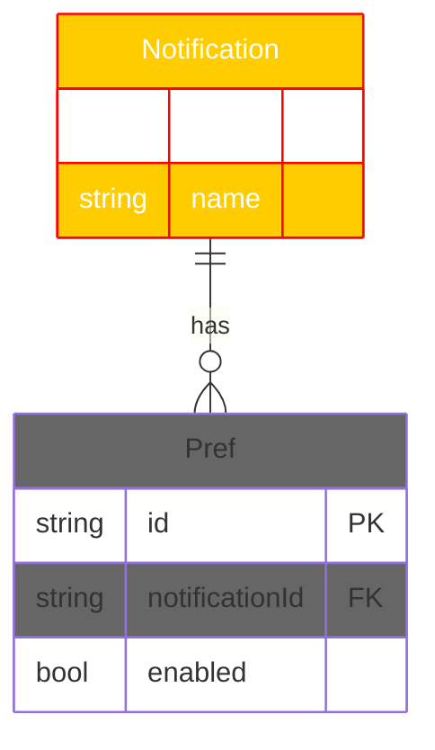

# ER Coloring + Custom Styles Implementation Plan

> **For agentic workers:** REQUIRED SUB-SKILL: Use superpowers:subagent-driven-development (recommended) or superpowers:executing-plans to implement this plan task-by-task. Steps use checkbox (`- [ ]`) syntax for tracking.

**Goal:** Make ER diagrams pick up theme colors by default and accept the same `style` / `classDef` / `class` directives flowchart already supports.

**Architecture:** Two coordinated changes: (1) ER parser learns three new directives, attaching `NodeStyle` to entities; (2) styled painter is rewritten from a "replace whole rows with default-styled spans" hack into a per-cell rebuilder that honors `node_style.stroke` (borders + crow's foot) and `node_style.color` (text content).

**Tech Stack:** Rust 2024, `anyhow` for errors, `insta` for snapshots, existing `mermaid::color::parse_node_style_props` helper.

**Spec:** `docs/superpowers/specs/2026-04-26-er-coloring-design.md`

---

## File Structure

**Modified:**
- `src/mermaid/er/mod.rs` — add `node_style: Option<NodeStyle>` field on `Entity`.
- `src/mermaid/er/parse.rs` — parse `style` / `classDef` / `class`; apply at end-of-parse; auto-create entities for style/class refs.
- `src/mermaid/er/layout.rs::to_flowchart` — propagate `entity.node_style` onto `Node.node_style`.
- `src/mermaid/er/ascii.rs` — add `paint_entity_styled` and `paint_cardinality_styled` plus a per-cell rebuilder helper.
- `src/mermaid/ascii.rs::render_styled` — replace the "rows_to_replace + single default-styled span" block with calls to the new styled painters.
- `tests/snapshots.rs` — add a styled snapshot.
- `docs/USAGE.md` — add a "Styling" subsection under ER docs.
- `CHANGELOG.md` — `0.1.9` entry.
- `Cargo.toml` — bump version `0.1.8` → `0.1.9`.

**Created:**
- `docs/examples/er-styled.md` — fixture exercising `style` + `classDef` + `class`.
- Auto-generated `tests/snapshots/snapshots__snapshot_er_styled_w120.snap`.

---

### Task 1: Add `node_style` to `Entity` and propagate through layout

**Files:**
- Modify: `src/mermaid/er/mod.rs` (Entity struct)
- Modify: `src/mermaid/er/parse.rs` (Entity literal in `ensure_entity` and any other constructors)
- Modify: `src/mermaid/er/layout.rs` (Node literal in `to_flowchart`; one new test)
- Modify: `src/mermaid/er/ascii.rs` (test helper `make_entity`)

- [ ] **Step 1: Write a failing test that round-trips `node_style` through the adapter**

Append to `src/mermaid/er/layout.rs::tests`:

```rust
#[test]
fn test_to_flowchart_propagates_node_style() {
    use crate::mermaid::NodeStyle;
    use crate::render::Color;
    let style = NodeStyle {
        fill: None,
        stroke: Some(Color::Red),
        color: Some(Color::Blue),
    };
    let mut diag = ErDiagram {
        direction: Direction::TopDown,
        direction_explicit: false,
        entities: vec![Entity {
            name: "Foo".into(),
            attributes: Vec::new(),
            rendered_lines: Vec::new(),
            width: 0,
            height: 0,
            node_style: Some(style.clone()),
        }],
        relationships: Vec::new(),
    };
    let chart = to_flowchart(&mut diag, 50);
    assert_eq!(chart.nodes[0].node_style, Some(style));
}
```

- [ ] **Step 2: Run — confirm it fails to compile**

Run: `cargo test mermaid::er::layout`
Expected: FAIL — `Entity` has no `node_style` field.

- [ ] **Step 3: Add the field on `Entity`**

In `src/mermaid/er/mod.rs`, find the `Entity` struct and add the field:

```rust
#[derive(Debug, Clone, PartialEq)]
pub struct Entity {
    pub name: String,
    pub attributes: Vec<Attribute>,
    /// Populated by the layout adapter.
    pub rendered_lines: Vec<EntityLine>,
    pub width: usize,
    pub height: usize,
    /// User-supplied or class-derived style. None means "use theme defaults".
    pub node_style: Option<crate::mermaid::NodeStyle>,
}
```

- [ ] **Step 4: Initialize the new field on every existing `Entity` literal**

Find all `Entity { ... }` literals in:
- `src/mermaid/er/parse.rs` — the literal inside `ensure_entity`
- `src/mermaid/er/layout.rs` — every `Entity { ... }` inside `tests`
- `src/mermaid/er/ascii.rs` — `make_entity` helper inside `tests`

Add `node_style: None` to each. The `cargo build` error messages list the exact line numbers.

For example, `ensure_entity` becomes:

```rust
fn ensure_entity(
    name: &str,
    entity_order: &mut Vec<String>,
    entities: &mut std::collections::HashMap<String, Entity>,
) {
    if !entities.contains_key(name) {
        entity_order.push(name.to_string());
        entities.insert(
            name.to_string(),
            Entity {
                name: name.to_string(),
                attributes: Vec::new(),
                rendered_lines: Vec::new(),
                width: 0,
                height: 0,
                node_style: None,
            },
        );
    }
}
```

- [ ] **Step 5: Propagate on the `Node` literal in `to_flowchart`**

In `src/mermaid/er/layout.rs::to_flowchart`, find the `.map(|e| Node { ... })` block. Change `node_style: None` to `node_style: e.node_style.clone()`:

```rust
let nodes: Vec<Node> = diagram
    .entities
    .iter()
    .map(|e| Node {
        id: e.name.clone(),
        label: e.name.clone(),
        shape: NodeShape::EntityBox,
        node_style: e.node_style.clone(),
        entity: Some(e.clone()),
    })
    .collect();
```

- [ ] **Step 6: Run — confirm tests pass**

Run: `cargo test mermaid::er::layout`
Expected: all layout tests pass including the new one.

Run: `cargo test`
Expected: 306 tests pass (305 baseline + 1 new).

- [ ] **Step 7: Commit**

```bash
git add src/mermaid/er
git commit -m "feat(er): add node_style field on Entity and propagate through layout"
```

---

### Task 2: Parse `style ENTITY` directive

**Files:**
- Modify: `src/mermaid/er/parse.rs`

- [ ] **Step 1: Write failing tests**

Append to `src/mermaid/er/parse.rs::tests`:

```rust
#[test]
fn test_parse_style_directive() {
    use crate::mermaid::NodeStyle;
    use crate::render::Color;
    let src = "erDiagram\n  Foo {\n    string id\n  }\n  style Foo fill:#ff0000,stroke:#00ff00,color:#0000ff\n";
    let d = parse_er(src).unwrap();
    let style = d.entities[0].node_style.as_ref().unwrap();
    assert_eq!(style.fill, Some(Color::Rgb(255, 0, 0)));
    assert_eq!(style.stroke, Some(Color::Rgb(0, 255, 0)));
    assert_eq!(style.color, Some(Color::Rgb(0, 0, 255)));
}

#[test]
fn test_parse_style_on_implicit_entity() {
    use crate::render::Color;
    // Entity referenced only by relationship + style line; no { } block.
    let src = "erDiagram\n  A ||--o{ B : has\n  style A stroke:#ff0000\n";
    let d = parse_er(src).unwrap();
    let a = d.entities.iter().find(|e| e.name == "A").unwrap();
    assert_eq!(a.node_style.as_ref().unwrap().stroke, Some(Color::Rgb(255, 0, 0)));
}
```

- [ ] **Step 2: Run — confirm tests fail**

Run: `cargo test mermaid::er::parse`
Expected: FAIL.

- [ ] **Step 3: Add the style line handler**

In `src/mermaid/er/parse.rs`, the body loop currently has the structure:

```rust
while i < body_lines.len() {
    let trimmed = body_lines[i].trim();
    i += 1;
    if trimmed.is_empty() || trimmed.starts_with("%%") { continue; }
    if let Some(rest) = trimmed.strip_prefix("direction ") { ... continue; }
    if let Some(rel) = parse_relationship_line(trimmed)? { ... continue; }
    if let Some(name) = parse_entity_opener(trimmed) { ... continue; }
    if trimmed.contains("--") || trimmed.contains("..") { bail!(...) }
}
```

Insert the new handler **before** the `parse_relationship_line` branch (so `style` / `classDef` / `class` lines are claimed before the cardinality fallthrough guard sees them). Add three new accumulators next to the existing ones:

```rust
let mut node_styles: Vec<(String, super::super::NodeStyle)> = Vec::new();
```

(Place this near the existing `let mut entity_order = Vec::new();` declarations. Tasks 3 will add `class_defs` and `class_assignments` next to it.)

Then in the body loop, before the relationship handler:

```rust
if let Some(rest) = trimmed.strip_prefix("style ") {
    if let Some((id, props)) = rest.split_once(char::is_whitespace) {
        let style = crate::mermaid::color::parse_node_style_props(props.trim());
        node_styles.push((id.trim().to_string(), style));
    }
    continue;
}
```

Note: `parse_node_style_props` is `pub(crate)` so reachable from sibling modules.

After the body loop, before constructing `entities_vec`, apply the styles:

```rust
for (id, style) in &node_styles {
    ensure_entity(id, &mut entity_order, &mut entities);
    let e = entities.get_mut(id).unwrap();
    e.node_style = Some(style.clone());
}
```

- [ ] **Step 4: Run — confirm tests pass**

Run: `cargo test mermaid::er::parse`
Expected: all parser tests pass including the two new ones.

- [ ] **Step 5: Commit**

```bash
git add src/mermaid/er/parse.rs
git commit -m "feat(er): parse style directive for per-entity colors"
```

---

### Task 3: Parse `classDef` + `class` directives, with override semantics

**Files:**
- Modify: `src/mermaid/er/parse.rs`

- [ ] **Step 1: Write failing tests**

Append to `src/mermaid/er/parse.rs::tests`:

```rust
#[test]
fn test_parse_class_def_and_assignment() {
    use crate::render::Color;
    let src = "erDiagram\n  A {\n    string id\n  }\n  classDef bar fill:#ff00ff\n  class A bar\n";
    let d = parse_er(src).unwrap();
    let a = &d.entities[0];
    assert_eq!(
        a.node_style.as_ref().unwrap().fill,
        Some(Color::Rgb(255, 0, 255))
    );
}

#[test]
fn test_parse_class_assignment_multiple_entities() {
    use crate::render::Color;
    let src = "erDiagram\n  A {\n    string id\n  }\n  B {\n    string id\n  }\n  C {\n    string id\n  }\n  classDef bar fill:#ff00ff\n  class A,B,C bar\n";
    let d = parse_er(src).unwrap();
    for entity in &d.entities {
        assert_eq!(
            entity.node_style.as_ref().unwrap().fill,
            Some(Color::Rgb(255, 0, 255)),
            "entity {} missing class fill",
            entity.name
        );
    }
}

#[test]
fn test_parse_style_overrides_class() {
    use crate::render::Color;
    // class sets fill, then style sets stroke; final state should have BOTH:
    // fill from class, stroke from style. (Style overrides class on overlapping
    // fields; class fills in non-overlapping ones.)
    //
    // To match flowchart semantics precisely: the final node_style is *replaced*
    // by the explicit `style` line. Class fills are NOT preserved if style
    // is applied after. This matches flowchart's apply order.
    let src = "erDiagram\n  A {\n    string id\n  }\n  classDef bar fill:#ff00ff\n  class A bar\n  style A stroke:#00ff00\n";
    let d = parse_er(src).unwrap();
    let a = &d.entities[0];
    let style = a.node_style.as_ref().unwrap();
    // Style line replaces class — only stroke is set, fill is None.
    assert_eq!(style.stroke, Some(Color::Rgb(0, 255, 0)));
    assert_eq!(style.fill, None);
}

#[test]
fn test_parse_unknown_class_silently_ignored() {
    let src = "erDiagram\n  A {\n    string id\n  }\n  class A nonexistent\n";
    let d = parse_er(src).unwrap();
    assert!(d.entities[0].node_style.is_none());
}
```

- [ ] **Step 2: Run — confirm tests fail**

Run: `cargo test mermaid::er::parse`
Expected: FAIL.

- [ ] **Step 3: Add classDef + class handlers**

In `src/mermaid/er/parse.rs`, add two more accumulators next to the `node_styles` accumulator from Task 2:

```rust
let mut class_defs: std::collections::HashMap<String, super::super::NodeStyle> =
    std::collections::HashMap::new();
let mut class_assignments: Vec<(Vec<String>, String)> = Vec::new();
```

Add two new line handlers in the body loop, alongside the `style` handler:

```rust
if let Some(rest) = trimmed.strip_prefix("classDef ") {
    if let Some((name, props)) = rest.split_once(char::is_whitespace) {
        let style = crate::mermaid::color::parse_node_style_props(props.trim());
        class_defs.insert(name.trim().to_string(), style);
    }
    continue;
}
if let Some(rest) = trimmed.strip_prefix("class ") {
    if let Some((ids_str, class_name)) = rest.rsplit_once(char::is_whitespace) {
        let ids: Vec<String> = ids_str.split(',').map(|s| s.trim().to_string()).collect();
        class_assignments.push((ids, class_name.trim().to_string()));
    }
    continue;
}
```

(Use `rsplit_once` so `class A, B foo` works even with arbitrary whitespace inside the comma list — flowchart uses the same pattern.)

After the body loop, **before** the existing `node_styles` application from Task 2, apply class assignments first:

```rust
// Apply class assignments first (so explicit `style` lines override class).
for (entity_ids, cls) in &class_assignments {
    if let Some(style) = class_defs.get(cls) {
        for id in entity_ids {
            ensure_entity(id, &mut entity_order, &mut entities);
            let e = entities.get_mut(id).unwrap();
            e.node_style = Some(style.clone());
        }
    }
    // Unknown class: silently ignored.
}
// Explicit `style` lines (already accumulated in Task 2's `node_styles`).
for (id, style) in &node_styles {
    ensure_entity(id, &mut entity_order, &mut entities);
    let e = entities.get_mut(id).unwrap();
    e.node_style = Some(style.clone());
}
```

- [ ] **Step 4: Run — confirm tests pass**

Run: `cargo test mermaid::er::parse`
Expected: all parser tests pass.

- [ ] **Step 5: Commit**

```bash
git add src/mermaid/er/parse.rs
git commit -m "feat(er): parse classDef and class directives"
```

---

### Task 4: Implement `paint_entity_styled` (per-cell rebuilder)

**Files:**
- Modify: `src/mermaid/er/ascii.rs`

This task does NOT yet wire the new function into `render_styled`. It only implements and unit-tests the function. Task 6 wires it in.

- [ ] **Step 1: Write failing tests**

Append to `src/mermaid/er/ascii.rs::tests`:

```rust
#[test]
fn test_paint_entity_styled_borders_use_stroke_color() {
    use crate::mermaid::NodeStyle;
    use crate::mermaid::layout::PositionedNode;
    use crate::render::{Color, StyledLine, StyledSpan};

    let mut entity = make_entity("Foo");
    crate::mermaid::er::layout::layout_entity_for_test(&mut entity, 30);
    let node = PositionedNode {
        id: "Foo".into(),
        label: "Foo".into(),
        shape: crate::mermaid::NodeShape::EntityBox,
        x: 0,
        y: 0,
        width: entity.width,
        height: entity.height,
        compact: false,
        node_style: Some(NodeStyle {
            fill: None,
            stroke: Some(Color::Red),
            color: Some(Color::Blue),
        }),
        entity: Some(entity.clone()),
    };
    let mut rows: Vec<StyledLine> = (0..node.height)
        .map(|_| StyledLine {
            spans: vec![StyledSpan {
                text: " ".repeat(node.width),
                style: Default::default(),
            }],
        })
        .collect();
    crate::mermaid::er::ascii::paint_entity_styled(&mut rows, &node);

    // Top border row contains '+' / '-' cells with fg = Red.
    let top: String = rows[0].spans.iter().map(|s| s.text.as_str()).collect();
    assert!(top.contains('+') && top.contains('-'));
    // Find a span containing a '-' and assert its fg is Red.
    let dash_span = rows[0]
        .spans
        .iter()
        .find(|s| s.text.contains('-'))
        .expect("expected dash span on border row");
    assert_eq!(dash_span.style.fg, Some(Color::Red));
}

#[test]
fn test_paint_entity_styled_text_uses_color() {
    use crate::mermaid::NodeStyle;
    use crate::mermaid::layout::PositionedNode;
    use crate::render::{Color, StyledLine, StyledSpan};

    let mut entity = make_entity("Foo");
    crate::mermaid::er::layout::layout_entity_for_test(&mut entity, 30);
    let node = PositionedNode {
        id: "Foo".into(),
        label: "Foo".into(),
        shape: crate::mermaid::NodeShape::EntityBox,
        x: 0,
        y: 0,
        width: entity.width,
        height: entity.height,
        compact: false,
        node_style: Some(NodeStyle {
            fill: None,
            stroke: Some(Color::Red),
            color: Some(Color::Blue),
        }),
        entity: Some(entity.clone()),
    };
    let mut rows: Vec<StyledLine> = (0..node.height)
        .map(|_| StyledLine {
            spans: vec![StyledSpan {
                text: " ".repeat(node.width),
                style: Default::default(),
            }],
        })
        .collect();
    crate::mermaid::er::ascii::paint_entity_styled(&mut rows, &node);

    // Header row (y=1) contains "Foo" — the text spans should have fg = Blue.
    let foo_span = rows[1]
        .spans
        .iter()
        .find(|s| s.text.contains("Foo"))
        .expect("expected Foo span on header row");
    assert_eq!(foo_span.style.fg, Some(Color::Blue));
}
```

These tests reference a helper `layout::layout_entity_for_test` that doesn't exist yet — the next step adds it. The tests reference `make_entity` which is the existing test helper in this file's `tests` module (creates an empty entity).

- [ ] **Step 2: Add a small test-only export of `layout_entity` so painter tests can pre-size entities**

In `src/mermaid/er/layout.rs`, add at the end of the file:

```rust
#[cfg(test)]
pub fn layout_entity_for_test(entity: &mut super::Entity, max_box_width: usize) {
    layout_entity(entity, max_box_width)
}
```

- [ ] **Step 3: Run — confirm tests fail**

Run: `cargo test mermaid::er::ascii`
Expected: FAIL — `paint_entity_styled` doesn't exist.

- [ ] **Step 4: Implement `paint_entity_styled`**

In `src/mermaid/er/ascii.rs`, add at the bottom (after the existing `paint_cardinality` stub/impl):

```rust
use crate::render::{Color, SpanStyle, StyledLine, StyledSpan};
use crate::mermaid::er::EntityLineKind;

/// Paints an entity box onto pre-allocated styled rows. Each row's content is
/// rebuilt span-by-span: the function reads the existing row's plain text
/// (joining all spans), overwrites the cells inside the entity's bounding box
/// with the entity content, and emits new spans grouped by color.
///
/// The caller must:
///   - Allocate `rows` with at least `node.y + node.height` entries.
///   - Have first painted the plain entity content via `paint_entity` (so the
///     character payload exists in the rows; this function only colors it).
pub fn paint_entity_styled(rows: &mut [StyledLine], node: &crate::mermaid::layout::PositionedNode) {
    let Some(entity) = node.entity.as_ref() else { return; };
    let Some(style) = node.node_style.as_ref() else { return; };
    let stroke = style.stroke.clone().or_else(|| style.fill.clone());
    let text_color = style.color.clone();

    let w = node.width;
    let h = node.height;
    if w < 2 || h < 2 { return; }

    // Determine which (x, y) cells are border vs. inner content.
    // Border: all cells on the four edges of the box.
    // Inner content: cells inside the box that contain rendered_lines content.
    for dy in 0..h {
        let y = node.y + dy;
        if y >= rows.len() { continue; }
        let row_text = row_text_string(&rows[y]);
        let row_chars: Vec<char> = row_text.chars().collect();

        let mut new_spans: Vec<StyledSpan> = Vec::new();
        let mut current_text = String::new();
        let mut current_fg: Option<Color> = None;
        let mut started = false;

        for (x, ch) in row_chars.iter().enumerate() {
            let cell_fg = if x >= node.x && x < node.x + w && (dy == 0 || dy == h - 1 || x == node.x || x == node.x + w - 1) {
                // Border cell — stroke color.
                stroke.clone()
            } else if x >= node.x + 1 && x < node.x + w - 1 && dy >= 1 && dy < h - 1 {
                // Inner cell. If the entity's rendered_lines marks this row as a
                // Separator, treat it as border (stroke). Otherwise text color.
                let inner_y = dy.saturating_sub(1);
                let kind = entity.rendered_lines.get(inner_y).map(|l| l.kind);
                if matches!(kind, Some(EntityLineKind::Separator)) {
                    stroke.clone()
                } else {
                    text_color.clone()
                }
            } else {
                // Outside the entity box — preserve the existing span's color.
                find_existing_fg(&rows[y], x)
            };

            if !started {
                current_fg = cell_fg.clone();
                current_text.push(*ch);
                started = true;
            } else if cell_fg == current_fg {
                current_text.push(*ch);
            } else {
                new_spans.push(StyledSpan {
                    text: std::mem::take(&mut current_text),
                    style: SpanStyle {
                        fg: current_fg.clone(),
                        ..Default::default()
                    },
                });
                current_fg = cell_fg;
                current_text.push(*ch);
            }
        }
        if started && !current_text.is_empty() {
            new_spans.push(StyledSpan {
                text: current_text,
                style: SpanStyle {
                    fg: current_fg,
                    ..Default::default()
                },
            });
        }
        rows[y] = StyledLine { spans: new_spans };
    }
}

/// Joins all spans of a styled line back into plain text.
fn row_text_string(line: &StyledLine) -> String {
    line.spans.iter().map(|s| s.text.as_str()).collect()
}

/// Returns the foreground color of the span containing column `x` in the row,
/// or None if no span covers that column.
fn find_existing_fg(line: &StyledLine, x: usize) -> Option<Color> {
    let mut col = 0usize;
    for span in &line.spans {
        let len = span.text.chars().count();
        if x < col + len {
            return span.style.fg.clone();
        }
        col += len;
    }
    None
}
```

- [ ] **Step 5: Run — confirm tests pass**

Run: `cargo test mermaid::er::ascii`
Expected: all painter tests pass including the two new ones.

- [ ] **Step 6: Run full suite**

Run: `cargo test`
Expected: previous count + 2.

- [ ] **Step 7: Commit**

```bash
git add src/mermaid/er
git commit -m "feat(er): paint_entity_styled — per-cell color rebuilder"
```

---

### Task 5: Implement `paint_cardinality_styled`

**Files:**
- Modify: `src/mermaid/er/ascii.rs`

- [ ] **Step 1: Write a failing test**

Append to `src/mermaid/er/ascii.rs::tests`:

```rust
#[test]
fn test_paint_cardinality_styled_uses_edge_stroke() {
    use crate::mermaid::layout::PositionedEdge;
    use crate::mermaid::er::{Cardinality, ErEdgeMeta};
    use crate::mermaid::{EdgeStyle, MermaidEdgeStyle};
    use crate::render::{Color, StyledLine, StyledSpan};

    // Construct a horizontal edge: A at (0,1) → B at (10,1).
    // Glyph at the start: "||" painted in cells (0,1) and (1,1).
    // Glyph at the end: "o{" painted in cells (10,1) and (9,1).
    let edge = PositionedEdge {
        from: "A".into(),
        to: "B".into(),
        label: None,
        style: EdgeStyle::Arrow,
        points: vec![(0, 1), (10, 1)],
        edge_style: Some(MermaidEdgeStyle {
            stroke: Some(Color::Green),
            label_color: None,
        }),
        er_meta: Some(ErEdgeMeta {
            left_card: Cardinality::ExactlyOne,
            right_card: Cardinality::ZeroOrMany,
            identifying: true,
        }),
    };
    // Pre-fill row 1 with 16 spaces (plain default style).
    let mut rows: Vec<StyledLine> = (0..3)
        .map(|_| StyledLine {
            spans: vec![StyledSpan {
                text: " ".repeat(16),
                style: Default::default(),
            }],
        })
        .collect();
    // Plain pass first (places the actual glyph characters):
    crate::mermaid::er::ascii::paint_cardinality_plain_for_test(&mut rows, &edge);
    // Styled pass colors them:
    crate::mermaid::er::ascii::paint_cardinality_styled(&mut rows, &edge);

    // The glyphs at columns 0,1 and 9,10 should now have fg = Green.
    let row1: &StyledLine = &rows[1];
    let row1_text: String = row1.spans.iter().map(|s| s.text.as_str()).collect();
    assert!(row1_text.contains("||"), "expected || glyph painted: `{row1_text}`");
    // Locate the span containing "||" and assert its fg.
    let bar_span = row1
        .spans
        .iter()
        .find(|s| s.text.contains("||"))
        .expect("expected || span");
    assert_eq!(bar_span.style.fg, Some(Color::Green));
}
```

The test calls `paint_cardinality_plain_for_test` — a `#[cfg(test)]` re-export of the existing `paint_cardinality` so the test can invoke the plain glyph painter into `Vec<StyledLine>` rows. Add it next to `paint_cardinality`:

```rust
#[cfg(test)]
pub fn paint_cardinality_plain_for_test(
    rows: &mut [StyledLine],
    edge: &crate::mermaid::layout::PositionedEdge,
) {
    // Convert StyledLine rows to plain strings, paint, then write back as a
    // single default-styled span.
    let mut plain: Vec<String> = rows
        .iter()
        .map(|l| l.spans.iter().map(|s| s.text.as_str()).collect::<String>())
        .collect();
    paint_cardinality(&mut plain, edge);
    for (i, line) in plain.into_iter().enumerate() {
        if i < rows.len() {
            rows[i] = StyledLine {
                spans: vec![StyledSpan {
                    text: line,
                    style: Default::default(),
                }],
            };
        }
    }
}
```

- [ ] **Step 2: Run — confirm test fails**

Run: `cargo test mermaid::er::ascii test_paint_cardinality_styled_uses_edge_stroke`
Expected: FAIL — `paint_cardinality_styled` doesn't exist.

- [ ] **Step 3: Implement `paint_cardinality_styled`**

In `src/mermaid/er/ascii.rs`:

```rust
/// Colors the two endpoint glyph cells of an ER edge using the resolved
/// `edge_style.stroke`. Caller has already painted the plain glyphs.
pub fn paint_cardinality_styled(
    rows: &mut [StyledLine],
    edge: &crate::mermaid::layout::PositionedEdge,
) {
    let Some(meta) = edge.er_meta.as_ref() else { return; };
    if edge.points.len() < 2 { return; }
    let stroke = edge
        .edge_style
        .as_ref()
        .and_then(|s| s.stroke.clone());
    if stroke.is_none() { return; } // No color set — leave defaults.

    let start = edge.points[0];
    let end = *edge.points.last().unwrap();
    let next_after_start = edge.points[1];
    let next_before_end = edge.points[edge.points.len() - 2];

    let l_glyph = left_glyph(meta.left_card);
    let r_glyph = right_glyph(meta.right_card);

    color_glyph_cells(rows, start, next_after_start, l_glyph.chars().count(), &stroke);
    color_glyph_cells(rows, end, next_before_end, r_glyph.chars().count(), &stroke);
}

fn color_glyph_cells(
    rows: &mut [StyledLine],
    endpoint: (usize, usize),
    next: (usize, usize),
    glyph_len: usize,
    fg: &Option<Color>,
) {
    if glyph_len != 2 { return; }
    let (x, y) = endpoint;
    let dx = next.0 as isize - endpoint.0 as isize;
    let dy = next.1 as isize - endpoint.1 as isize;
    let cells: [(usize, usize); 2] = if dx.abs() > dy.abs() {
        if dx > 0 {
            [(x, y), (x + 1, y)]
        } else if x >= 1 {
            [(x - 1, y), (x, y)]
        } else {
            return;
        }
    } else if dy != 0 {
        if dy > 0 {
            [(x, y), (x, y + 1)]
        } else if y >= 1 {
            [(x, y - 1), (x, y)]
        } else {
            return;
        }
    } else {
        return;
    };
    for (cx, cy) in cells {
        if cy >= rows.len() { continue; }
        recolor_cell(&mut rows[cy], cx, fg);
    }
}

/// Splits a `StyledLine`'s spans so the cell at column `x` gets `fg`.
fn recolor_cell(line: &mut StyledLine, x: usize, fg: &Option<Color>) {
    // Walk spans, find the one covering column `x`, split it into up-to-three
    // pieces: [pre, cell, post]; assign `fg` to the cell.
    let mut new_spans: Vec<StyledSpan> = Vec::new();
    let mut col = 0usize;
    for span in line.spans.drain(..) {
        let span_len = span.text.chars().count();
        if x < col || x >= col + span_len {
            new_spans.push(span);
            col += span_len;
            continue;
        }
        // The target cell is in this span.
        let local = x - col;
        let chars: Vec<char> = span.text.chars().collect();
        if local > 0 {
            new_spans.push(StyledSpan {
                text: chars[..local].iter().collect(),
                style: span.style.clone(),
            });
        }
        new_spans.push(StyledSpan {
            text: chars[local].to_string(),
            style: SpanStyle {
                fg: fg.clone(),
                ..Default::default()
            },
        });
        if local + 1 < chars.len() {
            new_spans.push(StyledSpan {
                text: chars[local + 1..].iter().collect(),
                style: span.style,
            });
        }
        col += span_len;
    }
    line.spans = new_spans;
}
```

- [ ] **Step 4: Run — confirm tests pass**

Run: `cargo test mermaid::er::ascii`
Expected: all painter tests pass.

- [ ] **Step 5: Commit**

```bash
git add src/mermaid/er/ascii.rs
git commit -m "feat(er): paint_cardinality_styled — color crow's foot endpoint cells"
```

---

### Task 6: Wire styled painters into `render_styled`

**Files:**
- Modify: `src/mermaid/ascii.rs::render_styled`

- [ ] **Step 1: Write a failing test**

Append to `src/mermaid/ascii.rs::tests` (or wherever the styled-render tests live; check `grep -n "test_render_styled\|fn test_" src/mermaid/ascii.rs | tail -20`):

```rust
#[test]
fn test_render_styled_er_applies_node_style_colors() {
    use crate::mermaid::Direction;
    use crate::mermaid::NodeStyle;
    use crate::mermaid::er::layout::to_flowchart;
    use crate::mermaid::er::{Entity, ErDiagram};
    use crate::render::Color;

    let mut diag = ErDiagram {
        direction: Direction::LeftRight,
        direction_explicit: false,
        entities: vec![Entity {
            name: "Foo".into(),
            attributes: Vec::new(),
            rendered_lines: Vec::new(),
            width: 0,
            height: 0,
            node_style: Some(NodeStyle {
                fill: None,
                stroke: Some(Color::Red),
                color: Some(Color::Blue),
            }),
        }],
        relationships: Vec::new(),
    };
    let chart = to_flowchart(&mut diag, 30);
    let layout = crate::mermaid::layout::layout(&chart);
    let lines = crate::mermaid::ascii::render_styled(&layout);
    let any_red = lines
        .iter()
        .flat_map(|l| l.spans.iter())
        .any(|s| s.style.fg == Some(Color::Red));
    assert!(any_red, "expected at least one Red-colored span (border)");
    let any_blue = lines
        .iter()
        .flat_map(|l| l.spans.iter())
        .any(|s| s.style.fg == Some(Color::Blue));
    assert!(any_blue, "expected at least one Blue-colored span (text)");
}
```

- [ ] **Step 2: Run — confirm test fails**

Run: `cargo test test_render_styled_er_applies_node_style_colors`
Expected: FAIL — current `render_styled` block writes default-styled spans.

- [ ] **Step 3: Replace the row-replacement block in `render_styled`**

In `src/mermaid/ascii.rs::render_styled`, find the block that starts with `// 8. Paint entity boxes onto a plain line buffer` (around line 825) and ends just before the trailing `while lines.last()...` cleanup. The block currently:
1. Builds a plain canvas via `canvas_to_padded_lines`.
2. Calls `paint_entity` and `paint_cardinality` on the plain buffer.
3. Computes `rows_to_replace` (entity rows + edge endpoint y±1).
4. Overwrites those `lines[y]` with single default-styled spans.

Replace step 4 (the `for y in rows_to_replace { ... }` loop and the row construction) with calls to the new styled painters. The new flow:

1. Build the plain buffer the same way (so the cell content is correct after entity overlay).
2. **Convert each row in `rows_to_replace`** from the plain buffer into a `StyledLine` with a single default-styled span (this gives the styled painters a row to operate on).
3. **Call `paint_entity_styled` for each entity node** and `paint_cardinality_styled` for each ER edge — these recolor the spans.

Concretely, replace from `// Replace styled rows that fall inside any entity box ...` onward (everything down to the closing `}` of `if !entity_nodes.is_empty() || !er_edges.is_empty() {`):

```rust
        // Promote the plain ER region into the styled output as default-styled
        // single-span rows, then let the styled painters recolor cell-by-cell.
        let mut rows_to_replace: std::collections::BTreeSet<usize> =
            std::collections::BTreeSet::new();
        for node in &entity_nodes {
            for dy in 0..node.height {
                rows_to_replace.insert(node.y + dy);
            }
        }
        for edge in &er_edges {
            if edge.points.len() < 2 {
                continue;
            }
            let start = edge.points[0];
            let end = *edge.points.last().unwrap();
            for &(_, y) in &[start, end] {
                rows_to_replace.insert(y);
                if y > 0 {
                    rows_to_replace.insert(y - 1);
                }
                rows_to_replace.insert(y + 1);
            }
        }
        for y in &rows_to_replace {
            if *y >= plain.len() {
                continue;
            }
            let row_text: String = plain[*y].trim_end().to_string();
            while lines.len() <= *y {
                lines.push(StyledLine::empty());
            }
            lines[*y] = StyledLine {
                spans: if row_text.is_empty() {
                    Vec::new()
                } else {
                    vec![StyledSpan {
                        text: row_text,
                        style: SpanStyle::default(),
                    }]
                },
            };
        }
        // Recolor cells using node_style / edge_style.
        for node in &entity_nodes {
            crate::mermaid::er::ascii::paint_entity_styled(&mut lines, node);
        }
        for edge in &er_edges {
            crate::mermaid::er::ascii::paint_cardinality_styled(&mut lines, edge);
        }
```

- [ ] **Step 4: Run — confirm test passes**

Run: `cargo test test_render_styled_er_applies_node_style_colors`
Expected: PASS.

- [ ] **Step 5: Run full suite**

Run: `cargo test`
Expected: previous count + 1. The existing snapshot tests should refresh — run them and review:

Run: `INSTA_UPDATE=always cargo test snapshot_er`
Expected: existing ER snapshots now contain ANSI escape codes for theme colors. Inspect each updated `.snap` file to confirm the colors look reasonable (no all-black or garbled output). Accept the changes; this is the intended visible diff.

- [ ] **Step 6: Commit**

```bash
git add src/mermaid/ascii.rs tests/snapshots/snapshots__snapshot_er_*.snap
git commit -m "feat(er): wire styled painters into render_styled, dropping the row-replace hack"
```

---

### Task 7: Snapshot fixture, USAGE docs, CHANGELOG, version bump

**Files:**
- Create: `docs/examples/er-styled.md`
- Modify: `tests/snapshots.rs`
- Modify: `docs/USAGE.md`
- Modify: `CHANGELOG.md`
- Modify: `Cargo.toml`

- [ ] **Step 1: Create `docs/examples/er-styled.md`**

```markdown
# ER styled


```

- [ ] **Step 2: Add a snapshot test**

Append to `tests/snapshots.rs`:

```rust
// er-styled.md
snapshot_test!(snapshot_er_styled_w120, "docs/examples/er-styled.md", 120);
```

- [ ] **Step 3: Generate the snapshot**

Run: `INSTA_UPDATE=always cargo test snapshot_er_styled_w120`
Expected: the snapshot is created. Read it and confirm:
- Notification entity has its border colored red and text colored white (from the explicit `style` line — overrides the `config` class).
- Pref entity uses the `audit` class fill color.

- [ ] **Step 4: Update USAGE.md**

In `docs/USAGE.md`, find the existing "Mermaid ER diagrams" section. Append a new "Styling" subsection at the end:

````markdown
### Styling

ER diagrams support the same `style`, `classDef`, and `class` directives
as flowcharts. Place them inside the `erDiagram` block:

```
erDiagram
    Notification ||--o{ Pref : has
    classDef audit fill:#666
    classDef config fill:#fc0
    Notification {
      string id PK
    }
    Pref {
      string id PK
    }
    class Notification config
    class Pref audit
    style Notification stroke:#f00
```

- `style ENTITY <props>` sets per-entity color. Properties: `fill`, `stroke`, `color`.
- `classDef NAME <props>` defines a reusable style.
- `class ENTITY[,ENTITY...] NAME` applies the named class to one or more entities.
- An explicit `style` line replaces any class-applied style on the same entity.
- Border cells (and crow's foot glyphs at edge endpoints) use `stroke` (or `fill` if `stroke` is not set). Inner text uses `color`.
````

- [ ] **Step 5: Update CHANGELOG.md**

Add an entry above the `0.1.8` entry:

```markdown
## 0.1.9 — 2026-04-27

### Added
- ER diagrams now use theme colors by default (matching flowchart and
  sequence diagrams).
- Per-entity styling via `style`, `classDef`, and `class` directives,
  identical to flowchart syntax.
```

- [ ] **Step 6: Bump version**

Edit `Cargo.toml`. Change `version = "0.1.8"` to `version = "0.1.9"`.

- [ ] **Step 7: Refresh Cargo.lock**

Run: `cargo build`
Expected: builds; `Cargo.lock` updates the package version automatically.

- [ ] **Step 8: Run full suite**

Run: `cargo test`
Expected: all tests pass.

- [ ] **Step 9: Commit**

```bash
git add docs/examples/er-styled.md tests/snapshots.rs tests/snapshots/snapshots__snapshot_er_styled_w120.snap docs/USAGE.md CHANGELOG.md Cargo.toml Cargo.lock
git commit -m "docs(er): document ER styling and bump to 0.1.9"
```

---

## Self-review

| Spec section | Task |
|---|---|
| Architecture (parser absorbs directives + painter respects styles) | 2, 3, 4, 5, 6 |
| Data model: `Entity.node_style` field | 1 |
| Parsing: `style` directive | 2 |
| Parsing: `classDef` + `class` directives | 3 |
| Parsing: end-of-parse application order (class first, then style) | 3 |
| Parsing: auto-create entities for style/class refs | 2, 3 (via `ensure_entity`) |
| Parsing: unknown class silently ignored | 3 |
| Layout: propagate `node_style` onto `Node` | 1 |
| Painter: `paint_entity_styled` (per-cell rebuilder) | 4 |
| Painter: `paint_cardinality_styled` | 5 |
| Painter: borders use stroke ‖ fill; text uses color | 4 (logic in `paint_entity_styled`) |
| Wire into `render_styled` | 6 |
| Theme defaults remain (Task-13 logic kept) | 6 (no change required; defaults already applied before painter runs) |
| Snapshot coverage | 7 |
| USAGE + CHANGELOG + version bump | 7 |

No placeholders. Method signatures (`paint_entity_styled(&mut [StyledLine], &PositionedNode)`, `paint_cardinality_styled(&mut [StyledLine], &PositionedEdge)`) are consistent across tasks. The `node_style` field name matches the spec and existing flowchart `Node.node_style` convention.

The plan deliberately keeps the Task-11 / Task-12 plain painters (`paint_entity`, `paint_cardinality`) — they're still used by both `render` (plain) and `render_styled` (Step 8 builds the plain canvas first, then the styled painters layer color on top of those rows).
